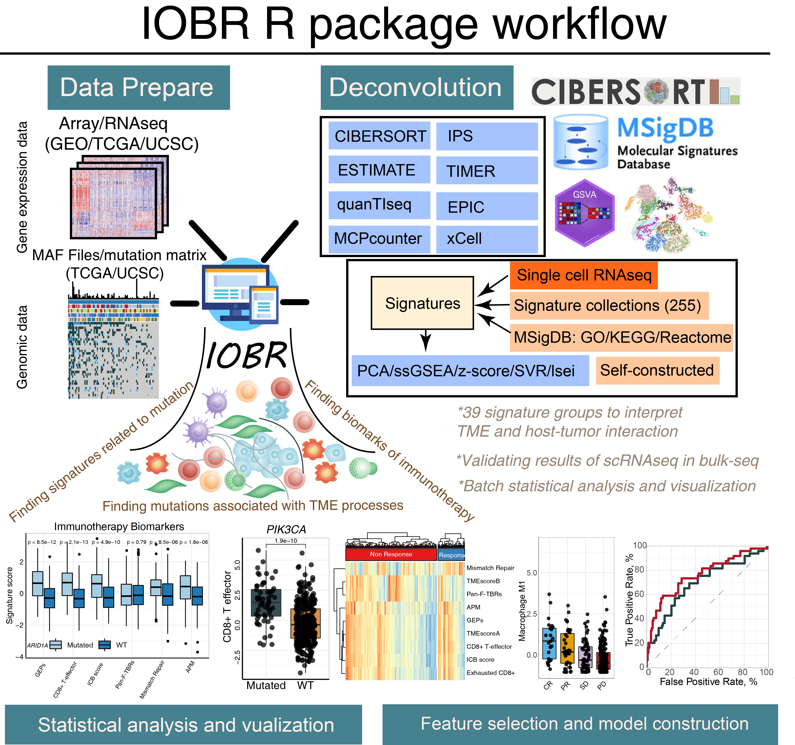
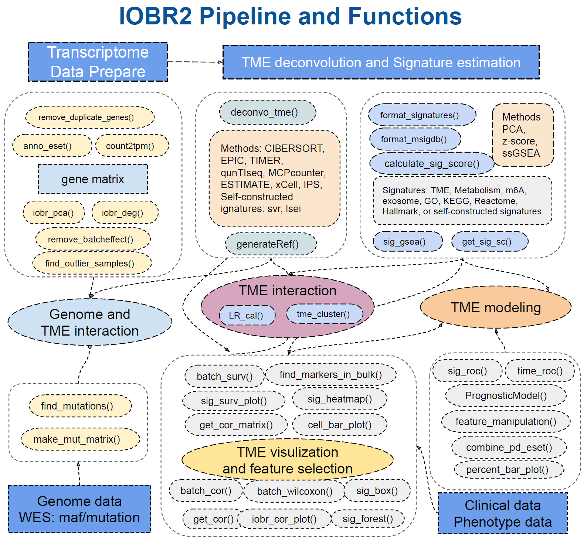

<!-- README.md is generated from README.Rmd. Please edit that file -->

```{r, include = FALSE}
knitr::opts_chunk$set(
  collapse = TRUE,
  comment = "#>",
  fig.path = "man/figures",
  out.width = "100%",
  message = FALSE,
  warning = FALSE
)
```

# IOBR: Immuno-Oncology Biological Research

[](https://GitHub.com/IOBR/IOBR/releases/)
[](https://GitHub.com/IOBR/IOBR/stargazers/)
[](https://GitHub.com/IOBR/IOBR/issues/)
[](https://opensource.org/licenses/GPL-3.0)

IOBR is a comprehensive R package designed for immuno-oncology research, providing a one-stop solution for tumor microenvironment (TME) deconvolution, signature analysis, and integrated visualization. It integrates multiple state-of-the-art algorithms and curated gene sets to facilitate in-depth analysis of tumor immunity.

## 📊 Package Workflow





## 🎯 Key Features

### 1. Extensive Signature Collection

- **322+ published signature gene sets** covering TME, metabolism, m6A, exosomes, microsatellite instability, tertiary lymphoid structure, and more
- Easy access to signature genes and source citations
- Flexible signature management and customization

### 2. Multi-algorithm TME Deconvolution

Integrates 8 cutting-edge TME decoding methodologies:

- `CIBERSORT` - Cell-type identification by estimating relative subsets of RNA transcripts
- `TIMER` - Tumor Immune Estimation Resource
- `xCell` - Digital portrayal of tissue cellular heterogeneity
- `MCPcounter` - Estimation of immune and stromal cell populations
- `ESTIMATE` - Inference of tumor purity and stromal/immune cell admixture
- `EPIC` - Enumeration of cancer and immune cell types
- `IPS` - Immunophenoscore calculation
- `quanTIseq` - Quantification of tumor-infiltrating immune cells

### 3. Signature Score Calculation

Three robust computational methods for signature scoring:

- `PCA` - Principal Component Analysis
- `z-score` - Standardized expression scoring
- `ssGSEA` - Single-sample Gene Set Enrichment Analysis

### 4. Integrated Analysis Pipeline

- Data preprocessing and normalization
- Batch effect correction
- Feature selection and dimensionality reduction
- Survival analysis and risk modeling
- Statistical testing and visualization

### 5. Rich Visualization Tools

- Batch survival analysis plots
- Subgroup characteristic visualization
- Correlation heatmaps and scatter plots
- Forest plots for biomarker validation
- Customizable themes and color palettes

## 📦 Installation

### Prerequisites
- R version 3.6.0 or higher
- Bioconductor version 3.10 or higher

### Install from GitHub

#### Standard Installation
```r
# Install BiocManager if not already installed
if (!requireNamespace("BiocManager", quietly = TRUE)) {
  install.packages("BiocManager")
}

# Install IOBR from GitHub
BiocManager::install("IOBR/IOBR")
```

#### For Chinese Users (Faster Download)
```r
# Install remotes if not already installed
if (!requireNamespace("remotes", quietly = TRUE)) {
  install.packages("remotes")
}

# Install IOBR using a mirror for faster download
remotes::install_git("https://ghfast.top/https://github.com/IOBR/IOBR")
```

### Load the Package

```{r}
library(IOBR)
```

## 🚀 Quick Start

### TME Deconvolution

```r
# List available TME deconvolution methods
tme_deconvolution_methods

# Perform TME deconvolution using multiple methods
# Assuming you have an expression set object 'eset'
tme_result <- deconvo_tme(eset, 
                          methods = c("cibersort", "timer", "xcell"),
                          output_format = "data.frame")
```

### Signature Score Calculation

```r
# List available signature score calculation methods
signature_score_calculation_methods

# Calculate signature scores using ssGSEA
# Assuming you have an expression set object 'eset' and signature list 'sig_list'
sig_scores <- sigScore(eset, 
                       signature = sig_list,
                       method = "ssgsea")
```

## 📖 Documentation

### IOBR Book

For detailed tutorials and case studies, please refer to the [IOBR Book](https://iobr.github.io/book/), which provides comprehensive guidance on:

- Installation and setup
- Data preprocessing
- TME deconvolution
- Signature analysis
- Survival analysis
- Visualization techniques

### Package Vignettes

Vignettes are available within the package and can be accessed using:

```r
browseVignettes("IOBR")
```

## 🛠️ Available Methods

### TME Deconvolution Methods

```{r}
tme_deconvolution_methods
```

### Signature Score Calculation Methods

```{r}
signature_score_calculation_methods
```

### Signature Collection

```{r}
data("signature_collection")
# Number of available signatures
length(signature_collection)

head(signature_collection)

data("signature_collection_citation")
head(signature_collection_citation)

data("sig_group")
sig_group[1:3]
```

## 📊 Licenses and Citations

### TME Deconvolution Methods

| Method | License | Citation |
|--------|---------|----------|
| [CIBERSORT](https://cibersort.stanford.edu/) | Free for non-commercial use only | Newman, A. M., et al. (2015). Nature Methods, 12(5), 453–457. [https://doi.org/10.1038/nmeth.3337](https://doi.org/10.1038/nmeth.3337) |
| [ESTIMATE](https://bioinformatics.mdanderson.org/public-software/estimate/) | Free ([GPL2.0](https://bioinformatics.mdanderson.org/estimate/)) | Vegesna R, et al. (2013). Nature Communications, 4, 2612. [http://doi.org/10.1038/ncomms3612](http://doi.org/10.1038/ncomms3612) |
| [quanTIseq](http://icbi.at/software/quantiseq/doc/index.html) | Free ([BSD](https://github.com/icbi-lab/immunedeconv/blob/master/LICENSE.md)) | Finotello, F., et al. (2019). Genome Medicine, 11(1), 34. [https://doi.org/10.1186/s13073-019-0638-6](https://doi.org/10.1186/s13073-019-0638-6) |
| [TIMER](http://cistrome.org/TIMER/) | Free ([GPL 2.0](http://cistrome.org/TIMER/download.html)) | Li, B., et al. (2016). Genome Biology, 17(1), 174. [https://doi.org/10.1186/s13059-016-1028-7](https://doi.org/10.1186/s13059-016-1028-7) |
| [IPS](https://github.com/icbi-lab/Immunophenogram) | Free ([BSD](https://github.com/icbi-lab/Immunophenogram/blob/master/LICENSE)) | Charoentong P, et al. (2017). Cell Reports, 18, 248-262. [https://doi.org/10.1016/j.celrep.2016.12.019](https://doi.org/10.1016/j.celrep.2016.12.019) |
| [MCPCounter](https://github.com/ebecht/MCPcounter) | Free ([GPL 3.0](https://github.com/ebecht/MCPcounter/blob/master/Source/License)) | Becht, E., et al. (2016). Genome Biology, 17(1), 218. [https://doi.org/10.1186/s13059-016-1070-5](https://doi.org/10.1186/s13059-016-1070-5) |
| [xCell](http://xcell.ucsf.edu/) | Free ([GPL 3.0](https://github.com/dviraran/xCell/blob/master/DESCRIPTION)) | Aran, D., et al. (2017). Genome Biology, 18(1), 220. [https://doi.org/10.1186/s13059-017-1349-1](https://doi.org/10.1186/s13059-017-1349-1) |
| [EPIC](https://gfellerlab.shinyapps.io/EPIC_1-1/) | Free for non-commercial use only ([Academic License](https://github.com/GfellerLab/EPIC/blob/master/LICENSE)) | Racle, J., et al. (2017). eLife, 6, e26476. [https://doi.org/10.7554/eLife.26476](https://doi.org/10.7554/eLife.26476) |

### Signature Estimation Methods

| Method | License | Citation |
|--------|---------|----------|
| [GSVA](http://www.bioconductor.org/packages/release/bioc/html/GSVA.html) | Free ([GPL (>= 2)](https://github.com/rcastelo/GSVA)) | Hänzelmann S, et al. (2013). BMC Bioinformatics, 14, 7. [https://doi.org/10.1186/1471-2105-14-7](https://doi.org/10.1186/1471-2105-14-7) |

## 📝 Citing IOBR

If you use IOBR in your research, please cite both the IOBR package and the specific methods you employ.

1. Zeng DQ, Fang YR, …, Liao WJ. Enhancing Immuno-Oncology Investigations Through Multidimensional Decoding of Tumour Microenvironment with IOBR 2.0, **Cell Reports Methods**, 2024 [https://doi.org/10.1016/j.crmeth.2024.100910](https://doi.org/10.1016/j.crmeth.2024.100910)

2. Fang YR, ..., Liao WJ, Zeng DQ, Systematic Investigation of Tumor Microenvironment and Antitumor Immunity With IOBR, **Med Research**, 2025 [https://onlinelibrary.wiley.com/doi/epdf/10.1002/mdr2.70001](https://onlinelibrary.wiley.com/doi/epdf/10.1002/mdr2.70001)

## 🤝 Contributing

We welcome contributions to IOBR! If you're interested in contributing, please:

1. Fork the repository
2. Create a feature branch
3. Make your changes
4. Submit a pull request

Please ensure your code follows the project's coding standards and includes appropriate documentation and tests.

## 🐛 Reporting Bugs

If you encounter any bugs or issues, please report them to the [GitHub issues page](https://github.com/IOBR/IOBR/issues). When reporting bugs, please include:

- A clear and descriptive title
- A detailed description of the issue
- Minimal reproducible example (if possible)
- Your R and IOBR versions
- Any error messages or warnings

## 📧 Contact

For questions or inquiries, please contact:

- Dr. Deqiang Zeng: interlaken@smu.edu.cn
- Dr. Yunru Fang: fyr_nate@163.com

## 📄 License

IOBR is released under the [GNU General Public License v3.0](LICENSE).


