<!-- README.md is generated from README.Rmd. Please edit that file -->

# IOBR: Immuno-Oncology Bioinformatics Research

IOBR is an R package to perform comprehensive analysis of tumor
microenvironment and signatures for immuno-oncology.

## 1 Introduction and Installation

### 1.1 Introduction

  - 1.IOBR integrates 8 published methodologies decoding tumor
    microenvironment (TME) contexture: `CIBERSORT`, `TIMER`, `xCell`,
    `MCPcounter`, `ESITMATE`, `EPIC`, `IPS`, `quanTIseq`;
  - 2.IOBR collects 255 published signature gene sets, involving tumor
    microenvironment, tumor metabolism, m6A, exosomes, microsatellite
    instability, and tertiary lymphoid structure. Running the function
    `signature_collection_citation` to attain the source papers. The
    function `signature_collection` returns the detail signature genes
    of all given signatures.
  - 3.IOBR adopts three computational methods to calculate the signature
    score, comprising `PCA`,`z-score`, and `ssGSEA`;
  - 4.IOBR integrates multiple approaches for variable transition,
    visualization, batch survival analysis, feature selection, and
    statistical analysis.
  - 5.IOBR also integrates methods for batch visualization of subgroup
    characteristics.

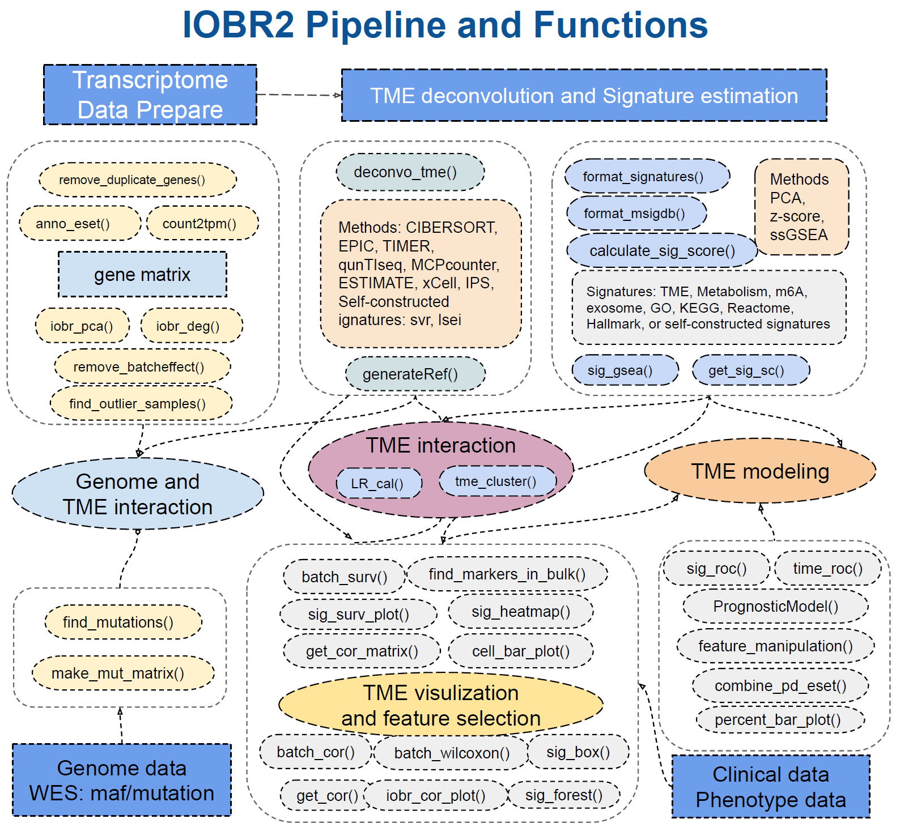

### 1.2 Installation

Before installing IOBR, please install all dependencies by executing the
following command in R console:

The dependencies includs `tibble`, `survival`, `survminer`, `limma`,
`limSolve`, `GSVA`, `e1071`, `preprocessCore`, `ggplot2` and `ggpubr`.

``` r
options("repos"= c(CRAN="https://mirrors.tuna.tsinghua.edu.cn/CRAN/"))
options(BioC_mirror="http://mirrors.tuna.tsinghua.edu.cn/bioconductor/")
if (!requireNamespace("BiocManager", quietly = TRUE)) install("BiocManager")
depens<-c('tibble', 'survival', 'survminer', 'sva', 'limma', "DESeq2",
          'limSolve', 'GSVA', 'e1071', 'preprocessCore', 'ggplot2', 
          'ggpubr',"devtools")
for(i in 1:length(depens)){
  depen<-depens[i]
  if (!requireNamespace(depen, quietly = TRUE))
    BiocManager::install(depen)
}

if (!requireNamespace("EPIC", quietly = TRUE))
  devtools::install_github("GfellerLab/EPIC", build_vignettes=TRUE)

if (!requireNamespace("MCPcounter", quietly = TRUE))
  devtools::install_github("ebecht/MCPcounter",ref="master", subdir="Source")

if (!requireNamespace("estimate", quietly = TRUE)){
  rforge <- "http://r-forge.r-project.org"
  install.packages("estimate", repos=rforge, dependencies=TRUE)
}
```

The package is not yet on CRAN. You can install it from Github:

``` r
if (!requireNamespace("IOBR", quietly = TRUE))
  devtools::install_github("DongqiangZeng0808/IOBR",ref="master")
#> Warning: replacing previous import 'caret::lift' by 'purrr::lift' when loading
#> 'IOBR'
#> Warning: replacing previous import 'caret::cluster' by 'survival::cluster' when
#> loading 'IOBR'
```

## 1.3 Library R packages

``` r
library(IOBR) 
library(EPIC)
library(estimate) 
library(MCPcounter)
Sys.setenv(LANGUAGE = "en") # The error message would be present in English.
options(stringsAsFactors = FALSE) #To avoid transiting character into factor.
```

## 2 TME deconvolution

### 2.1 Availabie methods to decode TME contexture

``` r
tme_deconvolution_methods
#>         MCPcounter               EPIC              xCell          CIBERSORT 
#>       "mcpcounter"             "epic"            "xcell"        "cibersort" 
#> CIBERSORT Absolute                IPS           ESTIMATE                SVM 
#>    "cibersort_abs"              "ips"         "estimate"          "svm_ref" 
#>               lsei              TIMER          quanTIseq 
#>         "lsei_ref"            "timer"        "quantiseq"
# Return available parameter options of deconvolution methods
```

If you use this package in your work, please cite both our package and
the method(s) you are using.

#### Licenses of the deconvolution methods

| method                                                                      | license                                                                                                       | citation                                                                                                                                                                                                                                                                                                 |
| --------------------------------------------------------------------------- | ------------------------------------------------------------------------------------------------------------- | -------------------------------------------------------------------------------------------------------------------------------------------------------------------------------------------------------------------------------------------------------------------------------------------------------- |
| [CIBERSORT](https://cibersort.stanford.edu/)                                | free for non-commerical use only                                                                              | Newman, A. M., Liu, C. L., Green, M. R., Gentles, A. J., Feng, W., Xu, Y., … Alizadeh, A. A. (2015). Robust enumeration of cell subsets from tissue expression profiles. Nature Methods, 12(5), 453–457. <https://doi.org/10.1038/nmeth.3337>                                                            |
| [ESTIMATE](https://bioinformatics.mdanderson.org/public-software/estimate/) | free ([GPL2.0](https://bioinformatics.mdanderson.org/estimate/))                                              | Vegesna R, Kim H, Torres-Garcia W, …, Verhaak R. (2013). Inferring tumour purity and stromal and immune cell admixture from expression data. Nature Communications 4, 2612. <http://doi.org/10.1038/ncomms3612>                                                                                          |
| [quanTIseq](http://icbi.at/software/quantiseq/doc/index.html)               | free ([BSD](https://github.com/icbi-lab/immunedeconv/blob/master/LICENSE.md))                                 | Finotello, F., Mayer, C., Plattner, C., Laschober, G., Rieder, D., Hackl, H., …, Sopper, S. (2019). Molecular and pharmacological modulators of the tumor immune contexture revealed by deconvolution of RNA-seq data. Genome medicine, 11(1), 34. <https://doi.org/10.1186/s13073-019-0638-6>           |
| [TIMER](http://cistrome.org/TIMER/)                                         | free ([GPL 2.0](http://cistrome.org/TIMER/download.html))                                                     | Li, B., Severson, E., Pignon, J.-C., Zhao, H., Li, T., Novak, J., … Liu, X. S. (2016). Comprehensive analyses of tumor immunity: implications for cancer immunotherapy. Genome Biology, 17(1), 174. <https://doi.org/10.1186/s13059-016-1028-7>                                                          |
| [IPS](https://github.com/icbi-lab/Immunophenogram)                          | free ([BSD](https://github.com/icbi-lab/Immunophenogram/blob/master/LICENSE))                                 | P. Charoentong et al., Pan-cancer Immunogenomic Analyses Reveal Genotype-Immunophenotype Relationships and Predictors of Response to Checkpoint Blockade. Cell Reports 18, 248-262 (2017). <https://doi.org/10.1016/j.celrep.2016.12.019>                                                                |
| [MCPCounter](https://github.com/ebecht/MCPcounter)                          | free ([GPL 3.0](https://github.com/ebecht/MCPcounter/blob/master/Source/License))                             | Becht, E., Giraldo, N. A., Lacroix, L., Buttard, B., Elarouci, N., Petitprez, F., … de Reyniès, A. (2016). Estimating the population abundance of tissue-infiltrating immune and stromal cell populations using gene expression. Genome Biology, 17(1), 218. <https://doi.org/10.1186/s13059-016-1070-5> |
| [xCell](http://xcell.ucsf.edu/)                                             | free ([GPL 3.0](https://github.com/dviraran/xCell/blob/master/DESCRIPTION))                                   | Aran, D., Hu, Z., & Butte, A. J. (2017). xCell: digitally portraying the tissue cellular heterogeneity landscape. Genome Biology, 18(1), 220. <https://doi.org/10.1186/s13059-017-1349-1>                                                                                                                |
| [EPIC](https://gfellerlab.shinyapps.io/EPIC_1-1/)                           | free for non-commercial use only ([Academic License](https://github.com/GfellerLab/EPIC/blob/master/LICENSE)) | Racle, J., de Jonge, K., Baumgaertner, P., Speiser, D. E., & Gfeller, D. (2017). Simultaneous enumeration of cancer and immune cell types from bulk tumor gene expression data. ELife, 6, e26476. <https://doi.org/10.7554/eLife.26476>                                                                  |

#### Licenses of the signature-esitmation method

| method                                                                   | license                                                | citation                                                                                                                                                                                                              |
| ------------------------------------------------------------------------ | ------------------------------------------------------ | --------------------------------------------------------------------------------------------------------------------------------------------------------------------------------------------------------------------- |
| [GSVA](http://www.bioconductor.org/packages/release/bioc/html/GSVA.html) | free ([GPL (\>= 2)](https://github.com/rcastelo/GSVA)) | Hänzelmann S, Castelo R, Guinney J (2013). “GSVA: gene set variation analysis for microarray and RNA-Seq data.” BMC Bioinformatics, 14, 7. doi: 10.1186/1471-2105-14-7, <http://www.biomedcentral.com/1471-2105/14/7> |

The input data is a matrix (log2(TMP+1) transformed) containing 98
TCGA-STAD samples, with genes in rows and samples in columns. The
rownames must be HGNC symbols and the colnames must be sample names.

``` r
# Check data 
eset_stad[1:5,1:5]
#>         TCGA-B7-5818 TCGA-BR-4187 TCGA-BR-4201 TCGA-BR-4253 TCGA-BR-4256
#> MT-CO1      15.18012     15.55806     14.60960     14.63728     15.23528
#> MT-CO3      14.75536     15.19199     14.55337     13.54925     14.30425
#> MT-ND4      14.19637     15.61564     15.80262     14.98329     14.83764
#> MT-CO2      15.10790     15.50514     15.43261     14.52009     14.65806
#> MT-RNR2     14.22690     14.71157     13.48096     13.32553     13.55689
```

Check detail parameters of the function

``` r
help(deconvo_tme)
#> starting httpd help server ... done
```

#### 2.1.1 Method 1: Use CIBERSORT to decode the TME contexture.

``` r
cibersort<-deconvo_tme(eset = eset_stad,method = "cibersort",arrays = FALSE,perm = 200 )
#> 
#> >>> Running CIBERSORT
head(cibersort)
#> # A tibble: 6 x 26
#>   ID    B_cells_naive_C~ B_cells_memory_~ Plasma_cells_CI~ T_cells_CD8_CIB~
#>   <chr>            <dbl>            <dbl>            <dbl>            <dbl>
#> 1 TCGA~           0.0323                0          0                 0.193 
#> 2 TCGA~           0.0866                0          0                 0.0872
#> 3 TCGA~           0.0474                0          0.00644           0.0286
#> 4 TCGA~           0.0125                0          0.00257           0.224 
#> 5 TCGA~           0.0544                0          0.00923           0.0936
#> 6 TCGA~           0.0246                0          0.00162           0.124 
#> # ... with 21 more variables: T_cells_CD4_naive_CIBERSORT <dbl>,
#> #   T_cells_CD4_memory_resting_CIBERSORT <dbl>,
#> #   T_cells_CD4_memory_activated_CIBERSORT <dbl>,
#> #   T_cells_follicular_helper_CIBERSORT <dbl>,
#> #   `T_cells_regulatory_(Tregs)_CIBERSORT` <dbl>,
#> #   T_cells_gamma_delta_CIBERSORT <dbl>, NK_cells_resting_CIBERSORT <dbl>,
#> #   NK_cells_activated_CIBERSORT <dbl>, Monocytes_CIBERSORT <dbl>,
#> #   Macrophages_M0_CIBERSORT <dbl>, Macrophages_M1_CIBERSORT <dbl>,
#> #   Macrophages_M2_CIBERSORT <dbl>, Dendritic_cells_resting_CIBERSORT <dbl>,
#> #   Dendritic_cells_activated_CIBERSORT <dbl>,
#> #   Mast_cells_resting_CIBERSORT <dbl>, Mast_cells_activated_CIBERSORT <dbl>,
#> #   Eosinophils_CIBERSORT <dbl>, Neutrophils_CIBERSORT <dbl>,
#> #   `P-value_CIBERSORT` <dbl>, Correlation_CIBERSORT <dbl>,
#> #   RMSE_CIBERSORT <dbl>
res<-cell_bar_plot(input = cibersort[1:12,], title = "CIBERSORT Cell Fraction")
#> There are seven categories you can choose: box, continue2, continue, random, heatmap, heatmap3, tidyheatmap
```

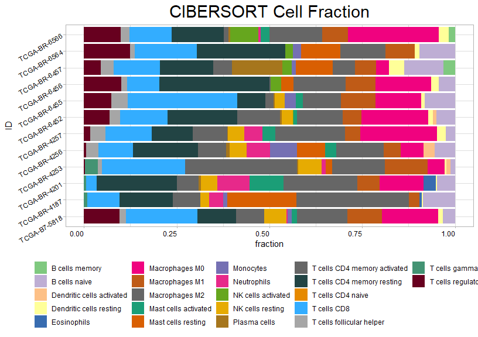

#### 2.1.2 Method 2: Use EPIC to decode the TME contexture.

``` r
help(deconvo_epic)
epic<-deconvo_tme(eset = eset_stad,method = "epic",arrays = FALSE)
#> 
#> >>> Running EPIC
#> Warning in EPIC::EPIC(bulk = eset, reference = ref, mRNA_cell = NULL, scaleExprs = TRUE): The optimization didn't fully converge for some samples:
#> TCGA-BR-6705; TCGA-BR-7958; TCGA-BR-8366; TCGA-BR-A4J4; TCGA-BR-A4J9; TCGA-CD-A4MG; TCGA-FP-8209; TCGA-HU-A4G9
#>  - check fit.gof for the convergeCode and convergeMessage
#> Warning in EPIC::EPIC(bulk = eset, reference = ref, mRNA_cell = NULL, scaleExprs
#> = TRUE): mRNA_cell value unknown for some cell types: CAFs, Endothelial - using
#> the default value of 0.4 for these but this might bias the true cell proportions
#> from all cell types.
head(epic)
#> # A tibble: 6 x 9
#>   ID    Bcells_EPIC CAFs_EPIC CD4_Tcells_EPIC CD8_Tcells_EPIC Endothelial_EPIC
#>   <chr>       <dbl>     <dbl>           <dbl>           <dbl>            <dbl>
#> 1 TCGA~      0.0226    0.0206           0.163          0.110             0.124
#> 2 TCGA~      0.0511    0.0254           0.189          0.107             0.182
#> 3 TCGA~      0.0435    0.0245           0.242          0.0726            0.146
#> 4 TCGA~      0.0353    0.0163           0.212          0.169             0.128
#> 5 TCGA~      0.0330    0.0226           0.208          0.111             0.177
#> 6 TCGA~      0.0145    0.0223           0.205          0.102             0.140
#> # ... with 3 more variables: Macrophages_EPIC <dbl>, NKcells_EPIC <dbl>,
#> #   otherCells_EPIC <dbl>
```

#### 2.1.3 Method 3: Use MCPcounter to decode the TME contexture.

``` r
mcp<-deconvo_tme(eset = eset_stad,method = "mcpcounter")
#> 
#> >>> Running MCP-counter
head(mcp)
#> # A tibble: 6 x 11
#>   ID    T_cells_MCPcoun~ CD8_T_cells_MCP~ Cytotoxic_lymph~ NK_cells_MCPcou~
#>   <chr>            <dbl>            <dbl>            <dbl>            <dbl>
#> 1 TCGA~             2.26             2.81             1.59            0.387
#> 2 TCGA~             2.07             3.14             1.53            0.487
#> 3 TCGA~             2.28             1.11             1.96            1.15 
#> 4 TCGA~             3.69             4.66             3.83            1.12 
#> 5 TCGA~             2.71             3.40             2.26            0.800
#> 6 TCGA~             2.06             2.54             1.76            0.489
#> # ... with 6 more variables: B_lineage_MCPcounter <dbl>,
#> #   Monocytic_lineage_MCPcounter <dbl>,
#> #   Myeloid_dendritic_cells_MCPcounter <dbl>, Neutrophils_MCPcounter <dbl>,
#> #   Endothelial_cells_MCPcounter <dbl>, Fibroblasts_MCPcounter <dbl>
```

#### 2.1.4 Method 4: Use xCELL to decode the TME contexture.

``` r
xcell<-deconvo_tme(eset = eset_stad,method = "xcell",arrays = FALSE)
#> [1] "Num. of genes: 10761"
#> Estimating ssGSEA scores for 489 gene sets.
#>   |                                                                              |                                                                      |   0%Using parallel with 4 cores
#>   |                                                                              |=                                                                     |   1%  |                                                                              |=                                                                     |   2%  |                                                                              |==                                                                    |   3%  |                                                                              |===                                                                   |   4%  |                                                                              |====                                                                  |   5%  |                                                                              |====                                                                  |   6%  |                                                                              |=====                                                                 |   7%  |                                                                              |======                                                                |   8%  |                                                                              |======                                                                |   9%  |                                                                              |=======                                                               |  10%  |                                                                              |========                                                              |  11%  |                                                                              |=========                                                             |  12%  |                                                                              |=========                                                             |  13%  |                                                                              |==========                                                            |  14%  |                                                                              |===========                                                           |  15%  |                                                                              |===========                                                           |  16%  |                                                                              |============                                                          |  17%  |                                                                              |=============                                                         |  18%  |                                                                              |==============                                                        |  19%  |                                                                              |==============                                                        |  20%  |                                                                              |===============                                                       |  21%  |                                                                              |================                                                      |  22%  |                                                                              |================                                                      |  23%  |                                                                              |=================                                                     |  24%  |                                                                              |==================                                                    |  26%  |                                                                              |===================                                                   |  27%  |                                                                              |===================                                                   |  28%  |                                                                              |====================                                                  |  29%  |                                                                              |=====================                                                 |  30%  |                                                                              |=====================                                                 |  31%  |                                                                              |======================                                                |  32%  |                                                                              |=======================                                               |  33%  |                                                                              |========================                                              |  34%  |                                                                              |========================                                              |  35%  |                                                                              |=========================                                             |  36%  |                                                                              |==========================                                            |  37%  |                                                                              |==========================                                            |  38%  |                                                                              |===========================                                           |  39%  |                                                                              |============================                                          |  40%  |                                                                              |=============================                                         |  41%  |                                                                              |=============================                                         |  42%  |                                                                              |==============================                                        |  43%  |                                                                              |===============================                                       |  44%  |                                                                              |===============================                                       |  45%  |                                                                              |================================                                      |  46%  |                                                                              |=================================                                     |  47%  |                                                                              |==================================                                    |  48%  |                                                                              |==================================                                    |  49%  |                                                                              |===================================                                   |  50%  |                                                                              |====================================                                  |  51%  |                                                                              |====================================                                  |  52%  |                                                                              |=====================================                                 |  53%  |                                                                              |======================================                                |  54%  |                                                                              |=======================================                               |  55%  |                                                                              |=======================================                               |  56%  |                                                                              |========================================                              |  57%  |                                                                              |=========================================                             |  58%  |                                                                              |=========================================                             |  59%  |                                                                              |==========================================                            |  60%  |                                                                              |===========================================                           |  61%  |                                                                              |============================================                          |  62%  |                                                                              |============================================                          |  63%  |                                                                              |=============================================                         |  64%  |                                                                              |==============================================                        |  65%  |                                                                              |==============================================                        |  66%  |                                                                              |===============================================                       |  67%  |                                                                              |================================================                      |  68%  |                                                                              |=================================================                     |  69%  |                                                                              |=================================================                     |  70%  |                                                                              |==================================================                    |  71%  |                                                                              |===================================================                   |  72%  |                                                                              |===================================================                   |  73%  |                                                                              |====================================================                  |  74%  |                                                                              |=====================================================                 |  76%  |                                                                              |======================================================                |  77%  |                                                                              |======================================================                |  78%  |                                                                              |=======================================================               |  79%  |                                                                              |========================================================              |  80%  |                                                                              |========================================================              |  81%  |                                                                              |=========================================================             |  82%  |                                                                              |==========================================================            |  83%  |                                                                              |===========================================================           |  84%  |                                                                              |===========================================================           |  85%  |                                                                              |============================================================          |  86%  |                                                                              |=============================================================         |  87%  |                                                                              |=============================================================         |  88%  |                                                                              |==============================================================        |  89%  |                                                                              |===============================================================       |  90%  |                                                                              |================================================================      |  91%  |                                                                              |================================================================      |  92%  |                                                                              |=================================================================     |  93%  |                                                                              |==================================================================    |  94%  |                                                                              |==================================================================    |  95%  |                                                                              |===================================================================   |  96%  |                                                                              |====================================================================  |  97%  |                                                                              |===================================================================== |  98%  |                                                                              |===================================================================== |  99%  |                                                                              |======================================================================| 100%
head(xcell)
#> # A tibble: 6 x 68
#>   ID    aDC_xCell Adipocytes_xCell Astrocytes_xCell `B-cells_xCell`
#>   <chr>     <dbl>            <dbl>            <dbl>           <dbl>
#> 1 TCGA~    0.189           0                0.00159          0.0664
#> 2 TCGA~    0.0604          0.00896          0.132            0.0599
#> 3 TCGA~    0.0993          0.00142          0.116            0.0504
#> 4 TCGA~    0.311           0                0                0.202 
#> 5 TCGA~    0.315           0.00768          0.127            0.0458
#> 6 TCGA~    0.0805          0                0.0508           0.0499
#> # ... with 63 more variables: Basophils_xCell <dbl>,
#> #   `CD4+_memory_T-cells_xCell` <dbl>, `CD4+_naive_T-cells_xCell` <dbl>,
#> #   `CD4+_T-cells_xCell` <dbl>, `CD4+_Tcm_xCell` <dbl>, `CD4+_Tem_xCell` <dbl>,
#> #   `CD8+_naive_T-cells_xCell` <dbl>, `CD8+_T-cells_xCell` <dbl>,
#> #   `CD8+_Tcm_xCell` <dbl>, `CD8+_Tem_xCell` <dbl>, cDC_xCell <dbl>,
#> #   Chondrocytes_xCell <dbl>, `Class-switched_memory_B-cells_xCell` <dbl>,
#> #   CLP_xCell <dbl>, CMP_xCell <dbl>, DC_xCell <dbl>,
#> #   Endothelial_cells_xCell <dbl>, Eosinophils_xCell <dbl>,
#> #   Epithelial_cells_xCell <dbl>, Erythrocytes_xCell <dbl>,
#> #   Fibroblasts_xCell <dbl>, GMP_xCell <dbl>, Hepatocytes_xCell <dbl>,
#> #   HSC_xCell <dbl>, iDC_xCell <dbl>, Keratinocytes_xCell <dbl>,
#> #   ly_Endothelial_cells_xCell <dbl>, Macrophages_xCell <dbl>,
#> #   Macrophages_M1_xCell <dbl>, Macrophages_M2_xCell <dbl>,
#> #   Mast_cells_xCell <dbl>, Megakaryocytes_xCell <dbl>,
#> #   Melanocytes_xCell <dbl>, `Memory_B-cells_xCell` <dbl>, MEP_xCell <dbl>,
#> #   Mesangial_cells_xCell <dbl>, Monocytes_xCell <dbl>, MPP_xCell <dbl>,
#> #   MSC_xCell <dbl>, mv_Endothelial_cells_xCell <dbl>, Myocytes_xCell <dbl>,
#> #   `naive_B-cells_xCell` <dbl>, Neurons_xCell <dbl>, Neutrophils_xCell <dbl>,
#> #   NK_cells_xCell <dbl>, NKT_xCell <dbl>, Osteoblast_xCell <dbl>,
#> #   pDC_xCell <dbl>, Pericytes_xCell <dbl>, Plasma_cells_xCell <dbl>,
#> #   Platelets_xCell <dbl>, Preadipocytes_xCell <dbl>,
#> #   `pro_B-cells_xCell` <dbl>, Sebocytes_xCell <dbl>,
#> #   Skeletal_muscle_xCell <dbl>, Smooth_muscle_xCell <dbl>,
#> #   Tgd_cells_xCell <dbl>, Th1_cells_xCell <dbl>, Th2_cells_xCell <dbl>,
#> #   Tregs_xCell <dbl>, ImmuneScore_xCell <dbl>, StromaScore_xCell <dbl>,
#> #   MicroenvironmentScore_xCell <dbl>
```

#### 2.1.5 Method 5: Use ESTIMATE to estimate tumor purity, and generate immune score and stromal score.

``` r
estimate<-deconvo_tme(eset = eset_stad,method = "estimate")
#> [1] "Merged dataset includes 10156 genes (256 mismatched)."
#> [1] "1 gene set: StromalSignature  overlap= 139"
#> [1] "2 gene set: ImmuneSignature  overlap= 140"
head(estimate)
#> # A tibble: 6 x 5
#>   ID      StromalScore_est~ ImmuneScore_esti~ ESTIMATEScore_es~ TumorPurity_est~
#>   <chr>               <dbl>             <dbl>             <dbl>            <dbl>
#> 1 TCGA-B~             -111.             1762.             1651.            0.662
#> 2 TCGA-B~             2054.             2208.             4262.            0.334
#> 3 TCGA-B~             1411.             1770.             3181.            0.479
#> 4 TCGA-B~              483.             2905.             3389.            0.451
#> 5 TCGA-B~             1659.             2541.             4200.            0.342
#> 6 TCGA-B~              831.             1722.             2553.            0.557
```

#### 2.1.6 Method 6: Use TIMER to decode the TME contexture.

``` r
timer<-deconvo_tme(eset = eset_stad,method = "timer",group_list = rep("stad",dim(eset_stad)[2]))
#> [1] "Outlier genes: FTL IGF2 IGHA1 IGHM IGKC IGKV4-1 LYZ MT-ATP6 MT-CO1 MT-CO2 MT-CO3 MT-CYB MT-ND1 MT-ND2 MT-ND3 MT-ND4 MT-ND4L MT-RNR1 MT-RNR2 MT-TP PGC"
#> Standardizing Data across genes
head(timer)
#> # A tibble: 6 x 7
#>   ID    B_cell_TIMER T_cell_CD4_TIMER T_cell_CD8_TIMER Neutrophil_TIMER
#>   <chr>        <dbl>            <dbl>            <dbl>            <dbl>
#> 1 TCGA~       0.0954            0.130            0.191            0.114
#> 2 TCGA~       0.0983            0.131            0.202            0.125
#> 3 TCGA~       0.0996            0.122            0.200            0.127
#> 4 TCGA~       0.101             0.131            0.240            0.129
#> 5 TCGA~       0.0945            0.133            0.213            0.137
#> 6 TCGA~       0.0907            0.126            0.199            0.121
#> # ... with 2 more variables: Macrophage_TIMER <dbl>, DC_TIMER <dbl>
```

#### 2.1.7 Method 7: Use quanTIseq to decode the TME contexture.

``` r
quantiseq<-deconvo_tme(eset = eset_stad, tumor = TRUE, arrays = FALSE, scale_mrna = TRUE,method = "quantiseq")
#> 
#> Running quanTIseq deconvolution module
#> Gene expression normalization and re-annotation (arrays: FALSE)
#> Removing 17 noisy genes
#> Removing 15 genes with high expression in tumors
#> Signature genes found in data set: 138/138 (100%)
#> Mixture deconvolution (method: lsei)
#> Deconvolution sucessful!
head(quantiseq)
#> # A tibble: 6 x 12
#>   ID    B_cells_quantis~ Macrophages_M1_~ Macrophages_M2_~ Monocytes_quant~
#>   <chr>            <dbl>            <dbl>            <dbl>            <dbl>
#> 1 TCGA~          0.00897           0.0943           0.0299                0
#> 2 TCGA~          0.0269            0.0155           0.169                 0
#> 3 TCGA~          0.0160            0.0570           0.0661                0
#> 4 TCGA~          0.0240            0.171            0.128                 0
#> 5 TCGA~          0.0129            0.126            0.0922                0
#> 6 TCGA~          0.0148            0.0685           0.0673                0
#> # ... with 7 more variables: Neutrophils_quantiseq <dbl>,
#> #   NK_cells_quantiseq <dbl>, T_cells_CD4_quantiseq <dbl>,
#> #   T_cells_CD8_quantiseq <dbl>, Tregs_quantiseq <dbl>,
#> #   Dendritic_cells_quantiseq <dbl>, Other_quantiseq <dbl>
res<-cell_bar_plot(input = quantiseq[1:12,], title = "quanTIseq Cell Fraction")
#> There are seven categories you can choose: box, continue2, continue, random, heatmap, heatmap3, tidyheatmap
```


#### 2.1.8 Method 8: Use IPS to estimate immune phenotype.

``` r
ips<-deconvo_tme(eset = eset_stad,method = "ips",plot= FALSE)
#>    Mode    TRUE 
#> logical     161 
#> [1] GENE   NAME   CLASS  WEIGHT
#> <0 rows> (or 0-length row.names)
#> [1] GENE   NAME   CLASS  WEIGHT
#> <0 rows> (or 0-length row.names)
head(ips)
#> # A tibble: 6 x 7
#>   ID           MHC_IPS EC_IPS SC_IPS CP_IPS AZ_IPS IPS_IPS
#>   <chr>          <dbl>  <dbl>  <dbl>  <dbl>  <dbl>   <dbl>
#> 1 TCGA-B7-5818    3.56   1.09  -1.37 -0.576   2.70       9
#> 2 TCGA-BR-4187    3.37   1.18  -1.71 -0.308   2.53       8
#> 3 TCGA-BR-4201    3.04   1.22  -1.62 -0.439   2.20       7
#> 4 TCGA-BR-4253    3.79   1.63  -1.74 -1.25    2.42       8
#> 5 TCGA-BR-4256    3.65   1.40  -1.95 -0.847   2.25       8
#> 6 TCGA-BR-4257    3.11   1.23  -1.74 -0.529   2.07       7
```

#### 2.1.9 Combine the above deconvolution results for subsequent analyses.

``` r
tme_combine<-cibersort %>% 
  inner_join(.,mcp,by = "ID") %>% 
  inner_join(.,xcell,by = "ID") %>%
  inner_join(.,epic,by = "ID") %>% 
  inner_join(.,estimate,by = "ID") %>% 
  inner_join(.,timer,by = "ID") %>% 
  inner_join(.,quantiseq,by = "ID") %>% 
  inner_join(.,ips,by = "ID")
dim(tme_combine)
#> [1]  98 138
colnames(tme_combine)
#>   [1] "ID"                                    
#>   [2] "B_cells_naive_CIBERSORT"               
#>   [3] "B_cells_memory_CIBERSORT"              
#>   [4] "Plasma_cells_CIBERSORT"                
#>   [5] "T_cells_CD8_CIBERSORT"                 
#>   [6] "T_cells_CD4_naive_CIBERSORT"           
#>   [7] "T_cells_CD4_memory_resting_CIBERSORT"  
#>   [8] "T_cells_CD4_memory_activated_CIBERSORT"
#>   [9] "T_cells_follicular_helper_CIBERSORT"   
#>  [10] "T_cells_regulatory_(Tregs)_CIBERSORT"  
#>  [11] "T_cells_gamma_delta_CIBERSORT"         
#>  [12] "NK_cells_resting_CIBERSORT"            
#>  [13] "NK_cells_activated_CIBERSORT"          
#>  [14] "Monocytes_CIBERSORT"                   
#>  [15] "Macrophages_M0_CIBERSORT"              
#>  [16] "Macrophages_M1_CIBERSORT"              
#>  [17] "Macrophages_M2_CIBERSORT"              
#>  [18] "Dendritic_cells_resting_CIBERSORT"     
#>  [19] "Dendritic_cells_activated_CIBERSORT"   
#>  [20] "Mast_cells_resting_CIBERSORT"          
#>  [21] "Mast_cells_activated_CIBERSORT"        
#>  [22] "Eosinophils_CIBERSORT"                 
#>  [23] "Neutrophils_CIBERSORT"                 
#>  [24] "P-value_CIBERSORT"                     
#>  [25] "Correlation_CIBERSORT"                 
#>  [26] "RMSE_CIBERSORT"                        
#>  [27] "T_cells_MCPcounter"                    
#>  [28] "CD8_T_cells_MCPcounter"                
#>  [29] "Cytotoxic_lymphocytes_MCPcounter"      
#>  [30] "NK_cells_MCPcounter"                   
#>  [31] "B_lineage_MCPcounter"                  
#>  [32] "Monocytic_lineage_MCPcounter"          
#>  [33] "Myeloid_dendritic_cells_MCPcounter"    
#>  [34] "Neutrophils_MCPcounter"                
#>  [35] "Endothelial_cells_MCPcounter"          
#>  [36] "Fibroblasts_MCPcounter"                
#>  [37] "aDC_xCell"                             
#>  [38] "Adipocytes_xCell"                      
#>  [39] "Astrocytes_xCell"                      
#>  [40] "B-cells_xCell"                         
#>  [41] "Basophils_xCell"                       
#>  [42] "CD4+_memory_T-cells_xCell"             
#>  [43] "CD4+_naive_T-cells_xCell"              
#>  [44] "CD4+_T-cells_xCell"                    
#>  [45] "CD4+_Tcm_xCell"                        
#>  [46] "CD4+_Tem_xCell"                        
#>  [47] "CD8+_naive_T-cells_xCell"              
#>  [48] "CD8+_T-cells_xCell"                    
#>  [49] "CD8+_Tcm_xCell"                        
#>  [50] "CD8+_Tem_xCell"                        
#>  [51] "cDC_xCell"                             
#>  [52] "Chondrocytes_xCell"                    
#>  [53] "Class-switched_memory_B-cells_xCell"   
#>  [54] "CLP_xCell"                             
#>  [55] "CMP_xCell"                             
#>  [56] "DC_xCell"                              
#>  [57] "Endothelial_cells_xCell"               
#>  [58] "Eosinophils_xCell"                     
#>  [59] "Epithelial_cells_xCell"                
#>  [60] "Erythrocytes_xCell"                    
#>  [61] "Fibroblasts_xCell"                     
#>  [62] "GMP_xCell"                             
#>  [63] "Hepatocytes_xCell"                     
#>  [64] "HSC_xCell"                             
#>  [65] "iDC_xCell"                             
#>  [66] "Keratinocytes_xCell"                   
#>  [67] "ly_Endothelial_cells_xCell"            
#>  [68] "Macrophages_xCell"                     
#>  [69] "Macrophages_M1_xCell"                  
#>  [70] "Macrophages_M2_xCell"                  
#>  [71] "Mast_cells_xCell"                      
#>  [72] "Megakaryocytes_xCell"                  
#>  [73] "Melanocytes_xCell"                     
#>  [74] "Memory_B-cells_xCell"                  
#>  [75] "MEP_xCell"                             
#>  [76] "Mesangial_cells_xCell"                 
#>  [77] "Monocytes_xCell"                       
#>  [78] "MPP_xCell"                             
#>  [79] "MSC_xCell"                             
#>  [80] "mv_Endothelial_cells_xCell"            
#>  [81] "Myocytes_xCell"                        
#>  [82] "naive_B-cells_xCell"                   
#>  [83] "Neurons_xCell"                         
#>  [84] "Neutrophils_xCell"                     
#>  [85] "NK_cells_xCell"                        
#>  [86] "NKT_xCell"                             
#>  [87] "Osteoblast_xCell"                      
#>  [88] "pDC_xCell"                             
#>  [89] "Pericytes_xCell"                       
#>  [90] "Plasma_cells_xCell"                    
#>  [91] "Platelets_xCell"                       
#>  [92] "Preadipocytes_xCell"                   
#>  [93] "pro_B-cells_xCell"                     
#>  [94] "Sebocytes_xCell"                       
#>  [95] "Skeletal_muscle_xCell"                 
#>  [96] "Smooth_muscle_xCell"                   
#>  [97] "Tgd_cells_xCell"                       
#>  [98] "Th1_cells_xCell"                       
#>  [99] "Th2_cells_xCell"                       
#> [100] "Tregs_xCell"                           
#> [101] "ImmuneScore_xCell"                     
#> [102] "StromaScore_xCell"                     
#> [103] "MicroenvironmentScore_xCell"           
#> [104] "Bcells_EPIC"                           
#> [105] "CAFs_EPIC"                             
#> [106] "CD4_Tcells_EPIC"                       
#> [107] "CD8_Tcells_EPIC"                       
#> [108] "Endothelial_EPIC"                      
#> [109] "Macrophages_EPIC"                      
#> [110] "NKcells_EPIC"                          
#> [111] "otherCells_EPIC"                       
#> [112] "StromalScore_estimate"                 
#> [113] "ImmuneScore_estimate"                  
#> [114] "ESTIMATEScore_estimate"                
#> [115] "TumorPurity_estimate"                  
#> [116] "B_cell_TIMER"                          
#> [117] "T_cell_CD4_TIMER"                      
#> [118] "T_cell_CD8_TIMER"                      
#> [119] "Neutrophil_TIMER"                      
#> [120] "Macrophage_TIMER"                      
#> [121] "DC_TIMER"                              
#> [122] "B_cells_quantiseq"                     
#> [123] "Macrophages_M1_quantiseq"              
#> [124] "Macrophages_M2_quantiseq"              
#> [125] "Monocytes_quantiseq"                   
#> [126] "Neutrophils_quantiseq"                 
#> [127] "NK_cells_quantiseq"                    
#> [128] "T_cells_CD4_quantiseq"                 
#> [129] "T_cells_CD8_quantiseq"                 
#> [130] "Tregs_quantiseq"                       
#> [131] "Dendritic_cells_quantiseq"             
#> [132] "Other_quantiseq"                       
#> [133] "MHC_IPS"                               
#> [134] "EC_IPS"                                
#> [135] "SC_IPS"                                
#> [136] "CP_IPS"                                
#> [137] "AZ_IPS"                                
#> [138] "IPS_IPS"
```

## 3 Signature score estimation

IOBR integrates 255 published signature gene sets, involving tumor
microenvironment, tumor metabolism, m6A, exosomes, microsatellite
instability, and tertiary lymphoid structure. Running the function
`signature_collection_citation` to attain the source papers. The
function `signature_collection` returns the detail signature genes of
all given signatures.

### 3.1 Obtain the included signatures

``` r
library(IOBR)
#TME associated signatures
names(signature_tme)[1:20]
#>  [1] "CD_8_T_effector"            "DDR"                       
#>  [3] "APM"                        "Immune_Checkpoint"         
#>  [5] "CellCycle_Reg"              "Pan_F_TBRs"                
#>  [7] "Histones"                   "EMT1"                      
#>  [9] "EMT2"                       "EMT3"                      
#> [11] "WNT_target"                 "FGFR3_related"             
#> [13] "Cell_cycle"                 "Mismatch_Repair"           
#> [15] "Homologous_recombination"   "Nucleotide_excision_repair"
#> [17] "DNA_replication"            "Base_excision_repair"      
#> [19] "TMEscoreA_CIR"              "TMEscoreB_CIR"
#Metabolism related signatures
names(signature_metabolism)[1:20]
#>  [1] "Cardiolipin_Metabolism"                    
#>  [2] "Cardiolipin_Biosynthesis"                  
#>  [3] "Cholesterol_Biosynthesis"                  
#>  [4] "Citric_Acid_Cycle"                         
#>  [5] "Cyclooxygenase_Arachidonic_Acid_Metabolism"
#>  [6] "Prostaglandin_Biosynthesis"                
#>  [7] "Purine_Biosynthesis"                       
#>  [8] "Pyrimidine_Biosynthesis"                   
#>  [9] "Dopamine_Biosynthesis"                     
#> [10] "Epinephrine_Biosynthesis"                  
#> [11] "Norepinephrine_Biosynthesis"               
#> [12] "Fatty_Acid_Degradation"                    
#> [13] "Fatty_Acid_Elongation"                     
#> [14] "Fatty_Acid_Biosynthesis"                   
#> [15] "Folate_One_Carbon_Metabolism"              
#> [16] "Folate_biosynthesis"                       
#> [17] "Gluconeogenesis"                           
#> [18] "Glycolysis"                                
#> [19] "Glycogen_Biosynthesis"                     
#> [20] "Glycogen_Degradation"
#Signatures associated with biomedical basic research: such as m6A and exosomes
names(signature_tumor)
#>  [1] "Nature_metabolism_Hypoxia"                
#>  [2] "Winter_hypoxia_signature"                 
#>  [3] "Hu_hypoxia_signature"                     
#>  [4] "Molecular_Cancer_m6A"                     
#>  [5] "MT_exosome"                               
#>  [6] "SR_exosome"                               
#>  [7] "Positive_regulation_of_exosomal_secretion"
#>  [8] "Negative_regulation_of_exosomal_secretion"
#>  [9] "Exosomal_secretion"                       
#> [10] "Exosome_assembly"                         
#> [11] "Extracellular_vesicle_biogenesis"         
#> [12] "MC_Review_Exosome1"                       
#> [13] "MC_Review_Exosome2"                       
#> [14] "CMLS_Review_Exosome"                      
#> [15] "Ferroptosis"                              
#> [16] "EV_Cell_2020"
#signature collection including all aforementioned signatures 
names(signature_collection)[1:20]
#>  [1] "CD_8_T_effector"            "DDR"                       
#>  [3] "APM"                        "Immune_Checkpoint"         
#>  [5] "CellCycle_Reg"              "Pan_F_TBRs"                
#>  [7] "Histones"                   "EMT1"                      
#>  [9] "EMT2"                       "EMT3"                      
#> [11] "WNT_target"                 "FGFR3_related"             
#> [13] "Cell_cycle"                 "Mismatch_Repair"           
#> [15] "Homologous_recombination"   "Nucleotide_excision_repair"
#> [17] "DNA_replication"            "Base_excision_repair"      
#> [19] "TMEscoreA_CIR"              "TMEscoreB_CIR"
```

### 3.2 Methods for signature calculation

### 3.2.1 Calculate TME associated signatures-(through PCA method).

``` r
sig_tme<-calculate_sig_score(pdata = NULL,
                             eset = eset_stad,
                             signature = signature_tme,
                             method = "pca",
                             mini_gene_count = 2)
#> 
#> >>> Calculating signature score with PCA method
sig_tme[1:5,1:10]
#> # A tibble: 5 x 10
#>   Index ID    CD_8_T_effector    DDR    APM Immune_Checkpoi~ CellCycle_Reg
#>   <int> <chr>           <dbl>  <dbl>  <dbl>            <dbl>         <dbl>
#> 1     1 TCGA~           2.41   1.02   0.782           0.833         -0.463
#> 2     2 TCGA~          -0.581 -1.94   0.172           0.0794        -0.584
#> 3     3 TCGA~           1.09   0.735 -0.417           0.671         -0.247
#> 4     4 TCGA~           5.69   3.19   1.33            3.09          -0.553
#> 5     5 TCGA~           2.23   0.329  1.25            1.79           0.985
#> # ... with 3 more variables: Pan_F_TBRs <dbl>, Histones <dbl>, EMT1 <dbl>
```

### 3.2.2 Calculate TME associated signatures-(through ssGSEA method).

``` r
sig_tme<-calculate_sig_score(pdata = NULL,
                             eset = eset_stad,
                             signature = signature_tme,
                             method = "ssgsea",
                             mini_gene_count = 5)
#> Estimating ssGSEA scores for 98 gene sets.
#>   |                                                                              |                                                                      |   0%Using parallel with 8 cores
#>   |                                                                              |=                                                                     |   1%  |                                                                              |=                                                                     |   2%  |                                                                              |==                                                                    |   3%  |                                                                              |===                                                                   |   4%  |                                                                              |====                                                                  |   5%  |                                                                              |====                                                                  |   6%  |                                                                              |=====                                                                 |   7%  |                                                                              |======                                                                |   8%  |                                                                              |======                                                                |   9%  |                                                                              |=======                                                               |  10%  |                                                                              |========                                                              |  11%  |                                                                              |=========                                                             |  12%  |                                                                              |=========                                                             |  13%  |                                                                              |==========                                                            |  14%  |                                                                              |===========                                                           |  15%  |                                                                              |===========                                                           |  16%  |                                                                              |============                                                          |  17%  |                                                                              |=============                                                         |  18%  |                                                                              |==============                                                        |  19%  |                                                                              |==============                                                        |  20%  |                                                                              |===============                                                       |  21%  |                                                                              |================                                                      |  22%  |                                                                              |================                                                      |  23%  |                                                                              |=================                                                     |  24%  |                                                                              |==================                                                    |  26%  |                                                                              |===================                                                   |  27%  |                                                                              |===================                                                   |  28%  |                                                                              |====================                                                  |  29%  |                                                                              |=====================                                                 |  30%  |                                                                              |=====================                                                 |  31%  |                                                                              |======================                                                |  32%  |                                                                              |=======================                                               |  33%  |                                                                              |========================                                              |  34%  |                                                                              |========================                                              |  35%  |                                                                              |=========================                                             |  36%  |                                                                              |==========================                                            |  37%  |                                                                              |==========================                                            |  38%  |                                                                              |===========================                                           |  39%  |                                                                              |============================                                          |  40%  |                                                                              |=============================                                         |  41%  |                                                                              |=============================                                         |  42%  |                                                                              |==============================                                        |  43%  |                                                                              |===============================                                       |  44%  |                                                                              |===============================                                       |  45%  |                                                                              |================================                                      |  46%  |                                                                              |=================================                                     |  47%  |                                                                              |==================================                                    |  48%  |                                                                              |==================================                                    |  49%  |                                                                              |===================================                                   |  50%  |                                                                              |====================================                                  |  51%  |                                                                              |====================================                                  |  52%  |                                                                              |=====================================                                 |  53%  |                                                                              |======================================                                |  54%  |                                                                              |=======================================                               |  55%  |                                                                              |=======================================                               |  56%  |                                                                              |========================================                              |  57%  |                                                                              |=========================================                             |  58%  |                                                                              |=========================================                             |  59%  |                                                                              |==========================================                            |  60%  |                                                                              |===========================================                           |  61%  |                                                                              |============================================                          |  62%  |                                                                              |============================================                          |  63%  |                                                                              |=============================================                         |  64%  |                                                                              |==============================================                        |  65%  |                                                                              |==============================================                        |  66%  |                                                                              |===============================================                       |  67%  |                                                                              |================================================                      |  68%  |                                                                              |=================================================                     |  69%  |                                                                              |=================================================                     |  70%  |                                                                              |==================================================                    |  71%  |                                                                              |===================================================                   |  72%  |                                                                              |===================================================                   |  73%  |                                                                              |====================================================                  |  74%  |                                                                              |=====================================================                 |  76%  |                                                                              |======================================================                |  77%  |                                                                              |======================================================                |  78%  |                                                                              |=======================================================               |  79%  |                                                                              |========================================================              |  80%  |                                                                              |========================================================              |  81%  |                                                                              |=========================================================             |  82%  |                                                                              |==========================================================            |  83%  |                                                                              |===========================================================           |  84%  |                                                                              |===========================================================           |  85%  |                                                                              |============================================================          |  86%  |                                                                              |=============================================================         |  87%  |                                                                              |=============================================================         |  88%  |                                                                              |==============================================================        |  89%  |                                                                              |===============================================================       |  90%  |                                                                              |================================================================      |  91%  |                                                                              |================================================================      |  92%  |                                                                              |=================================================================     |  93%  |                                                                              |==================================================================    |  94%  |                                                                              |==================================================================    |  95%  |                                                                              |===================================================================   |  96%  |                                                                              |====================================================================  |  97%  |                                                                              |===================================================================== |  98%  |                                                                              |===================================================================== |  99%  |                                                                              |======================================================================| 100%
sig_tme[1:5,1:10]
#> # A tibble: 5 x 10
#>   ID    Index CD_8_T_effector   DDR   APM Immune_Checkpoi~ CellCycle_Reg
#>   <chr> <int>           <dbl> <dbl> <dbl>            <dbl>         <dbl>
#> 1 TCGA~     1           0.456 0.368 0.555            0.340         0.362
#> 2 TCGA~     2           0.334 0.343 0.537            0.278         0.419
#> 3 TCGA~     3           0.400 0.370 0.548            0.307         0.443
#> 4 TCGA~     4           0.539 0.394 0.573            0.453         0.442
#> 5 TCGA~     5           0.447 0.362 0.569            0.381         0.452
#> # ... with 3 more variables: Pan_F_TBRs <dbl>, EMT1 <dbl>, EMT2 <dbl>
```

### 3.2.3 Calculate metabolism related signatures.

``` r
sig_meta<-calculate_sig_score(pdata = NULL,
                              eset = eset_stad,
                              signature = signature_metabolism,
                              method = "pca",
                              mini_gene_count = 2)
#> 
#> >>> Calculating signature score with PCA method
sig_meta[1:5,1:10]
#> # A tibble: 5 x 10
#>   Index ID    Cardiolipin_Met~ Cardiolipin_Bio~ Cholesterol_Bio~
#>   <int> <chr>            <dbl>            <dbl>            <dbl>
#> 1     1 TCGA~           -0.634          -0.0453            1.93 
#> 2     2 TCGA~            0.349          -0.156            -1.22 
#> 3     3 TCGA~            0.789           0.378             1.48 
#> 4     4 TCGA~           -0.963          -0.0409           -0.697
#> 5     5 TCGA~            0.311          -0.0895            0.353
#> # ... with 5 more variables: Citric_Acid_Cycle <dbl>,
#> #   Cyclooxygenase_Arachidonic_Acid_Metabolism <dbl>,
#> #   Prostaglandin_Biosynthesis <dbl>, Purine_Biosynthesis <dbl>,
#> #   Pyrimidine_Biosynthesis <dbl>
```

### 3.2.4 Calculate all collected signature scores (integrating three methods: PCA, ssGSEA and z-score).

``` r
sig_res<-calculate_sig_score(pdata = NULL,
                             eset = eset_stad,
                             signature = signature_collection,
                             method = "integration",
                             mini_gene_count = 2)
#> Estimating ssGSEA scores for 213 gene sets.
#>   |                                                                              |                                                                      |   0%Using parallel with 8 cores
#>   |                                                                              |=                                                                     |   1%  |                                                                              |=                                                                     |   2%  |                                                                              |==                                                                    |   3%  |                                                                              |===                                                                   |   4%  |                                                                              |====                                                                  |   5%  |                                                                              |====                                                                  |   6%  |                                                                              |=====                                                                 |   7%  |                                                                              |======                                                                |   8%  |                                                                              |======                                                                |   9%  |                                                                              |=======                                                               |  10%  |                                                                              |========                                                              |  11%  |                                                                              |=========                                                             |  12%  |                                                                              |=========                                                             |  13%  |                                                                              |==========                                                            |  14%  |                                                                              |===========                                                           |  15%  |                                                                              |===========                                                           |  16%  |                                                                              |============                                                          |  17%  |                                                                              |=============                                                         |  18%  |                                                                              |==============                                                        |  19%  |                                                                              |==============                                                        |  20%  |                                                                              |===============                                                       |  21%  |                                                                              |================                                                      |  22%  |                                                                              |================                                                      |  23%  |                                                                              |=================                                                     |  24%  |                                                                              |==================                                                    |  26%  |                                                                              |===================                                                   |  27%  |                                                                              |===================                                                   |  28%  |                                                                              |====================                                                  |  29%  |                                                                              |=====================                                                 |  30%  |                                                                              |=====================                                                 |  31%  |                                                                              |======================                                                |  32%  |                                                                              |=======================                                               |  33%  |                                                                              |========================                                              |  34%  |                                                                              |========================                                              |  35%  |                                                                              |=========================                                             |  36%  |                                                                              |==========================                                            |  37%  |                                                                              |==========================                                            |  38%  |                                                                              |===========================                                           |  39%  |                                                                              |============================                                          |  40%  |                                                                              |=============================                                         |  41%  |                                                                              |=============================                                         |  42%  |                                                                              |==============================                                        |  43%  |                                                                              |===============================                                       |  44%  |                                                                              |===============================                                       |  45%  |                                                                              |================================                                      |  46%  |                                                                              |=================================                                     |  47%  |                                                                              |==================================                                    |  48%  |                                                                              |==================================                                    |  49%  |                                                                              |===================================                                   |  50%  |                                                                              |====================================                                  |  51%  |                                                                              |====================================                                  |  52%  |                                                                              |=====================================                                 |  53%  |                                                                              |======================================                                |  54%  |                                                                              |=======================================                               |  55%  |                                                                              |=======================================                               |  56%  |                                                                              |========================================                              |  57%  |                                                                              |=========================================                             |  58%  |                                                                              |=========================================                             |  59%  |                                                                              |==========================================                            |  60%  |                                                                              |===========================================                           |  61%  |                                                                              |============================================                          |  62%  |                                                                              |============================================                          |  63%  |                                                                              |=============================================                         |  64%  |                                                                              |==============================================                        |  65%  |                                                                              |==============================================                        |  66%  |                                                                              |===============================================                       |  67%  |                                                                              |================================================                      |  68%  |                                                                              |=================================================                     |  69%  |                                                                              |=================================================                     |  70%  |                                                                              |==================================================                    |  71%  |                                                                              |===================================================                   |  72%  |                                                                              |===================================================                   |  73%  |                                                                              |====================================================                  |  74%  |                                                                              |=====================================================                 |  76%  |                                                                              |======================================================                |  77%  |                                                                              |======================================================                |  78%  |                                                                              |=======================================================               |  79%  |                                                                              |========================================================              |  80%  |                                                                              |========================================================              |  81%  |                                                                              |=========================================================             |  82%  |                                                                              |==========================================================            |  83%  |                                                                              |===========================================================           |  84%  |                                                                              |===========================================================           |  85%  |                                                                              |============================================================          |  86%  |                                                                              |=============================================================         |  87%  |                                                                              |=============================================================         |  88%  |                                                                              |==============================================================        |  89%  |                                                                              |===============================================================       |  90%  |                                                                              |================================================================      |  91%  |                                                                              |================================================================      |  92%  |                                                                              |=================================================================     |  93%  |                                                                              |==================================================================    |  94%  |                                                                              |==================================================================    |  95%  |                                                                              |===================================================================   |  96%  |                                                                              |====================================================================  |  97%  |                                                                              |===================================================================== |  98%  |                                                                              |===================================================================== |  99%  |                                                                              |======================================================================| 100%
sig_res[1:5,1:10]
#> # A tibble: 5 x 10
#>   ID    Index CD_8_T_effector~ DDR_PCA APM_PCA Immune_Checkpoi~ CellCycle_Reg_P~
#>   <chr> <int>            <dbl>   <dbl>   <dbl>            <dbl>            <dbl>
#> 1 TCGA~     1            2.41    1.02    0.782           0.833            -0.463
#> 2 TCGA~     2           -0.581  -1.94    0.172           0.0794           -0.584
#> 3 TCGA~     3            1.09    0.735  -0.417           0.671            -0.247
#> 4 TCGA~     4            5.69    3.19    1.33            3.09             -0.553
#> 5 TCGA~     5            2.23    0.329   1.25            1.79              0.985
#> # ... with 3 more variables: Pan_F_TBRs_PCA <dbl>, Histones_PCA <dbl>,
#> #   EMT1_PCA <dbl>
```

### 3.2.5 The signature gene sets derived from GO, KEGG, HALLMARK and REACTOME datasets.

IOBR also enrolls the signature gene sets, containing GO, KEGG, HALLMARK
and REACTOME gene sets obtained from
[MsigDB](https://www.gsea-msigdb.org/gsea/msigdb/collections.jsp#H). The
ssGSEA method is recommended for these signature estimation. This
process may take a while for big datasets or calculating a large number
of signatures.

``` r
sig_hallmark<-calculate_sig_score(pdata = NULL,
                                  eset = eset_stad,
                                  signature = hallmark,
                                  method = "ssgsea",
                                  mini_gene_count = 2)
#> Estimating ssGSEA scores for 50 gene sets.
#>   |                                                                              |                                                                      |   0%Using parallel with 8 cores
#>   |                                                                              |=                                                                     |   1%  |                                                                              |=                                                                     |   2%  |                                                                              |==                                                                    |   3%  |                                                                              |===                                                                   |   4%  |                                                                              |====                                                                  |   5%  |                                                                              |====                                                                  |   6%  |                                                                              |=====                                                                 |   7%  |                                                                              |======                                                                |   8%  |                                                                              |======                                                                |   9%  |                                                                              |=======                                                               |  10%  |                                                                              |========                                                              |  11%  |                                                                              |=========                                                             |  12%  |                                                                              |=========                                                             |  13%  |                                                                              |==========                                                            |  14%  |                                                                              |===========                                                           |  15%  |                                                                              |===========                                                           |  16%  |                                                                              |============                                                          |  17%  |                                                                              |=============                                                         |  18%  |                                                                              |==============                                                        |  19%  |                                                                              |==============                                                        |  20%  |                                                                              |===============                                                       |  21%  |                                                                              |================                                                      |  22%  |                                                                              |================                                                      |  23%  |                                                                              |=================                                                     |  24%  |                                                                              |==================                                                    |  26%  |                                                                              |===================                                                   |  27%  |                                                                              |===================                                                   |  28%  |                                                                              |====================                                                  |  29%  |                                                                              |=====================                                                 |  30%  |                                                                              |=====================                                                 |  31%  |                                                                              |======================                                                |  32%  |                                                                              |=======================                                               |  33%  |                                                                              |========================                                              |  34%  |                                                                              |========================                                              |  35%  |                                                                              |=========================                                             |  36%  |                                                                              |==========================                                            |  37%  |                                                                              |==========================                                            |  38%  |                                                                              |===========================                                           |  39%  |                                                                              |============================                                          |  40%  |                                                                              |=============================                                         |  41%  |                                                                              |=============================                                         |  42%  |                                                                              |==============================                                        |  43%  |                                                                              |===============================                                       |  44%  |                                                                              |===============================                                       |  45%  |                                                                              |================================                                      |  46%  |                                                                              |=================================                                     |  47%  |                                                                              |==================================                                    |  48%  |                                                                              |==================================                                    |  49%  |                                                                              |===================================                                   |  50%  |                                                                              |====================================                                  |  51%  |                                                                              |====================================                                  |  52%  |                                                                              |=====================================                                 |  53%  |                                                                              |======================================                                |  54%  |                                                                              |=======================================                               |  55%  |                                                                              |=======================================                               |  56%  |                                                                              |========================================                              |  57%  |                                                                              |=========================================                             |  58%  |                                                                              |=========================================                             |  59%  |                                                                              |==========================================                            |  60%  |                                                                              |===========================================                           |  61%  |                                                                              |============================================                          |  62%  |                                                                              |============================================                          |  63%  |                                                                              |=============================================                         |  64%  |                                                                              |==============================================                        |  65%  |                                                                              |==============================================                        |  66%  |                                                                              |===============================================                       |  67%  |                                                                              |================================================                      |  68%  |                                                                              |=================================================                     |  69%  |                                                                              |=================================================                     |  70%  |                                                                              |==================================================                    |  71%  |                                                                              |===================================================                   |  72%  |                                                                              |===================================================                   |  73%  |                                                                              |====================================================                  |  74%  |                                                                              |=====================================================                 |  76%  |                                                                              |======================================================                |  77%  |                                                                              |======================================================                |  78%  |                                                                              |=======================================================               |  79%  |                                                                              |========================================================              |  80%  |                                                                              |========================================================              |  81%  |                                                                              |=========================================================             |  82%  |                                                                              |==========================================================            |  83%  |                                                                              |===========================================================           |  84%  |                                                                              |===========================================================           |  85%  |                                                                              |============================================================          |  86%  |                                                                              |=============================================================         |  87%  |                                                                              |=============================================================         |  88%  |                                                                              |==============================================================        |  89%  |                                                                              |===============================================================       |  90%  |                                                                              |================================================================      |  91%  |                                                                              |================================================================      |  92%  |                                                                              |=================================================================     |  93%  |                                                                              |==================================================================    |  94%  |                                                                              |==================================================================    |  95%  |                                                                              |===================================================================   |  96%  |                                                                              |====================================================================  |  97%  |                                                                              |===================================================================== |  98%  |                                                                              |===================================================================== |  99%  |                                                                              |======================================================================| 100%
sig_hallmark[1:5,1:10]
#> # A tibble: 5 x 10
#>   ID    Index HALLMARK_TNFA_S~ HALLMARK_HYPOXIA HALLMARK_CHOLES~
#>   <chr> <int>            <dbl>            <dbl>            <dbl>
#> 1 TCGA~     1            0.911            0.794            0.887
#> 2 TCGA~     2            0.923            0.865            0.889
#> 3 TCGA~     3            0.980            0.870            0.936
#> 4 TCGA~     4            0.952            0.754            0.858
#> 5 TCGA~     5            1.01             0.863            0.907
#> # ... with 5 more variables: HALLMARK_MITOTIC_SPINDLE <dbl>,
#> #   HALLMARK_WNT_BETA_CATENIN_SIGNALING <dbl>,
#> #   HALLMARK_TGF_BETA_SIGNALING <dbl>, HALLMARK_IL6_JAK_STAT3_SIGNALING <dbl>,
#> #   HALLMARK_DNA_REPAIR <dbl>
```

## 4 Find phenotype relevant signatures

### 4.1 Data of IMvigor210 immuntherapy cohort is used for batch analysis of phenotype-related sigantures.

``` r
## Load the signatures and Cell fractions calculated in previous steps by IOBR.
imvigor210_sig[1:5,1:10]
#>                ID B_cells_naive_CIBERSORT B_cells_memory_CIBERSORT
#> 1 SAMf2ce197162ce              0.02900304              0.045657003
#> 2 SAM698d8d76b934              0.08119867              0.001266419
#> 3 SAMc1b27bc16435              0.01237173              0.000000000
#> 4 SAM85e41e7f33f9              0.00000000              0.000000000
#> 5 SAMf275eb859a39              0.00000000              0.000000000
#>   Plasma_cells_CIBERSORT T_cells_CD8_CIBERSORT T_cells_CD4_naive_CIBERSORT
#> 1            0.000000000                     0                   0.1316134
#> 2            0.000000000                     0                   0.0000000
#> 3            0.001273053                     0                   0.1693195
#> 4            0.001186289                     0                   0.0000000
#> 5            0.009493367                     0                   0.0000000
#>   T_cells_CD4_memory_resting_CIBERSORT T_cells_CD4_memory_activated_CIBERSORT
#> 1                            0.2390998                             0.04564597
#> 2                            0.1963620                             0.03865429
#> 3                            0.3168480                             0.08919590
#> 4                            0.3188597                             0.04426192
#> 5                            0.3923644                             0.04485934
#>   T_cells_follicular_helper_CIBERSORT T_cells_regulatory_(Tregs)_CIBERSORT
#> 1                          0.00000000                                    0
#> 2                          0.00822820                                    0
#> 3                          0.00000000                                    0
#> 4                          0.01379417                                    0
#> 5                          0.00000000                                    0

# Check therapeutic response and survival outcome in the phenotype data.
head(imvigor210_pdata)
#> # A tibble: 6 x 12
#>   ID    BOR   BOR_binary OS_days OS_status Mutation_Load Neo_antigen_Load
#>   <chr> <chr> <chr>      <chr>   <chr>     <chr>         <chr>           
#> 1 SAM0~ NA    NA         57.166~ 1         NA            NA              
#> 2 SAM0~ SD    NR         469.15~ 1         18            4.6862745099999~
#> 3 SAM0~ PD    NR         263.16~ 1         1             0.31372549      
#> 4 SAM0~ PD    NR         74.907~ 1         44            6.1960784310000~
#> 5 SAM0~ NA    NA         20.698~ 0         50            NA              
#> 6 SAM0~ SD    NR         136.01~ 1         2             1.4705882349999~
#> # ... with 5 more variables: CD_8_T_effector <dbl>, Immune_Checkpoint <dbl>,
#> #   Pan_F_TBRs <chr>, Mismatch_Repair <chr>, TumorPurity <dbl>
```

### 4.2 sig\_group() function for batch visualization of response associated signatures.

``` r
# The signature group list.
names(sig_group)
#>  [1] "tumor_signature"        "EMT"                    "io_biomarkers"         
#>  [4] "immu_microenvironment"  "immu_suppression"       "immu_exclusion"        
#>  [7] "immu_exhaustion"        "TCR_BCR"                "tme_signatures1"       
#> [10] "tme_signatures2"        "Bcells"                 "Tcells"                
#> [13] "DCs"                    "Macrophages"            "Neutrophils"           
#> [16] "Monocytes"              "CAFs"                   "NK"                    
#> [19] "tme_cell_types"         "CIBERSORT"              "MCPcounter"            
#> [22] "EPIC"                   "xCell"                  "quanTIseq"             
#> [25] "ESTIMATE"               "IPS"                    "TIMER"                 
#> [28] "fatty_acid_metabolism"  "hypoxia_signature"      "cholesterol_metabolism"
#> [31] "Metabolism"             "hallmark"               "hallmark1"             
#> [34] "hallmark2"              "hallmark3"              "Rooney_et_al"          
#> [37] "Bindea_et_al"           "Li_et_al"               "Peng_et_al"

# The tumor-relevant signatures in first group.
names(sig_group)[1]
#> [1] "tumor_signature"
sig_group[[1]]
#>  [1] "CellCycle_Reg"                            
#>  [2] "Cell_cycle"                               
#>  [3] "DDR"                                      
#>  [4] "Mismatch_Repair"                          
#>  [5] "Histones"                                 
#>  [6] "Homologous_recombination"                 
#>  [7] "Nature_metabolism_Hypoxia"                
#>  [8] "Molecular_Cancer_m6A"                     
#>  [9] "MT_exosome"                               
#> [10] "Positive_regulation_of_exosomal_secretion"
#> [11] "Ferroptosis"                              
#> [12] "EV_Cell_2020"

# The signatures associated with immunotherapy biomarkers.
names(sig_group)[3]
#> [1] "io_biomarkers"
sig_group[[3]]
#>  [1] "TMEscore_CIR"                    "TMEscoreA_CIR"                  
#>  [3] "TMEscoreB_CIR"                   "T_cell_inflamed_GEP_Ayers_et_al"
#>  [5] "CD_8_T_effector"                 "IPS_IPS"                        
#>  [7] "Immune_Checkpoint"               "Exhausted_CD8_Danaher_et_al"    
#>  [9] "Pan_F_TBRs"                      "Mismatch_Repair"                
#> [11] "APM"

# The signatures of immunosuppression.
names(sig_group)[5]
#> [1] "immu_suppression"
sig_group[[5]]
#> [1] "Pan_F_TBRs"                          
#> [2] "Fibroblasts_MCPcounter"              
#> [3] "Immune_Checkpoint"                   
#> [4] "Exhausted_CD8_Danaher_et_al"         
#> [5] "MDSC_Wang_et_al"                     
#> [6] "Macrophages_M2_cibersort"            
#> [7] "Tregs_quantiseq"                     
#> [8] "T_cells_regulatory_(Tregs)_CIBERSORT"
```

### 4.3 Construct phenotype group and bath visualize correlation betweeen therapy response and selected signatures.

``` r
pdata_group<-imvigor210_pdata[!imvigor210_pdata$BOR_binary=="NA",c("ID","BOR","BOR_binary")]
res<-iobr_cor_plot(pdata_group = pdata_group,
                   id1 = "ID",
                   feature_data = imvigor210_sig,
                   id2 = "ID",
                   target= NULL,
                   group = "BOR_binary",
                   is_target_continuous = FALSE,
                   padj_cutoff = 1,
                   index = 1,
                   category = "signature",
                   signature_group =sig_group[c(1,3,5)],
                   ProjectID = "IMvigor210",
                   palette_box = "paired1",
                   palette_corplot = "pheatmap",
                   palette_heatmap = 2,
                   feature_limit = 26,
                   character_limit = 30,
                   show_heatmap_col_name = FALSE,
                   show_col = FALSE,
                   show_plot = TRUE)
#> [1] ">>>  Processing signature: tumor_signature"
```

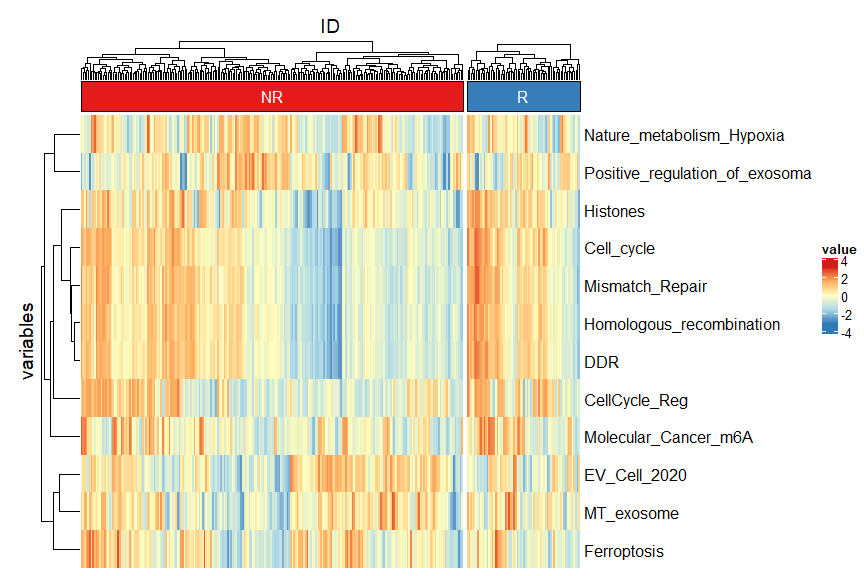

    #> [1] ">>>  Processing signature: io_biomarkers"

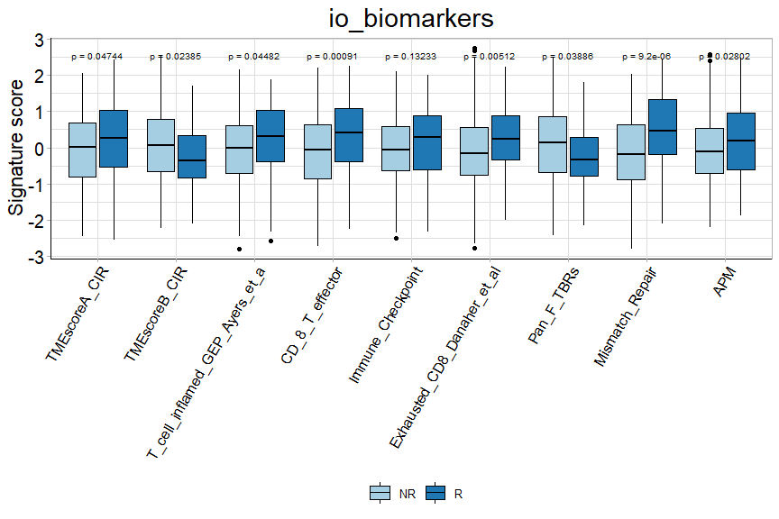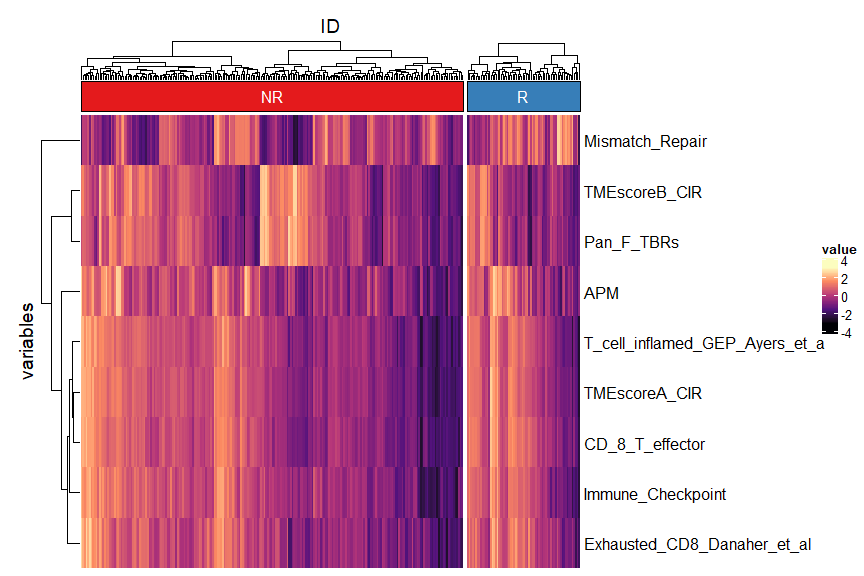

    #> [1] ">>>  Processing signature: immu_suppression"

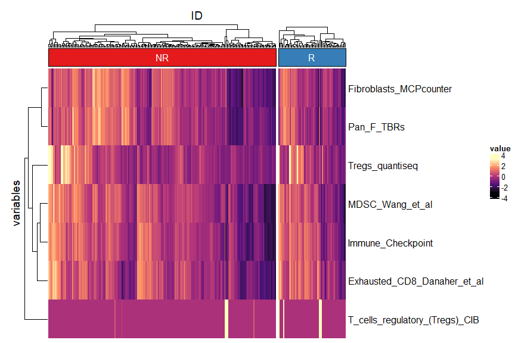

``` r
head(res,n=10)
#> NULL
```

### 4.4 Estemate the expression of response relevant signature genes.

``` r

imvigor210_eset[1:5,1:6]
#>              SAMf2ce197162ce SAM698d8d76b934 SAMc1b27bc16435 SAM85e41e7f33f9
#> LOC100093631       3.1009398       2.8207636       3.7058993      2.81012848
#> LOC100126784      -2.6237747      -4.2560520      -5.4104447     -2.07600356
#> LOC100128108      -1.5017841       0.5200520      -0.7665885     -2.07600356
#> LOC100128288      -0.3361981      -1.2204281      -1.9510131     -1.25886761
#> LOC100128361       0.2545468       0.2923847      -0.2009913     -0.02537748
#>              SAMf275eb859a39 SAM7f0d9cc7f001
#> LOC100093631       4.0102463      5.24697867
#> LOC100126784      -3.6376118     -2.23243417
#> LOC100128108      -1.9495558      0.08949393
#> LOC100128288       0.3320146     -0.33431378
#> LOC100128361       0.7698920     -1.16830383

res<-iobr_cor_plot(pdata_group = pdata_group,
                   id1 = "ID",
                   feature_data = imvigor210_eset,
                   id2 = "ID",
                   target= NULL,
                   group = "BOR_binary",
                   is_target_continuous = FALSE,
                   padj_cutoff = 1,
                   index = 1,
                   category = "gene",
                   signature_group =signature_collection[c(1:2,4)],
                   ProjectID = "IMvigor210",
                   palette_box = "paired1",
                   palette_corplot = "pheatmap",
                   palette_heatmap = 4,
                   feature_limit = 26,
                   character_limit = 30,
                   show_heatmap_col_name = FALSE,
                   show_col = FALSE,
                   show_plot = TRUE)
#> [1] ">>>  Processing signature: CD_8_T_effector"
```

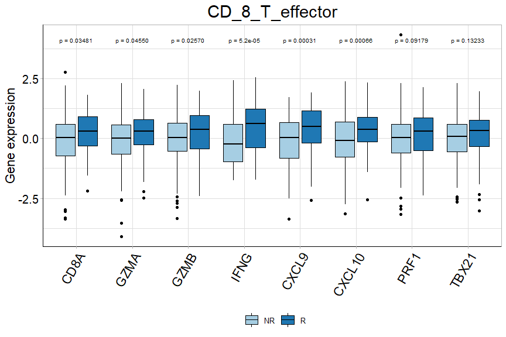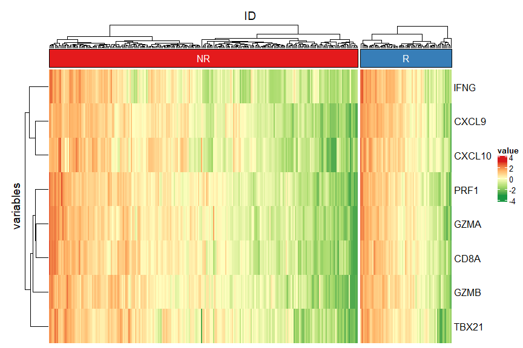

    #> [1] ">>>  Processing signature: DDR"

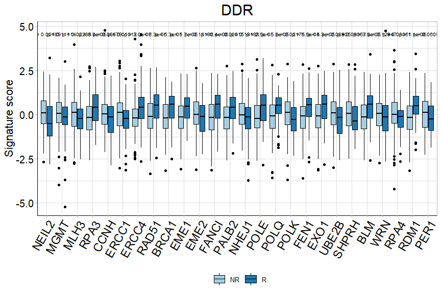

    #> [1] ">>>  Processing signature: Immune_Checkpoint"

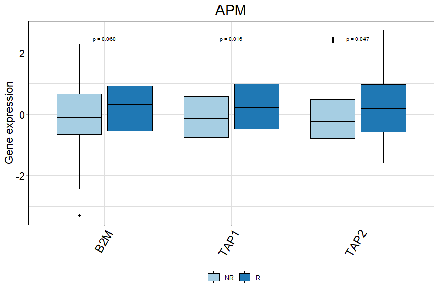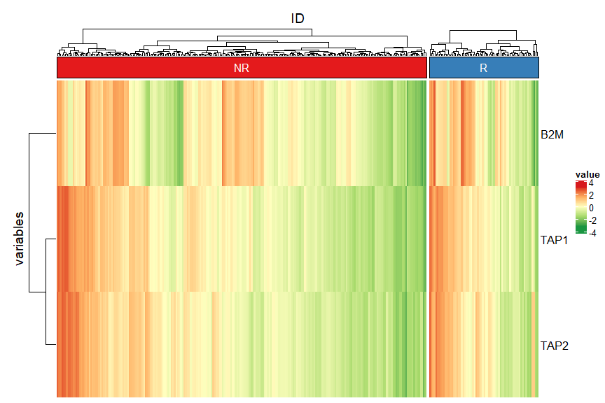

``` r
head(res,n=10)
#> NULL
```

## 5 Analyze signatures relevant to target signature.

### 5.1 Construct `pdata_group`as a phenotype data frame of patients.

``` r
# The data have been saved in `imvigor210_pdata`.
head(imvigor210_pdata)
#> # A tibble: 6 x 12
#>   ID    BOR   BOR_binary OS_days OS_status Mutation_Load Neo_antigen_Load
#>   <chr> <chr> <chr>      <chr>   <chr>     <chr>         <chr>           
#> 1 SAM0~ NA    NA         57.166~ 1         NA            NA              
#> 2 SAM0~ SD    NR         469.15~ 1         18            4.6862745099999~
#> 3 SAM0~ PD    NR         263.16~ 1         1             0.31372549      
#> 4 SAM0~ PD    NR         74.907~ 1         44            6.1960784310000~
#> 5 SAM0~ NA    NA         20.698~ 0         50            NA              
#> 6 SAM0~ SD    NR         136.01~ 1         2             1.4705882349999~
#> # ... with 5 more variables: CD_8_T_effector <dbl>, Immune_Checkpoint <dbl>,
#> #   Pan_F_TBRs <chr>, Mismatch_Repair <chr>, TumorPurity <dbl>
pdata_group<-as.data.frame(imvigor210_pdata[,c("ID","Pan_F_TBRs")])
pdata_group$Pan_F_TBRs<-scale(as.numeric(pdata_group$Pan_F_TBRs))
head(pdata_group)
#>                ID Pan_F_TBRs
#> 1 SAM00b9e5c52da9  0.2681507
#> 2 SAM0257bbbbd388  0.4618378
#> 3 SAM025b45c27e05 -0.8229645
#> 4 SAM032c642382a7 -0.4156874
#> 5 SAM04c589eb3fb3  9.0208975
#> 6 SAM0571f17f4045 -0.4462966
```

### 5.2 Analyze Pan-F-TBRs relevant signatures.

`Pan-F-TBRs` is an immune-exclusion signature published in Nature in
2018: S. Mariathasan et al., TGFbeta attenuates tumour response to PD-L1
blockade by contributing to exclusion of T cells. Nature 554, 544-548
(2018). the Pan-F-TBRs score obtained could be used to batch analyze and
visualize the interaction between this immune-exclusion signature and
other interested `signatures` , as well as its significant `cell
fractions`, and to further explore other biomarkers may impact
corresponding biological process.

``` r
res<-iobr_cor_plot(pdata_group = pdata_group,
                   id1 = "ID",
                   feature_data = imvigor210_sig,
                   id2 = "ID",
                   target= "Pan_F_TBRs",
                   group = "group3",
                   is_target_continuous = TRUE,
                   padj_cutoff = 1,
                   index = 1,
                   category = "signature",
                   signature_group =sig_group[1:2],
                   ProjectID = "IMvigor210",
                   palette_box = "set2",
                   palette_corplot = "pheatmap",
                   palette_heatmap = 2,
                   feature_limit = 26,
                   character_limit = 30,
                   show_heatmap_col_name = FALSE,
                   show_col = FALSE,
                   show_plot = TRUE)
#> [1] ">>>  Processing signature: tumor_signature"
```

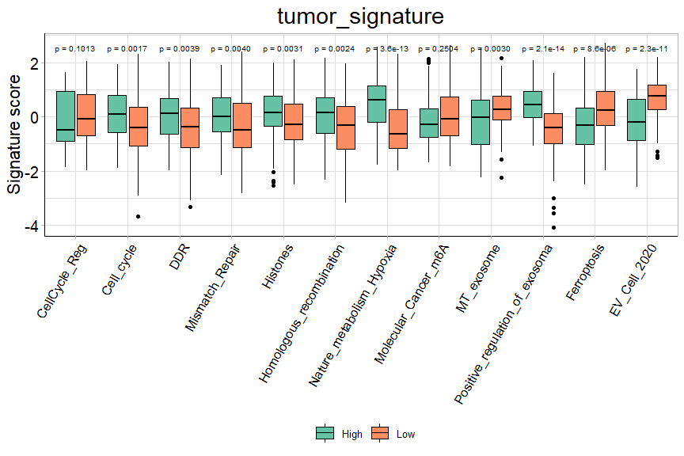

    #> [1] ">>>  Processing signature: EMT"

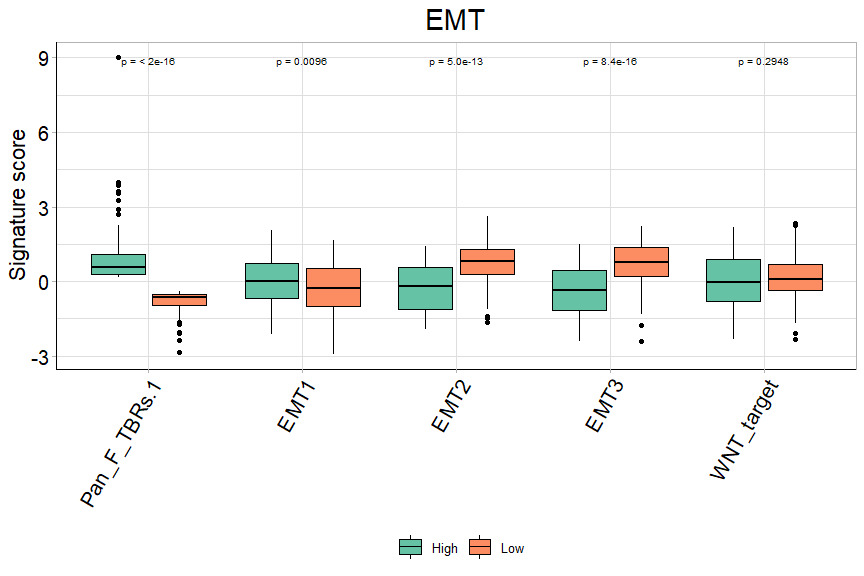

``` r
head(res,n=10)
#>                                    sig_names      p.value  statistic
#> 1                                       EMT3 1.338629e-21 -0.4815180
#> 2  Positive_regulation_of_exosomal_secretion 9.690275e-18  0.4379495
#> 3                                       EMT2 4.302414e-17 -0.4299882
#> 4                               EV_Cell_2020 6.950014e-16 -0.4145423
#> 5                  Nature_metabolism_Hypoxia 7.700609e-15  0.4005160
#> 6                                Ferroptosis 2.266934e-06 -0.2503045
#> 7                                   Histones 7.137085e-05  0.2112562
#> 8                                 Cell_cycle 7.390713e-05  0.2108234
#> 9                   Homologous_recombination 9.268569e-05  0.2079956
#> 10                           Mismatch_Repair 2.065444e-04  0.1976687
#>           p.adj log10pvalue stars
#> 1  2.141806e-20   20.873340  ****
#> 2  7.752220e-17   17.013664  ****
#> 3  2.294621e-16   16.366288  ****
#> 4  2.780005e-15   15.158014  ****
#> 5  2.464195e-14   14.113475  ****
#> 6  6.045158e-06    5.644561  ****
#> 7  1.478143e-04    4.146479  ****
#> 8  1.478143e-04    4.131314  ****
#> 9  1.647746e-04    4.032987  ****
#> 10 3.196548e-04    3.684987   ***
```

### 5.3 Analyze the immune cell infiltration lanscape related to Pan-F-TBRs.

``` r
names(sig_group)
#>  [1] "tumor_signature"        "EMT"                    "io_biomarkers"         
#>  [4] "immu_microenvironment"  "immu_suppression"       "immu_exclusion"        
#>  [7] "immu_exhaustion"        "TCR_BCR"                "tme_signatures1"       
#> [10] "tme_signatures2"        "Bcells"                 "Tcells"                
#> [13] "DCs"                    "Macrophages"            "Neutrophils"           
#> [16] "Monocytes"              "CAFs"                   "NK"                    
#> [19] "tme_cell_types"         "CIBERSORT"              "MCPcounter"            
#> [22] "EPIC"                   "xCell"                  "quanTIseq"             
#> [25] "ESTIMATE"               "IPS"                    "TIMER"                 
#> [28] "fatty_acid_metabolism"  "hypoxia_signature"      "cholesterol_metabolism"
#> [31] "Metabolism"             "hallmark"               "hallmark1"             
#> [34] "hallmark2"              "hallmark3"              "Rooney_et_al"          
#> [37] "Bindea_et_al"           "Li_et_al"               "Peng_et_al"
res<-iobr_cor_plot(pdata_group = pdata_group,
                   id1 = "ID",
                   feature_data = imvigor210_sig,
                   id2 = "ID",
                   target= "Pan_F_TBRs",
                   group = "group3",
                   is_target_continuous = TRUE,
                   padj_cutoff = 1,
                   index = 1,
                   category = "signature",
                   signature_group =sig_group[20:24],
                   ProjectID = "IMvigor210",
                   palette_box = "jco",
                   palette_corplot = "pheatmap",
                   palette_heatmap = 3,
                   feature_limit = 26,
                   character_limit = 30,
                   show_heatmap_col_name = FALSE,
                   show_col = FALSE,
                   show_plot = TRUE)
#> [1] ">>>  Processing signature: CIBERSORT"
```

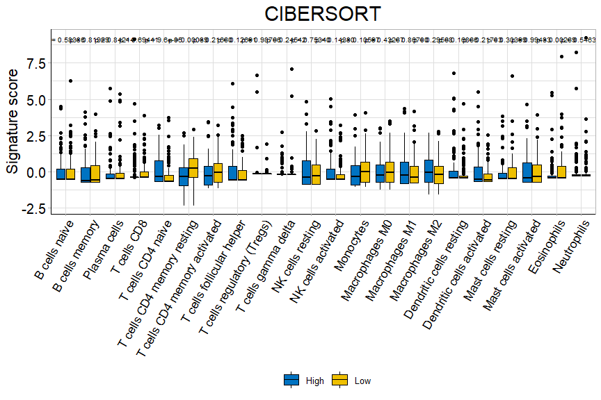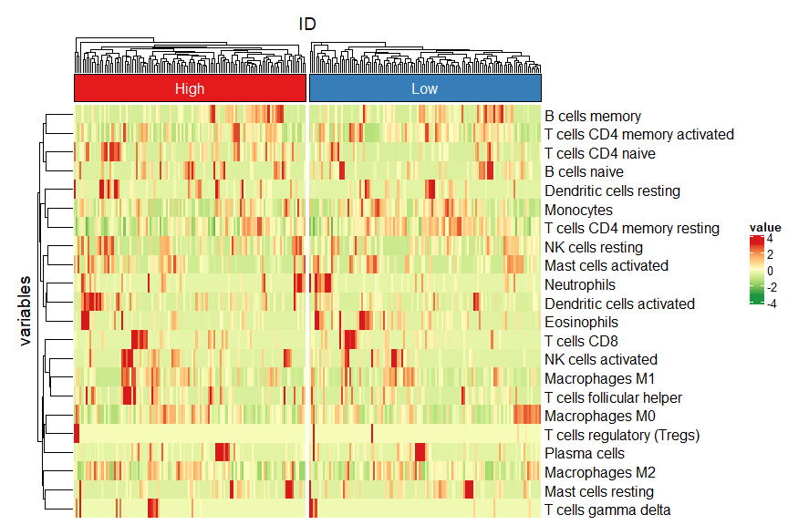

    #> [1] ">>>  Processing signature: MCPcounter"

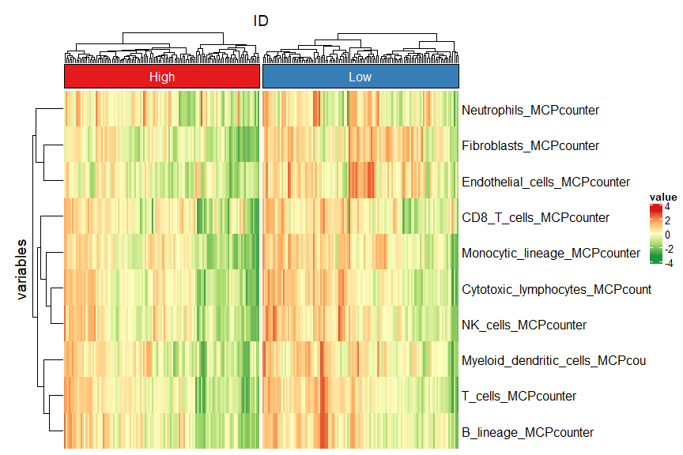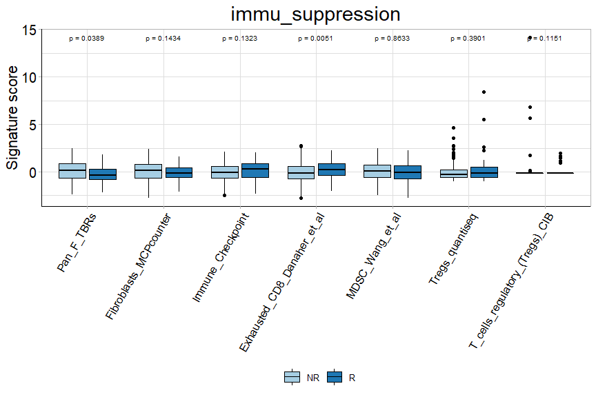

    #> [1] ">>>  Processing signature: EPIC"


    #> [1] ">>>  Processing signature: xCell"

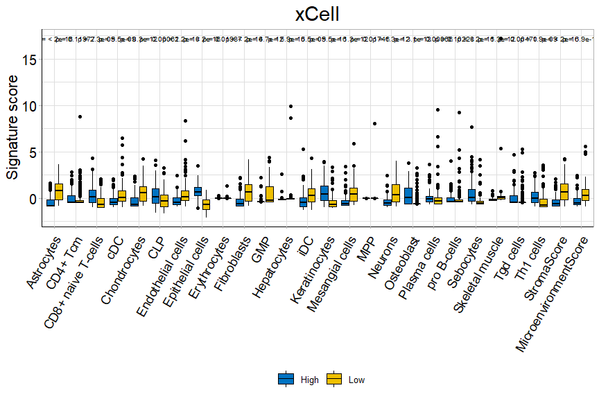

    #> [1] ">>>  Processing signature: quanTIseq"


``` r
head(res,n=10)
#>                 sig_names      p.value  statistic        p.adj log10pvalue
#> 1  Epithelial_cells_xCell 8.394285e-42  0.6418794 9.905256e-40    41.07602
#> 2         Sebocytes_xCell 1.306744e-26  0.5301168 7.709789e-25    25.88381
#> 3        Astrocytes_xCell 8.939503e-26 -0.5225389 3.516204e-24    25.04869
#> 4       StromaScore_xCell 7.309004e-24 -0.5044336 2.156156e-22    23.13614
#> 5       Fibroblasts_xCell 1.660269e-23 -0.5009376 3.918234e-22    22.77982
#> 6     Keratinocytes_xCell 7.307363e-21  0.4736650 1.437115e-19    20.13624
#> 7  Fibroblasts_MCPcounter 5.369128e-18 -0.4410461 9.050816e-17    17.27010
#> 8   Mesangial_cells_xCell 4.470877e-16 -0.4170451 5.917085e-15    15.34961
#> 9           Neurons_xCell 4.513031e-16 -0.4169920 5.917085e-15    15.34553
#> 10       Osteoblast_xCell 5.672853e-16  0.4156968 6.693967e-15    15.24620
#>    stars
#> 1   ****
#> 2   ****
#> 3   ****
#> 4   ****
#> 5   ****
#> 6   ****
#> 7   ****
#> 8   ****
#> 9   ****
#> 10  ****
```

## 6 Serach for mutations related to signature

### 6.1 Mutation matrix using MAF data format.

MAF data was obtained from [UCSC Xena
website](https://api.gdc.cancer.gov/data/c06465a3-50e7-46f7-b2dd-7bd654ca206b)

``` r
help("make_mut_matrix")

maf_file<-"TCGA.STAD.mutect.c06465a3-50e7-46f7-b2dd-7bd654ca206b.DR-10.0.somatic.maf"
# Each gene of every samples is categorized as binary variables(mutation or non-mutation) in the MAF data. 
mut_list<-make_mut_matrix(maf = maf_file,
                          isTCGA = T, 
                          category = "multi")
#> -Reading
#> -Validating
#> --Removed 2 duplicated variants
#> --Using only `Somatic` variants from Mutation_Status. Set useAll = TRUE to include everything.-Silent variants: 70966 
#> -Summarizing
#> --Possible FLAGS among top ten genes:
#>   TTN
#>   MUC16
#>   SYNE1
#>   FLG
#> -Processing clinical data
#> --Missing clinical data
#> -Finished in 11.8s elapsed (11.6s cpu) 
#>        Frame_Shift_Del        Frame_Shift_Ins           In_Frame_Del 
#>                  18418                   4461                    692 
#>           In_Frame_Ins      Missense_Mutation      Nonsense_Mutation 
#>                    268                 109668                   6011 
#>       Nonstop_Mutation            Splice_Site Translation_Start_Site 
#>                    107                   2445                    106 
#>    DEL    INS    SNP 
#>  19387   4900 117889
#> Aggregation function missing: defaulting to length
#> Aggregation function missing: defaulting to length
#> Aggregation function missing: defaulting to length
#> Aggregation function missing: defaulting to length
# If "multi" is set in above "category" parameter,four data frames will be returned, which evaluate all the mutations of every gene or estimate only SNP, indel and frameshift as follow:
names(mut_list)
#> [1] "all"        "snp"        "indel"      "frameshift"
mut_list$all[1:5,1:10]
#>              A1BG A1CF A2M A2ML1 A3GALT2 A4GALT A4GNT AAAS AACS AADAC
#> TCGA-3M-AB46    1    1   0     0       0      0     0    0    0     0
#> TCGA-3M-AB47    0    0   0     0       0      0     0    0    0     0
#> TCGA-B7-5816    0    0   1     0       0      0     0    1    0     0
#> TCGA-B7-5818    0    0   0     0       0      0     0    0    0     0
#> TCGA-B7-A5TI    0    0   0     0       0      0     0    0    0     0
```

### 6.2 sig\_group() function for batch visualization of response associated signatures.

``` r
# Transform the mutation data into categorical variable matrix.----------
mut<-mut_list$snp
max(mut)
#> [1] 22
# If the maximum of mutation counts of a single gene of a person in is over 4, the mutation data would be standardized according to following principles.
# mut[mut>=3&mut<=5]<-3
# mut[mut>5]<-4
##########################
res<-find_mutations(mutation_matrix = mut, 
                    signature_matrix = tcga_stad_sig,
                    id_signature_matrix = "ID",
                    signature = "CD_8_T_effector",
                    min_mut_freq = 0.01,
                    plot = TRUE,
                    method = "multi",
                    save_path = paste0("CD_8_T_effector-relevant-mutations"),
                    palette = "jama",
                    show_plot = T)
#> [1] ">>>> Result of Cuzick Test"
#>             p.value  names statistic adjust_pvalue
#> PIK3CA 3.148160e-09 PIK3CA  5.923680  1.574080e-06
#> SPEG   9.070928e-05   SPEG  3.914187  2.267732e-02
#> TCHH   4.409469e-04   TCHH  3.514281  5.740100e-02
#> PLXNA4 5.420662e-04 PLXNA4  3.459059  5.740100e-02
#> ARID1A 5.805905e-04 ARID1A  3.440523  5.740100e-02
#> WDFY3  6.888120e-04  WDFY3  3.393994  5.740100e-02
#> GTF3C1 8.120095e-04 GTF3C1  3.348668  5.800068e-02
#> DMD    1.675467e-03    DMD  3.142439  6.972915e-02
#> CR1    1.775997e-03    CR1  3.125340  6.972915e-02
#> EP300  2.042083e-03  EP300  3.084043  6.972915e-02
#> [1] ">>>> Result of Wilcoxon test"
#>             p.value  names statistic adjust_pvalue
#> PIK3CA 1.921035e-10 PIK3CA      4125  9.605174e-08
#> TCHH   1.961642e-05   TCHH      3312  4.904106e-03
#> SPEG   3.532750e-05   SPEG      1947  5.887916e-03
#> LRP1   7.511741e-05   LRP1      2649  9.389676e-03
#> WDFY3  1.257659e-04  WDFY3      2964  1.257659e-02
#> ARID1A 2.468609e-04 ARID1A      4878  2.057174e-02
#> PLXNA4 4.215809e-04 PLXNA4      3638  3.011292e-02
#> ANK3   6.399572e-04   ANK3      4446  3.933979e-02
#> DMD    7.364591e-04    DMD      5311  3.933979e-02
#> PLEC   8.026240e-04   PLEC      5562  3.933979e-02
```

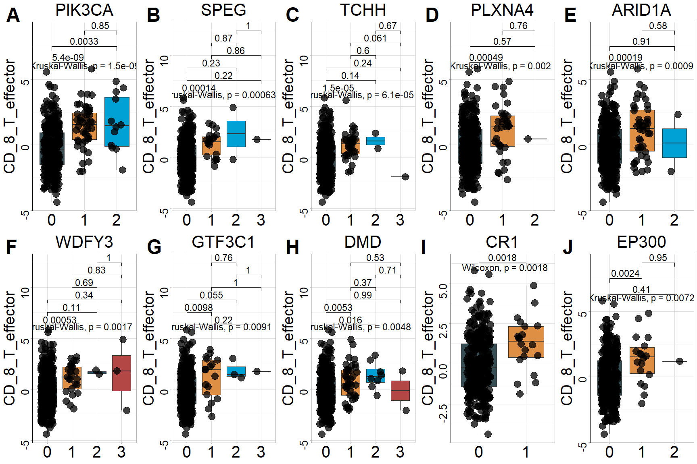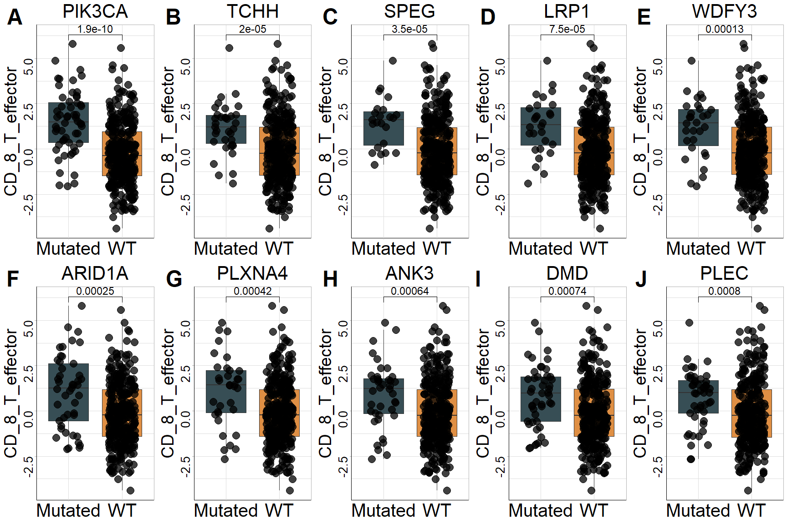

## 7 Other methods for batch analysis

IOBR provide multiple batch analytical functions for statistical
analysis, data operation and transformation. Batch survival analysis,
for example, could batch analyze the best cutoff value for subsequent
batch survival analysis, varied batch statistical tests, etc.

### 7.1 subgroup survival analyses

``` r

##loading data and filter NA
data(subgroup_data)
input <- subgroup_data %>% 
   filter(time > 0) %>% 
   filter(!is.na(status)) %>% 
   filter(!is.na(AJCC_stage))
dim(input)
#> [1] 1333    7
##for binary variable
data1 <- subgroup_survival(pdata = input,
                           time ="time", 
                           status = "status",
                           variable = c("ProjectID", "AJCC_stage"), 
                           object ="score_binary" )
data1
#>                         P     HR CI_low_0.95 CI_up_0.95
#> ProjectID_Dataset1 0.0000 3.0901      1.8648     5.1205
#> ProjectID_Dataset2 0.0023 2.1049      1.3057     3.3931
#> ProjectID_Dataset3 0.1397 2.4431      0.7467     7.9940
#> ProjectID_Dataset4 0.0024 2.0312      1.2854     3.2097
#> ProjectID_Dataset5 0.0000 4.6375      2.3759     9.0520
#> AJCC_stage_1       0.2533 1.7307      0.6753     4.4354
#> AJCC_stage_2       0.0000 2.9450      1.7858     4.8569
#> AJCC_stage_3       0.0000 2.2821      1.5551     3.3490
#> AJCC_stage_4       0.0510 1.5941      0.9979     2.5466
```

### 7.2 Batch survival analysis

``` r
data("pdata_sig_tme")

input <- pdata_sig_tme %>% 
   filter(time > 0) %>% 
   filter(!is.na(status))
res <- batch_surv(pdata = input, variable = c(277:ncol(input)), time = "time",status = "status")
res<-res[order(res$P,decreasing = F),]
head(res,n=10)
#>                                                                P      HR
#> KEGG_COMPLEMENT_AND_COAGULATION_CASCADES                  0.0002     Inf
#> GPAGs_PCA                                                 0.0018  1.6844
#> EMT2_ssGSEA                                               0.0037 16.9820
#> KEGG_ECM_RECEPTOR_INTERACTION                             0.0047     Inf
#> GPAGs_ssGSEA                                              0.0048     Inf
#> EMT2_PCA                                                  0.0057  1.2615
#> TMEscoreB_ssGSEA                                          0.0100  8.4856
#> KEGG_FOCAL_ADHESION                                       0.0100     Inf
#> TMEscoreB_PCA                                             0.0102  1.2386
#> KEGG_ARRHYTHMOGENIC_RIGHT_VENTRICULAR_CARDIOMYOPATHY_ARVC 0.0123     Inf
#>                                                           CI_low_0.95
#> KEGG_COMPLEMENT_AND_COAGULATION_CASCADES                          Inf
#> GPAGs_PCA                                                      1.2144
#> EMT2_ssGSEA                                                    2.5081
#> KEGG_ECM_RECEPTOR_INTERACTION                                 14.9838
#> GPAGs_ssGSEA                                                   4.9008
#> EMT2_PCA                                                       1.0700
#> TMEscoreB_ssGSEA                                               1.6660
#> KEGG_FOCAL_ADHESION                                           16.0205
#> TMEscoreB_PCA                                                  1.0520
#> KEGG_ARRHYTHMOGENIC_RIGHT_VENTRICULAR_CARDIOMYOPATHY_ARVC      5.0278
#>                                                           CI_up_0.95
#> KEGG_COMPLEMENT_AND_COAGULATION_CASCADES                         Inf
#> GPAGs_PCA                                                     2.3365
#> EMT2_ssGSEA                                                      Inf
#> KEGG_ECM_RECEPTOR_INTERACTION                                    Inf
#> GPAGs_ssGSEA                                                     Inf
#> EMT2_PCA                                                      1.4873
#> TMEscoreB_ssGSEA                                             43.2192
#> KEGG_FOCAL_ADHESION                                              Inf
#> TMEscoreB_PCA                                                 1.4583
#> KEGG_ARRHYTHMOGENIC_RIGHT_VENTRICULAR_CARDIOMYOPATHY_ARVC        Inf
```

## References

DQ Zeng, ZL Ye, RF Shen, Y Xiong, JN Wu, WJ Qiu WJ Liao.

IOBR: Comprehensive analysis of tumor microenvironment and signatures
for immuno-oncology.

## Contact

E-mail any questions to <dongqiangzeng0808@gmail.com>
