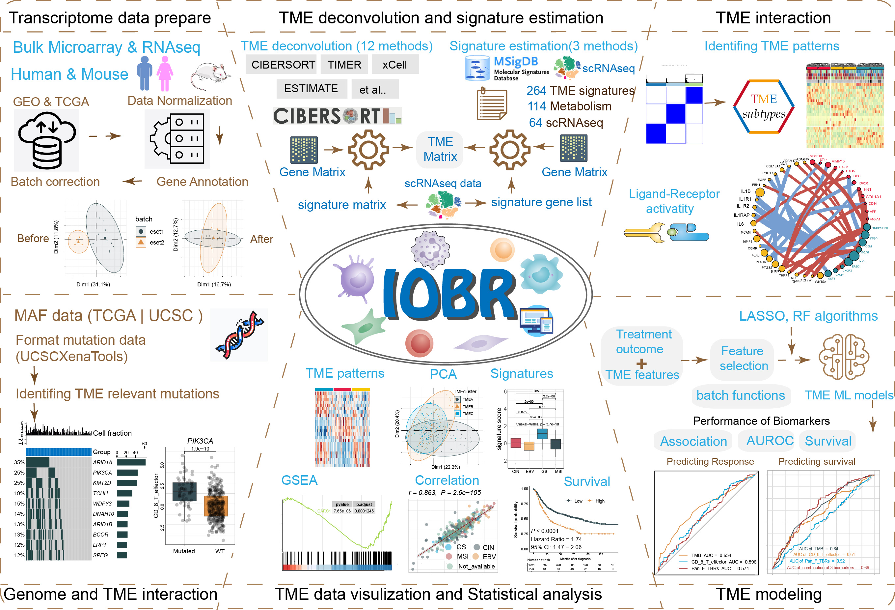

# Multidimensional Decoding Tumor Microenvironment for Immuno-Oncology Research

## Overview

IOBR is the acronym for [Immuno-Oncology Biological
Research](https://github.com/IOBR/IOBR) to perform multi-omics
immuno-oncology biological research to decipher tumour microenvironment
and signatures for clinical translation.

## Module Introduction

IOBR encompasses six functional modules:

- ***Transcriptome data prepare module*** : pre-procession of
  transcriptome data, as well as pertinent batch statistical analyses;
- ***TME deconvolution and signature estimation module*** : estimation
  of signature scores and identification of phenotype relevant
  signatures, along with decoding immune contexture;
- ***TME interaction module*** : clustering TME characteristics and
  analyzing receptor-ligand interactions;
- ***Genome and TME interaction module*** : analysis of signature
  associated mutations;
- ***TME data visualization and Statistical analysis module*** : visual
  representation and statistical examination of TME data;
- ***TME modeling module*** : fast model construction and the assessment
  of model performance.

## Methodology

IOBR integrates eight open-source deconvolution methodologies:
***CIBERSORT*** , ***ESTIMATE*** , ***quanTIseq*** , ***TIMER*** ,
***IPS*** , ***MCPCounter*** , ***xCell*** and ***EPIC*** . In addition,
323 published signature gene sets have been collected by IOBR covering
***tumour microenvironment*** , ***tumour metabolism*** , ***m6A*** ,
***exosomes*** , ***microsatellite instability*** and ***tertiary
lymphoid structure***. IOBR has used three computational methods to
calculate the signature score, including ***PCA*** , ***z-score*** and
***ssGSEA***.

## Visualization

IOBR integrates visualization function, including ***boxplots*** ,
***heatmaps*** , ***percentage bar charts*** , ***scatter plots*** ,
***KM plot*** , ***PCA plot*** etc.

## Tutorial

Please go to <https://iobr.github.io/book/> for the full tutorial.

## Citation

If you use [IOBR](https://github.com/IOBR/IOBR) in published research,
please cite:

***Zeng D***, Fang Y, …, Liao W (2024) IOBR2: Multidimensional Decoding
of Tumor Microenvironment for Immuno-Oncology Research. ***Cell Reports
Methods***\_. 4(9):100910.
<doi:%5B10.1016/j.crmeth.2024.100910>\](<https://doi.org/10.1016/j.crmeth.2024.100910>)

***Zeng D***, Ye Z, Shen R, Yu G, Wu J, Xiong Y,…, Liao W (2021) IOBR:
Multi-Omics Immuno-Oncology Biological Research to Decode Tumor
Microenvironment and Signatures. ***Frontiers in Immunology***.
12:687975.
<doi:%5B10.3389/fimmu.2021.687975>\](<https://www.frontiersin.org/journals/immunology/articles/10.3389/fimmu.2021.687975/full>)

## Feedback and helps

Should any queries or concerns arise, consider checking the [IOBR
primary webpage](https://github.com/IOBR/IOBR) initially. The majority
of your issues are likely already addressed there. Supposing you’ve
detected a fault, adhere to the instructions, and offer a replicable
instance to be showcased on the [github issue
tracker](https://github.com/IOBR/IOBR/issues).
