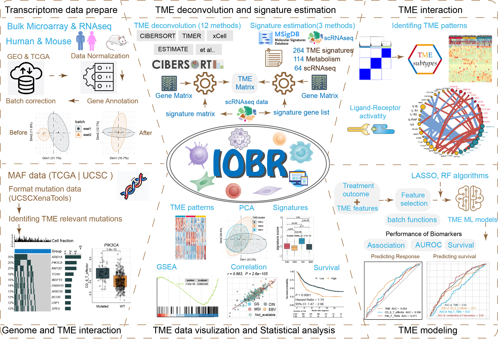

```{r style, echo=FALSE, results="asis", message=FALSE}
knitr::opts_chunk$set(
  tidy = FALSE,
  warning = FALSE,
  message = FALSE
)
```

# Overview

IOBR is the acronym for [Immuno-Oncology Biological Research](https://github.com/IOBR/IOBR)  to perform multi-omics immuno-oncology biological research to decipher tumour microenvironment and signatures for clinical translation.


# Module Introduction

<right>



IOBR encompasses six functional modules: 


+ __*Transcriptome data prepare module*__ : pre-procession of transcriptome data, as well as pertinent batch statistical analyses; 
+ __*TME deconvolution and signature estimation module*__ : estimation of signature scores and identification of phenotype relevant signatures, along with decoding immune contexture; 
+ __*TME interaction module*__ : clustering TME characteristics and analyzing receptor-ligand interactions; 
+ __*Genome and TME interaction module*__ : analysis of signature associated mutations; 
+ __*TME data visualization and Statistical analysis module*__ : visual representation and statistical examination of TME data; 
+ __*TME modeling module*__ : fast model construction and the assessment of model performance.

<center>


# Methodology

IOBR integrates eight open-source deconvolution methodologies: __*CIBERSORT*__ , __*ESTIMATE*__ , __*quanTIseq*__ , __*TIMER*__ , __*IPS*__ , __*MCPCounter*__ , __*xCell*__ and __*EPIC*__ . In addition, 323 published signature gene sets have been collected by IOBR covering __*tumour microenvironment*__ , __*tumour metabolism*__ , __*m6A*__ , __*exosomes*__ , __*microsatellite instability*__ and __*tertiary lymphoid structure*__. IOBR has used three computational methods to calculate the signature score, including __*PCA*__ , __*z-score*__ and __*ssGSEA*__.

# Visualization

IOBR integrates visualization function, including __*boxplots*__ , __*heatmaps*__ , __*percentage bar charts*__ , __*scatter plots*__ , __*KM plot*__ , __*PCA plot*__ etc.

# Vignette

Please go to <https://iobr.github.io/book/> for the full vignette.

# Citation

If you use [IOBR](https:) in published research, please cite:


__*Zeng D*__, Fang Y, …, Liao W (2024) IOBR2: Multidimensional Decoding of Tumor Microenvironment for Immuno-Oncology Research.**_bioRxiv_**.2024.01.13.575458
doi:[10.1101/2024.01.13.575484](https://www.biorxiv.org/content/10.1101/2024.01.13.575484v2.full.pdf)


__*Zeng D*__, Ye Z, Shen R, Yu G, Wu J, Xiong Y,…, Liao W (2021) IOBR: Multi-Omics Immuno-Oncology Biological Research to Decode Tumor Microenvironment and Signatures. **_Frontiers in Immunology_**. 12:687975.
doi:[10.3389/fimmu.2021.687975](https://www.frontiersin.org/journals/immunology/articles/10.3389/fimmu.2021.687975/full)


# Feedback and helps

Should any queries or concerns arise, consider checking the [IOBR primary webpage](https://github.com/IOBR/IOBR) initially. The majority of your issues are likely already addressed there. Supposing you've detected a fault, adhere to the instructions, and offer a replicable instance to be showcased on the [github issue tracker](https://github.com/IOBR/IOBR/issues). In the case of queries, kindly make your submission to the [Bioconductor help forum](https://support.bioconductor.org/) and label your entry with *IOBR*.
