<!-- README.md is generated from README.Rmd. Please edit that file -->

# IOBR: Immuno-Oncology Biological Research

IOBR is an R package to perform comprehensive analysis of tumor
microenvironment and signatures for immuno-oncology.

# CONTENTS

  - [1. Introduction](#Section.1)
  - [2. Installation](#Section.2)
  - [3. Data Scenario and Preparation](#Section.3)
      - [3.1 Gene-expression Data Derived from RNAseq](#Section.3.1)
      - [3.2 Gene-expression Data Derived from Array](#Section.3.2)
  - [4. IOBR Pipeline Introduction](#Section.4)
  - [5. Functional Modules](#Section.5)
      - [5.1 Signature And TME Deconvolution Module](#Section.5.1)
          - [5.1.1 Signature Estimation](#Section.5.1.1)
              - [1) Signature collection](#Section.5.1.1.1)
              - [2) Methods for signature calculation](#Section.5.1.1.2)
          - [5.1.2 Signatures Derived From Single Cell
            RNAseq](#Section.5.1.2)
              - [1) Methods for signature estimation](#Section.5.1.2.1)
              - [2) Signature-phenotype correlation](#Section.5.1.2.2)
          - [5.1.3 Available Methods to Decode TME
            Contexture](#Section.5.1.3)
              - [1) Method 1: CIBERSORT](#Section.5.1.3.1)
              - [2) Method 2: EPIC](#Section.5.1.3.2)
              - [3) Method 3: MCPcounter](#%20Section.5.1.3.3)
              - [4) Method 4: xCELL](#Section.5.1.3.4)
              - [5) Method 5: ESTIMATE](#Section.5.1.3.5)
              - [6) Method 6: TIMER](#%20Section.5.1.3.6)
              - [7) Method 7: quanTIseq](#Section.5.1.3.7)
              - [8) Method 8: IPS](#Section.5.1.3.8)
              - [9) Combination of above deconvolution
                results](#Section.5.1.3.9)  
      - [5.2 Phenotype Module](#Section.5.2)
          - [5.2.1 Explore Phenotype Relevant
            Signatures](#Section.5.2.1)
              - [1) Load data](#Section.5.2.1.1)
              - [2) Signature groups](#Section.5.2.1.2)
              - [3) Identify phenotype relevant
                signatures](#Section.5.2.1.3)
              - [4) Visualize phenotype relevant signature
                genes](#Section.5.2.1.4)
              - [5) Estimate lncRNA associated
                signatures](#Section.5.2.1.5)
          - [5.2.2 Identify Signatures Relevant to Targeted
            Signature](#Section.5.2.2)
              - [1) Construct phenotype group](#Section.5.2.2.1)
              - [2) Analyze Pan-F-TBRs correlated
                signatures](#Section.5.2.2.2)
              - [3) Evaluate Pan-F-TBRs related TME cell
                infiltration](#Section.5.2.2.3)
          - [5.2.5 Batch Analyses and Visualization](#Section.5.2.3)
              - [1) Batch survival analyses](#Section.5.2.3.1)
              - [2) Subgroup survival analyses](#Section.5.2.3.2)
              - [3) Batch statistical analyses](#Section.5.2.3.3)
              - [4) Batch analyses of Pearson’s correlation
                coefficient](#Section.5.2.3.4)  
      - [5.3 Mutation Module](#Section.5.3)
          - [5.3.1 Load Mutation MAF data](#Section.5.3.1)
          - [5.3.2 Analyze Signature Associated
            Mutations](#Section.5.3.2)
      - [5.4 Model Construction Module](#Section.5.4)
  - [6. Demonstration of IOBR Pipeline with An Example
    Dataset](#Section.6)
  - [7. Summary](#Section.7)
  - [8. Session Information](#Section.8)
  - [9. Citing IOBR](#Section.9)
  - [REFERENCES](#Section.10)

# <a id="Section.1" style="color:#B7950B;">1. Introduction</a>

Recent advance in next generation sequencing has triggered the rapid
accumulation of publicly available multi-omics data<sup>1</sup>. The
application of integrated omics to exploring robust signatures for
clinical translation is increasingly highlighted in immuno-oncology,but
raises computational and biological challenges<sup>2</sup>. This
vignette aims to demonstrate how to utilize the package named IOBR to
perform multi-omics immuno-oncology biological research to decode tumor
microenvironment and signatures for clinical translation. This R package
integrates 8 published methodologies for decoding tumor microenvironment
(TME) contexture: `CIBERSORT`, `TIMER`, `xCell`, `MCPcounter`,
`ESITMATE`, `EPIC`, `IPS`, `quanTIseq`. Moreover, 255 published
signature gene sets were collected by IOBR, involving tumor
microenvironment, tumor metabolism, m6A, exosomes, microsatellite
instability, and tertiary lymphoid structure. Run the function
`signature_collection_citation` to attain the source papers and the
function `signature_collection` returns the detail signature genes of
all given signatures. Subsequently, IOBR adopts three computational
methods to calculate the signature score, comprising `PCA`,`z-score`,
and `ssGSEA`. To note, IOBR collected and employed multiple approaches
for variable transition, visualization, batch survival analysis, feature
selection, and statistical analysis. Batch analysis and visualization of
corresponding results is supported. The details of how IOBR works is
described below.

### Graphical abstract outlines the workflow of IOBR package.

<p align="center">


</p>

# <a id="Section.2" style="color:#B7950B;">2. Installation</a>

It is essential that you have R 3.6.3 or above already installed on your
computer or server. IOBR is a pipeline that utilizes many other R
packages that are currently available from CRAN, Bioconductor and
GitHub.

Before installing IOBR, please properly install all dependencies
including `tibble`, `survival`, `survminer`, `limma`, `limSolve`,
`GSVA`, `e1071`, `preprocessCore`, `ggplot2`, `ggpubr` and so on. It is
an easy way to install them by executing the following command in your R
session:

``` r
# options("repos"= c(CRAN="https://mirrors.tuna.tsinghua.edu.cn/CRAN/"))
# options(BioC_mirror="http://mirrors.tuna.tsinghua.edu.cn/bioconductor/")
if (!requireNamespace("BiocManager", quietly = TRUE)) install("BiocManager")
depens<-c('tibble', 'survival', 'survminer', 'sva', 'limma', "DESeq2","devtools",
          'limSolve', 'GSVA', 'e1071', 'preprocessCore', 'ggplot2', "biomaRt",
          'ggpubr', "devtools", "tidyHeatmap", "caret", "glmnet", "ppcor","timeROC","pracma")
for(i in 1:length(depens)){
  depen<-depens[i]
  if (!requireNamespace(depen, quietly = TRUE)) BiocManager::install(depen)
}

if (!requireNamespace("EPIC", quietly = TRUE))
  devtools::install_github("GfellerLab/EPIC", build_vignettes=TRUE)
if (!requireNamespace("MCPcounter", quietly = TRUE))
  devtools::install_github("ebecht/MCPcounter",ref="master", subdir="Source")
if (!requireNamespace("estimate", quietly = TRUE)){
  rforge <- "http://r-forge.r-project.org"
  install.packages("estimate", repos=rforge, dependencies=TRUE)
}
```

Then, you can start to install IOBR from github by typing the following
code into your R session:

``` r
if (!requireNamespace("remotes", quietly = TRUE)) install("remotes")
if (!requireNamespace("IOBR", quietly = TRUE))
  remotes::install_github("IOBR/IOBR",ref="master")
```

Load the IOBR package in your R session after the installation is
complete:

``` r
library(IOBR)
library(EPIC)
library(estimate) 
library(MCPcounter)
library(tidyverse)
library(tidyHeatmap)
library(maftools)
library(ggpubr)
library(ggplot2)
library(survival)
```

# <a id="Section.3" style="color:#B7950B;">3. Data Scenario and Preparation</a>

## <a id="Section.3.1" style="color:#B7950B;">3.1 Gene-expression Data Derived from RNAseq</a>

### Preparation of Gene-expression data derived from RNAseq.

For transcriptomic data of TCGA data sets, we strongly recommend user to
use [UCSCXenaTools](https://github.com/ropensci/UCSCXenaTools) R
package. Here, we download counts data of TCGA-STAD from
[UCSC](https://genome.ucsc.edu/) using UCSCXenaTools R package. If you
use it in published research, please cite: *Wang et al.*, (2019). The
UCSCXenaTools R package: a toolkit for accessing genomics data from UCSC
Xena platform, from cancer multi-omics to single-cell RNA-seq. Journal
of Open Source Software, 4(40), 1627,
<https://doi.org/10.21105/joss.01627>. If you are not online or can not
access to UCSC, we have prepared expression data of TCGA-STAD in IOBR
package.`data(eset_stad)` could be applied to loading gene expression
data.

``` r
if (!requireNamespace("UCSCXenaTools", quietly = TRUE))
    BiocManager::install("UCSCXenaTools")
library(UCSCXenaTools)
#> =========================================================================================
#> UCSCXenaTools version 1.3.4
#> Project URL: https://github.com/ropensci/UCSCXenaTools
#> Usages: https://cran.r-project.org/web/packages/UCSCXenaTools/vignettes/USCSXenaTools.html
#> 
#> If you use it in published research, please cite:
#> Wang et al., (2019). The UCSCXenaTools R package: a toolkit for accessing genomics data
#>   from UCSC Xena platform, from cancer multi-omics to single-cell RNA-seq.
#>   Journal of Open Source Software, 4(40), 1627, https://doi.org/10.21105/joss.01627
#> =========================================================================================
#>                               --Enjoy it--
# NOTE: This process may take a few minutes which depends on the internet connection speed. Please wait for its completion.
eset_stad<-XenaGenerate(subset = XenaCohorts =="GDC TCGA Stomach Cancer (STAD)") %>% 
  XenaFilter(filterDatasets    = "TCGA-STAD.htseq_counts.tsv") %>% 
  XenaQuery() %>%
  XenaDownload() %>% 
  XenaPrepare()
#> This will check url status, please be patient.
#> All downloaded files will under directory /tmp/Rtmp9OZ6DM.
#> The 'trans_slash' option is FALSE, keep same directory structure as Xena.
#> Creating directories for datasets...
#> Downloading TCGA-STAD.htseq_counts.tsv.gz
eset_stad[1:5,1:5]
#> # A tibble: 5 x 5
#>   Ensembl_ID `TCGA-D7-5577-0… `TCGA-D7-6818-0… `TCGA-BR-7958-0… `TCGA-D7-8572-0…
#>   <chr>                 <dbl>            <dbl>            <dbl>            <dbl>
#> 1 ENSG00000…            11.3             10.6             10.2             10.8 
#> 2 ENSG00000…             1                0                0                2   
#> 3 ENSG00000…            11.2              9.96            10.2             11.6 
#> 4 ENSG00000…             9.13             8.77             8.73            10.1 
#> 5 ENSG00000…             8.42             8.89             8.46             9.87
```

### Transform gene expression matrix into TPM format, and conduct subsequent annotation.

``` r

# Remove the version numbers in Ensembl ID.
eset_stad$Ensembl_ID<-substring(eset_stad$Ensembl_ID, 1, 15)
eset_stad<-column_to_rownames(eset_stad, var = "Ensembl_ID")
# Revert back to original format because the data from UCSC was log2(x+1)transformed.
eset_stad<-(2^eset_stad)+1

# In this process, *biomaRt* R package is utilized to acquire the gene length of each Ensembl ID and calculate the TPM of each sample. If identical gene symbols exists, these genes would be ordered by the mean expression levels. The gene symbol with highest mean expression level is selected and remove others.
# NOTE: This process may take a few minutes which depends on the internet connection speed. Please wait for its completion.
eset_stad<-count2tpm(countMat = eset_stad, idType = "Ensembl", org="hsa")
eset_stad[1:5,1:5]
#>         TCGA-D7-5577-01A TCGA-D7-6818-01A TCGA-BR-7958-01A TCGA-D7-8572-01A
#> MT-CO1          41168.66        104364.29         55792.50         71064.82
#> MT-CO3          36231.83         45850.89         36682.78         33767.40
#> MT-ND4          25999.46         44800.15         31554.70         39443.03
#> MT-CO2          33418.75         61079.13         36951.59         31441.07
#> MT-RNR2         34755.20         65345.57         26787.41         23654.63
#>         TCGA-VQ-A91Z-01A
#> MT-CO1          51781.74
#> MT-CO3          57959.58
#> MT-ND4          55387.51
#> MT-CO2          43161.95
#> MT-RNR2         49405.00
```

## <a id="Section.3.2" style="color:#B7950B;">3.2 Gene-expression Data Derived from Array</a>

### Obtain dataset from GEO [Gastric cancer:GSE100935](https://www.ncbi.nlm.nih.gov/pubmed/30045931) using GEOquery R package.

``` r
if (!requireNamespace("GEOquery", quietly = TRUE))
    BiocManager::install("GEOquery")
library("GEOquery")
# NOTE: This process may take a few minutes which depends on the internet connection speed. Please wait for its completion.
eset_geo<-getGEO(GEO     = "GSE100935",
                 getGPL  = F,
                 destdir = "./")

eset    <-eset_geo[[1]]
eset    <-exprs(eset)
eset[1:5,1:5]
#>           GSM2696792 GSM2696793 GSM2696794 GSM2696795 GSM2696796
#> 1007_s_at  10.261650  10.740100  10.694980  10.692940  10.565560
#> 1053_at     8.365080   8.463314   8.535923   8.091345   7.280246
#> 117_at      7.212391   5.832635   5.616512   8.090054   4.959763
#> 121_at      7.377803   7.549826   8.186557   7.459644   7.782259
#> 1255_g_at   6.699024   2.621356   2.422049   2.423371   2.603957
```

### Annotate genes in expression matrix and remove duplicate genes.

``` r
# Load the annotation file `anno_hug133plus2` in IOBR.
head(anno_hug133plus2)
#> # A tibble: 6 x 2
#>   probe_id  symbol 
#>   <fct>     <fct>  
#> 1 1007_s_at MIR4640
#> 2 1053_at   RFC2   
#> 3 117_at    HSPA6  
#> 4 121_at    PAX8   
#> 5 1255_g_at GUCA1A 
#> 6 1294_at   MIR5193
# Conduct gene annotation using `anno_hug133plus2` file; If identical gene symbols exists, these genes would be ordered by the mean expression levels. The gene symbol with highest mean expression level is selected and remove others. 

eset<-anno_eset(eset       = eset,
                annotation = anno_hug133plus2,
                symbol     = "symbol",
                probe      = "probe_id",
                method     = "mean")
eset[1:5, 1:5]
#>              GSM2696792 GSM2696793 GSM2696794 GSM2696795 GSM2696796
#> SH3KBP1        14.30308   14.56398   14.37668   14.47983   14.56702
#> RPL41          14.36095   14.32783   14.33181   14.34614   14.35773
#> LOC101928826   14.18638   14.38247   14.34530   14.26433   14.23477
#> EEF1A1         14.13245   14.15141   14.08980   14.05879   14.09277
#> B2M            14.17932   14.25636   14.01158   14.12871   14.05124
# Another annotation file `anno_illumina` is also provided by IOBR for convenient annotation of Illumina gene expression arrays  
head(anno_illumina)
#> # A tibble: 6 x 2
#>   probe_id     symbol   
#>   <fct>        <fct>    
#> 1 ILMN_1725881 LOC23117 
#> 2 ILMN_1910180 HS.575038
#> 3 ILMN_1804174 FCGR2B   
#> 4 ILMN_1796063 TRIM44   
#> 5 ILMN_1811966 LOC653895
#> 6 ILMN_1668162 DGAT2L3
```

# <a id="Section.4" style="color:#B7950B;">4. IOBR Pipeline Introduction</a>

### Pipeline diagram dipict major functions contained in IOBR which are categorized into four functional modules.

<p align="center">

\!

</p>

### Outline of all functions for data preparation and analyses of each module.

  - 
    
    <div style="color:green">
    
    **Data Preparation: data annotation and transformation**
    
    </div>
    
      - `count2tpm()`: transform count data of RNA sequencing into TPM
        data.
      - `anno_eset()`: annotate the normalized genes expression matrix,
        including RNAseq and array (Affymetrix or Illumina).
      - `remove_duplicate_genes()`: remove the genes annotated with the
        duplicated symbol after normalization and retain only the symbol
        with highest expression level. </br>

  - 
    
    <div style="color:green">
    
    **TME Deconvolution Module: integrate multiple algorithms to decode
    immune contexture**
    
    </div>
    
      - `deconvo_tme()`: decode the TME infiltration with different
        deconvolution methodologies, based on bulk RNAseq, microarray or
        single cell RNAseq data.
      - `generateRef()`: generate a novel gene reference matrix for a
        specific feature such as infiltrating cell, through the SVR and
        lsei algorithm. </br>

  - 
    
    <div style="color:green">
    
    **Signature Module: calculate signature scores, estimate phenotype
    related signatures and corresponding genes, and evaluate signatures
    generated from single-cell RNA sequencing data **
    
    </div>
    
      - `calculate_sig_score()`: estimate the interested signatures
        enrolled in IOBR R package, which involves TME-associated,
        tumor-metabolism, and tumor-intrinsic signatures.
    
      - `feature_manipulation()`: manipulate features including the cell
        fraction and signatures generated from multi-omics data for
        latter analysis and model construction. Remove missing values,
        outliers and variables without significant variance.
    
      - `format_signatures()`: generate the object of
        `calculate_sig_score()`function, by inputting a data frame with
        signatures as column names of corresponding gene sets, and
        return a list contain the signature information for calculating
        multiple signature scores.
    
      - `format_msigdb()`: transform the signature gene sets data with
        gmt format, which is not included in the signature collection
        and might be downloaded in the MSgiDB website, into the object
        of `calculate_sig_score()`function. </br>
    
      - 
        
        <div style="color:green">
        
        **Batch Analysis and Visualization: batch survival analysis and
        batch correlation analysis and other batch statistical analyses
        **
        
        </div>
        
          - `batch_surv`: batch survival analysis of multiple continuous
            variables including varied signature scores.
          - `subgroup_survival`: batch survival analysis of multiple
            categorized variables with different number of subgroups.
          - `batch_cor()`: batch analysis of correlation between two
            continuous variables using Pearson correlation coefficient
            or Spearman’s rank correlation coefficient .
          - `batch_wilcoxon()`: conduct batch wilcoxon analyses of
            binary variables.
          - `batch_pcc()`: batch analyses of Partial Correlation
            coefficient(PCC) between continuous variables and minimize
            the interference derived from confounding factors.
          - `iobr_cor_plot()`: visualization of batch correlation
            analysis of signatures from ‘sig\_group’. Visualize the
            correlation between signature or phenotype with expression
            of gene sets in target signature is also supported.
          - `cell_bar_plot()`: batch visualization of TME cell fraction,
            supporting input of deconvolution results from ‘CIBERSORT’,
            ‘EPIC’ and ‘quanTIseq’ methodologies to further compare
            the TME cell distributions within one sample or among
            different samples. </br>

  - 
    
    <div style="color:green">
    
    **Signature Associated Mutation Module: identify and analyze
    mutations relevant to targeted signatures**
    
    </div>
    
      - `make_mut_matrix()`: transform the mutation data with MAF
        format(contain the columns of gene ID and the corresponding gene
        alterations which including SNP, indel and frameshift) into a
        mutation matrix in a suitable manner for further investigating
        signature relevant mutations.
      - `find_mutations()`: identify mutations associated with a
        distinct phenotype or signature. </br>

  - 
    
    <div style="color:green">
    
    **Model Construction Module: feature selection and fast model
    construct to predict clinical phenotype**
    
    </div>
    
      - `BinomialModel()`: select features and construct a model to
        predict a binary phenotype.
      - `PrognosticMode()`: select features and construct a model to
        predict clinical survial outcome. </br>

# <a id="Section.5" style="color:#B7950B;">5. Functional Modules</a>

IOBR consists of four functional modules, comprising decoding immune
contexture (TME deconvolution module), estimation of signature scores,
phenotype related signatures and corresponding genes, and signatures
generated from single-cell sequencing data (signature module), analysis
of signature associated mutations (signature associated mutation module)
and fast model construction (model construction module). Details of each
module and functional codes are described below. Hence, let us follow
the analytic pipeline of IOBR step by step.

## <a id="Section.5.1" style="color:#B7950B;">5.1 Signature And TME Deconvolution Module</a>

### <a id="Section.5.1.1" style="color:#B7950B;">5.2.1 Signature Estimation</a>

IOBR integrates 255 published signature gene sets, involving tumor
microenvironment, tumor metabolism, m6A, exosomes, microsatellite
instability, and tertiary lymphoid structure. Running the function
`signature_collection_citation` to attain the source papers. The
function `signature_collection` returns the detail signature genes of
all given signatures.

#### <a id="Section.5.1.1.1" style="color:#B7950B;">1) Signature collection</a>

Obtain the included signatures first.The signature collection is mainly
classified into 3 categories: TME-associated, tumor-metabolism, and
tumor-intrinsic signatures.

``` r
# Return available parameter options of signature estimation.
signature_score_calculation_methods
#>           PCA        ssGSEA       z-score   Integration 
#>         "pca"      "ssgsea"      "zscore" "integration"
#TME associated signatures
names(signature_tme)[1:20]
#>  [1] "CD_8_T_effector"            "DDR"                       
#>  [3] "APM"                        "Immune_Checkpoint"         
#>  [5] "CellCycle_Reg"              "Pan_F_TBRs"                
#>  [7] "Histones"                   "EMT1"                      
#>  [9] "EMT2"                       "EMT3"                      
#> [11] "WNT_target"                 "FGFR3_related"             
#> [13] "Cell_cycle"                 "Mismatch_Repair"           
#> [15] "Homologous_recombination"   "Nucleotide_excision_repair"
#> [17] "DNA_replication"            "Base_excision_repair"      
#> [19] "TMEscoreA_CIR"              "TMEscoreB_CIR"
#Metabolism related signatures
names(signature_metabolism)[1:20]
#>  [1] "Cardiolipin_Metabolism"                    
#>  [2] "Cardiolipin_Biosynthesis"                  
#>  [3] "Cholesterol_Biosynthesis"                  
#>  [4] "Citric_Acid_Cycle"                         
#>  [5] "Cyclooxygenase_Arachidonic_Acid_Metabolism"
#>  [6] "Prostaglandin_Biosynthesis"                
#>  [7] "Purine_Biosynthesis"                       
#>  [8] "Pyrimidine_Biosynthesis"                   
#>  [9] "Dopamine_Biosynthesis"                     
#> [10] "Epinephrine_Biosynthesis"                  
#> [11] "Norepinephrine_Biosynthesis"               
#> [12] "Fatty_Acid_Degradation"                    
#> [13] "Fatty_Acid_Elongation"                     
#> [14] "Fatty_Acid_Biosynthesis"                   
#> [15] "Folate_One_Carbon_Metabolism"              
#> [16] "Folate_biosynthesis"                       
#> [17] "Gluconeogenesis"                           
#> [18] "Glycolysis"                                
#> [19] "Glycogen_Biosynthesis"                     
#> [20] "Glycogen_Degradation"
#Signatures associated with biomedical basic research: such as m6A and exosomes
names(signature_tumor)
#>  [1] "Nature_metabolism_Hypoxia"                
#>  [2] "Winter_hypoxia_signature"                 
#>  [3] "Hu_hypoxia_signature"                     
#>  [4] "Molecular_Cancer_m6A"                     
#>  [5] "MT_exosome"                               
#>  [6] "SR_exosome"                               
#>  [7] "Positive_regulation_of_exosomal_secretion"
#>  [8] "Negative_regulation_of_exosomal_secretion"
#>  [9] "Exosomal_secretion"                       
#> [10] "Exosome_assembly"                         
#> [11] "Extracellular_vesicle_biogenesis"         
#> [12] "MC_Review_Exosome1"                       
#> [13] "MC_Review_Exosome2"                       
#> [14] "CMLS_Review_Exosome"                      
#> [15] "Ferroptosis"                              
#> [16] "EV_Cell_2020"
#signature collection including all aforementioned signatures 
names(signature_collection)[1:20]
#>  [1] "CD_8_T_effector"            "DDR"                       
#>  [3] "APM"                        "Immune_Checkpoint"         
#>  [5] "CellCycle_Reg"              "Pan_F_TBRs"                
#>  [7] "Histones"                   "EMT1"                      
#>  [9] "EMT2"                       "EMT3"                      
#> [11] "WNT_target"                 "FGFR3_related"             
#> [13] "Cell_cycle"                 "Mismatch_Repair"           
#> [15] "Homologous_recombination"   "Nucleotide_excision_repair"
#> [17] "DNA_replication"            "Base_excision_repair"      
#> [19] "TMEscoreA_CIR"              "TMEscoreB_CIR"
#citation of signatures
signature_collection_citation[1:20,]
#> # A tibble: 20 x 6
#>    Signatures    `Published year` Journal     Title              PMID  DOI      
#>    <chr>                    <dbl> <chr>       <chr>              <chr> <chr>    
#>  1 CD_8_T_effec…             2018 Nature      TGFβ attenuates t… 2944… 10.1038/…
#>  2 DDR                       2018 Nature      TGFβ attenuates t… 2944… 10.1038/…
#>  3 APM                       2018 Nature      TGFβ attenuates t… 2944… 10.1038/…
#>  4 Immune_Check…             2018 Nature      TGFβ attenuates t… 2944… 10.1038/…
#>  5 CellCycle_Reg             2018 Nature      TGFβ attenuates t… 2944… 10.1038/…
#>  6 Pan_F_TBRs                2018 Nature      TGFβ attenuates t… 2944… 10.1038/…
#>  7 Histones                  2018 Nature      TGFβ attenuates t… 2944… 10.1038/…
#>  8 EMT1                      2018 Nature      TGFβ attenuates t… 2944… 10.1038/…
#>  9 EMT2                      2018 Nature      TGFβ attenuates t… 2944… 10.1038/…
#> 10 EMT3                      2018 Nature      TGFβ attenuates t… 2944… 10.1038/…
#> 11 WNT_target                2018 Nature      TGFβ attenuates t… 2944… 10.1038/…
#> 12 FGFR3_related             2018 Nature      TGFβ attenuates t… 2944… 10.1038/…
#> 13 Cell_cycle                2018 Nature      TGFβ attenuates t… 2944… 10.1038/…
#> 14 Mismatch_Rep…             2018 Nature      TGFβ attenuates t… 2944… 10.1038/…
#> 15 Homologous_r…             2018 Nature      TGFβ attenuates t… 2944… 10.1038/…
#> 16 Nucleotide_e…             2018 Nature      TGFβ attenuates t… 2944… 10.1038/…
#> 17 DNA_replicat…             2018 Nature      TGFβ attenuates t… 2944… 10.1038/…
#> 18 Base_excisio…             2018 Nature      TGFβ attenuates t… 2944… 10.1038/…
#> 19 TMEscoreA_CIR             2019 Cancer Imm… Tumor Microenviro… 3084… 10.1158/…
#> 20 TMEscoreB_CIR             2019 Cancer Imm… Tumor Microenviro… 3084… 10.1158/…
```

#### <a id="Section.5.1.1.2" style="color:#B7950B;">2) Methods for signature calculation</a>

Three methodologies were adopted in the process of signature score
evaluation, comprising Single-sample Gene Set Enrichment Analysis
(ssGSEA), Principal component analysis (PCA), and Z-score.

The input data prepared in IOBR is a matrix (log2(TPM+1) transformed)
containing 98 TCGA-STAD samples, with genes in rows and samples in
columns. The row name must be HGNC symbols and the column name must be
sample names.

``` r
# Load the `eset_stad` test data of gene expression matrix in IOBR
data("eset_stad")
eset_stad[1:5, 1:5]
#>         TCGA-B7-5818 TCGA-BR-4187 TCGA-BR-4201 TCGA-BR-4253 TCGA-BR-4256
#> MT-CO1      15.18012     15.55806     14.60960     14.63728     15.23528
#> MT-CO3      14.75536     15.19199     14.55337     13.54925     14.30425
#> MT-ND4      14.19637     15.61564     15.80262     14.98329     14.83764
#> MT-CO2      15.10790     15.50514     15.43261     14.52009     14.65806
#> MT-RNR2     14.22690     14.71157     13.48096     13.32553     13.55689
```

#### Calculate TME associated signatures-(through PCA method).

``` r
sig_tme<-calculate_sig_score(pdata           = NULL,
                             eset            = eset_stad,
                             signature       = signature_tme,
                             method          = "pca",
                             mini_gene_count = 2)
sig_tme[1:5, 1:10]
#> # A tibble: 5 x 10
#>   Index ID    CD_8_T_effector    DDR    APM Immune_Checkpoi… CellCycle_Reg
#>   <int> <chr>           <dbl>  <dbl>  <dbl>            <dbl>         <dbl>
#> 1     1 TCGA…           2.41   1.02   0.782           0.833         -0.463
#> 2     2 TCGA…          -0.581 -1.94   0.172           0.0794        -0.584
#> 3     3 TCGA…           1.09   0.735 -0.417           0.671         -0.247
#> 4     4 TCGA…           5.69   3.19   1.33            3.09          -0.553
#> 5     5 TCGA…           2.23   0.329  1.25            1.79           0.985
#> # … with 3 more variables: Pan_F_TBRs <dbl>, Histones <dbl>, EMT1 <dbl>
```

#### Estimate TME associated signatures-(through ssGSEA method).

``` r
sig_tme<-calculate_sig_score(pdata           = NULL,
                             eset            = eset_stad,
                             signature       = signature_tme,
                             method          = "ssgsea",
                             mini_gene_count = 5)
```

``` r
sig_tme[1:5, 1:10]
#> # A tibble: 5 x 10
#>   ID    Index CD_8_T_effector   DDR   APM Immune_Checkpoi… CellCycle_Reg
#>   <chr> <int>           <dbl> <dbl> <dbl>            <dbl>         <dbl>
#> 1 TCGA…     1           0.456 0.368 0.555            0.340         0.362
#> 2 TCGA…     2           0.334 0.343 0.537            0.278         0.419
#> 3 TCGA…     3           0.400 0.370 0.548            0.307         0.443
#> 4 TCGA…     4           0.539 0.394 0.573            0.453         0.442
#> 5 TCGA…     5           0.447 0.362 0.569            0.381         0.452
#> # … with 3 more variables: Pan_F_TBRs <dbl>, EMT1 <dbl>, EMT2 <dbl>
```

#### Evaluate metabolism related signatures.

``` r
sig_meta<-calculate_sig_score(pdata           = NULL,
                              eset            = eset_stad,
                              signature       = signature_metabolism,
                              method          = "pca",
                              mini_gene_count = 2)
sig_meta[1:5, 1:10]
#> # A tibble: 5 x 10
#>   Index ID    Cardiolipin_Met… Cardiolipin_Bio… Cholesterol_Bio…
#>   <int> <chr>            <dbl>            <dbl>            <dbl>
#> 1     1 TCGA…           -0.634          -0.0453            1.93 
#> 2     2 TCGA…            0.349          -0.156            -1.22 
#> 3     3 TCGA…            0.789           0.378             1.48 
#> 4     4 TCGA…           -0.963          -0.0409           -0.697
#> 5     5 TCGA…            0.311          -0.0895            0.353
#> # … with 5 more variables: Citric_Acid_Cycle <dbl>,
#> #   Cyclooxygenase_Arachidonic_Acid_Metabolism <dbl>,
#> #   Prostaglandin_Biosynthesis <dbl>, Purine_Biosynthesis <dbl>,
#> #   Pyrimidine_Biosynthesis <dbl>
```

#### Analyze all collected signature scores (integrating three methods: PCA, ssGSEA and z-score).

``` r
sig_res<-calculate_sig_score(pdata           = NULL,
                             eset            = eset_stad,
                             signature       = signature_collection,
                             method          = "integration",
                             mini_gene_count = 2)
```

``` r
sig_res[1:5,1:5]
#> # A tibble: 5 x 5
#>   ID           Index CD_8_T_effector_PCA DDR_PCA APM_PCA
#>   <chr>        <int>               <dbl>   <dbl>   <dbl>
#> 1 TCGA-B7-5818     1               2.41    1.02    0.782
#> 2 TCGA-BR-4187     2              -0.581  -1.94    0.172
#> 3 TCGA-BR-4201     3               1.09    0.735  -0.417
#> 4 TCGA-BR-4253     4               5.69    3.19    1.33 
#> 5 TCGA-BR-4256     5               2.23    0.329   1.25
```

#### The signature gene sets derived from GO, KEGG, HALLMARK and REACTOME datasets.

IOBR also enrolls the signature gene sets, containing GO, KEGG, HALLMARK
and REACTOME gene sets obtained from
[MsigDB](https://www.gsea-msigdb.org/gsea/msigdb/collections.jsp#H). The
ssGSEA method is recommended for these signature estimation. This
process may take a while for big datasets or calculating a large number
of signatures.

``` r
sig_hallmark<-calculate_sig_score(pdata           = NULL,
                                  eset            = eset_stad,
                                  signature       = hallmark,
                                  method          = "ssgsea",
                                  mini_gene_count = 2)
```

``` r
sig_hallmark[1:5,1:5]
#> # A tibble: 5 x 5
#>   ID       Index HALLMARK_TNFA_SIGNALIN… HALLMARK_HYPOXIA HALLMARK_CHOLESTEROL_…
#>   <chr>    <int>                   <dbl>            <dbl>                  <dbl>
#> 1 TCGA-B7…     1                   0.911            0.794                  0.887
#> 2 TCGA-BR…     2                   0.923            0.865                  0.889
#> 3 TCGA-BR…     3                   0.980            0.870                  0.936
#> 4 TCGA-BR…     4                   0.952            0.754                  0.858
#> 5 TCGA-BR…     5                   1.01             0.863                  0.907
```

### <a id="Section.5.1.2" style="color:#B7950B;">5.2.2 Signatures Derived From Single Cell RNAseq</a>

The recent advances in single-cell analysis make it a popular
alternative to determine cell markers and gene signatures for phenotype.
However, the significantly expensive cost and high requirement for
starting tumor material still limited its widespread utility. Therefore,
the attainable bulk sequencing larger dataset is still a need in
validating the clinical significance of these signatures.

#### <a id="Section.5.1.2.1" style="color:#B7950B;">1) Methods for signature estimation</a>

Given that single-cell sequencing have a high resolution for dissecting
signature genes of cells, we provide mutiple methodologies to extract
cell signaturte genes from the single-cell sequencing data (`inputTPM`
or `inputcounts`). Additionally, the linear `svr` algorithm of CIBERSORT
or `lsei` algorithm is adopted in the bulk-seq data analysis to verify
the clinical significance of the targeted cells identified by
single-cell RNA sequencing.

Data Sources: Lineage-dependent gene expression programs influence the
immune landscape of colorectal cancer. Nat Genet 2020 Method: 10X 3’
Data operation process: Cell filtering: 1. Only immune cells and stromal
cells detected in the tumor are retained.

2.  Select the cell type with the cell volume greater than 500.

Gene filtering: Genes detected in more than 5% of cells.

``` r

immune_feature_limma <- GenerateRef(dat     = inputTPM, 
                                    pheno   = pdatacounts$cluster,
                                    method  = "limma", 
                                    FDR     = 0.05)
#> NULL

immune_feature_DESeq2 <- GenerateRef(dds    = inputcounts,
                                     pheno  = pdatacounts$cluster, 
                                     dat    = inputTPM, 
                                     method = "DESeq2",
                                     FDR    = 0.05)
#> NULL

reference        <- immune_feature_DESeq2$reference_matrix
condition_number <- immune_feature_DESeq2$condition_number
top_probe        <- immune_feature_DESeq2$G
```

``` r

data("eset_stad")
svm<-deconvo_tme(eset            = eset_stad, 
                 reference       = reference, 
                 method          = "svm", 
                 arrays          = FALSE,
                 absolute.mode   = FALSE,
                 # abs.method    = "sig.score",
                 perm            = 1000)
head(svm)
#> # A tibble: 6 x 24
#>   ID    BcellsCD19CD20B… BcellsIgAPlasma… BcellsIgGPlasma… MyeloidsProinfl…
#>   <chr>            <dbl>            <dbl>            <dbl>            <dbl>
#> 1 TCGA…           0.188            0               0.00352                0
#> 2 TCGA…           0.0677           0               0.00207                0
#> 3 TCGA…           0.0768           0               0.0178                 0
#> 4 TCGA…           0.103            0.0270          0.0109                 0
#> 5 TCGA…           0.119            0               0.00757                0
#> 6 TCGA…           0.0875           0.0100          0                      0
#> # … with 19 more variables: MyeloidsProliferating_svm <dbl>,
#> #   MyeloidsSPP1_svm <dbl>, MyeloidscDC_svm <dbl>,
#> #   StromalcellsMyofibroblasts_svm <dbl>, StromalcellsPericytes_svm <dbl>,
#> #   StromalcellsStalklikeECs_svm <dbl>, StromalcellsStromal2_svm <dbl>,
#> #   StromalcellsStromal3_svm <dbl>, StromalcellsTiplikeECs_svm <dbl>,
#> #   TcellsCD4Tcells_svm <dbl>, TcellsCD8Tcells_svm <dbl>,
#> #   TcellsNKcells_svm <dbl>, TcellsRegulatoryTcells_svm <dbl>,
#> #   TcellsTfollicularhelpercells_svm <dbl>, TcellsThelper17cells_svm <dbl>,
#> #   TcellsgammadeltaTcells_svm <dbl>, `P-value_svm` <dbl>,
#> #   Correlation_svm <dbl>, RMSE_svm <dbl>

lsei<-deconvo_tme(eset           = eset_stad, 
                 reference       = reference, 
                 method          = "lsei", 
                 arrays          = FALSE,
                 scale_reference = T,
                 perm            = 1000)
head(lsei)
#> # A tibble: 6 x 21
#>   ID    BcellsCD19CD20B… BcellsIgAPlasma… BcellsIgGPlasma… MyeloidsProinfl…
#>   <chr>            <dbl>            <dbl>            <dbl>            <dbl>
#> 1 TCGA…                0                0          0.0181                 0
#> 2 TCGA…                0                0          0.0173                 0
#> 3 TCGA…                0                0          0.0324                 0
#> 4 TCGA…                0                0          0.0310                 0
#> 5 TCGA…                0                0          0.0241                 0
#> 6 TCGA…                0                0          0.00999                0
#> # … with 16 more variables: MyeloidsProliferating_lsei <dbl>,
#> #   MyeloidsSPP1_lsei <dbl>, MyeloidscDC_lsei <dbl>,
#> #   StromalcellsMyofibroblasts_lsei <dbl>, StromalcellsPericytes_lsei <dbl>,
#> #   StromalcellsStalklikeECs_lsei <dbl>, StromalcellsStromal2_lsei <dbl>,
#> #   StromalcellsStromal3_lsei <dbl>, StromalcellsTiplikeECs_lsei <dbl>,
#> #   TcellsCD4Tcells_lsei <dbl>, TcellsCD8Tcells_lsei <dbl>,
#> #   TcellsNKcells_lsei <dbl>, TcellsRegulatoryTcells_lsei <dbl>,
#> #   TcellsTfollicularhelpercells_lsei <dbl>, TcellsThelper17cells_lsei <dbl>,
#> #   TcellsgammadeltaTcells_lsei <dbl>
```

#### <a id="Section.5.1.2.2" style="color:#B7950B;">2) Signature-phenotype correlation</a>

Following is the example to explore the correlation between TLS score
with tumor molecular characteristics, tumor microenvironment, and
clinical phenotype of patients. [B cells and tertiary lymphoid
structures promote immunotherapy
response](https://www.nature.com/articles/s41586-019-1922-8)

``` r
# Construct the signature list as an object first. The TLs signature mentioned above is included in the 'signature_collection' in IOBR.
signature_collection$TLS_Nature

# It is recommended to calculate other included signatures simultaneously, to systematically decode the correlation between TLS score and other tumor microenvironment characteristics.

# Data of mice received checkpoint blockade is adopted in this exploration. 
sig_res<-calculate_sig_score(pdata           = NULL,
                             eset            = eset_GSE63557,
                             signature       = signature_collection,
                             method          = "integration",
                             mini_gene_count = 2)
```

``` r
input<-merge(pdata_GSE63557,sig_res,by="ID",all =FALSE)
wilcox.test(input$TLS_Nature_PCA~input$BOR_binary)
#> 
#>  Wilcoxon rank sum test
#> 
#> data:  input$TLS_Nature_PCA by input$BOR_binary
#> W = 0, p-value = 1.083e-05
#> alternative hypothesis: true location shift is not equal to 0
```

### <a id="Section.5.1.3" style="color:#B7950B;">5.1.1 Available Methods to Decode TME Contexture</a>

``` r
tme_deconvolution_methods
#>         MCPcounter               EPIC              xCell          CIBERSORT 
#>       "mcpcounter"             "epic"            "xcell"        "cibersort" 
#> CIBERSORT Absolute                IPS           ESTIMATE                SVM 
#>    "cibersort_abs"              "ips"         "estimate"              "svm" 
#>               lsei              TIMER          quanTIseq 
#>             "lsei"            "timer"        "quantiseq"
# Return available parameter options of deconvolution methods
```

If you use this package in your work, please cite both our package and
the method(s) you are using.

### Licenses of the deconvolution methods

| method                                                                      | license                                                                                                       | citation                                                                                                                                                                                                                                                                                                 |
| --------------------------------------------------------------------------- | ------------------------------------------------------------------------------------------------------------- | -------------------------------------------------------------------------------------------------------------------------------------------------------------------------------------------------------------------------------------------------------------------------------------------------------- |
| [CIBERSORT](https://cibersort.stanford.edu/)                                | free for non-commerical use only                                                                              | Newman, A. M., Liu, C. L., Green, M. R., Gentles, A. J., Feng, W., Xu, Y., … Alizadeh, A. A. (2015). Robust enumeration of cell subsets from tissue expression profiles. Nature Methods, 12(5), 453–457. <https://doi.org/10.1038/nmeth.3337>                                                            |
| [ESTIMATE](https://bioinformatics.mdanderson.org/public-software/estimate/) | free ([GPL2.0](https://bioinformatics.mdanderson.org/estimate/))                                              | Vegesna R, Kim H, Torres-Garcia W, …, Verhaak R. (2013). Inferring tumour purity and stromal and immune cell admixture from expression data. Nature Communications 4, 2612. <http://doi.org/10.1038/ncomms3612>                                                                                          |
| [quanTIseq](http://icbi.at/software/quantiseq/doc/index.html)               | free ([BSD](https://github.com/icbi-lab/immunedeconv/blob/master/LICENSE.md))                                 | Finotello, F., Mayer, C., Plattner, C., Laschober, G., Rieder, D., Hackl, H., …, Sopper, S. (2019). Molecular and pharmacological modulators of the tumor immune contexture revealed by deconvolution of RNA-seq data. Genome medicine, 11(1), 34. <https://doi.org/10.1186/s13073-019-0638-6>           |
| [TIMER](http://cistrome.org/TIMER/)                                         | free ([GPL 2.0](http://cistrome.org/TIMER/download.html))                                                     | Li, B., Severson, E., Pignon, J.-C., Zhao, H., Li, T., Novak, J., … Liu, X. S. (2016). Comprehensive analyses of tumor immunity: implications for cancer immunotherapy. Genome Biology, 17(1), 174. <https://doi.org/10.1186/s13059-016-1028-7>                                                          |
| [IPS](https://github.com/icbi-lab/Immunophenogram)                          | free ([BSD](https://github.com/icbi-lab/Immunophenogram/blob/master/LICENSE))                                 | P. Charoentong et al., Pan-cancer Immunogenomic Analyses Reveal Genotype-Immunophenotype Relationships and Predictors of Response to Checkpoint Blockade. Cell Reports 18, 248-262 (2017). <https://doi.org/10.1016/j.celrep.2016.12.019>                                                                |
| [MCPCounter](https://github.com/ebecht/MCPcounter)                          | free ([GPL 3.0](https://github.com/ebecht/MCPcounter/blob/master/Source/License))                             | Becht, E., Giraldo, N. A., Lacroix, L., Buttard, B., Elarouci, N., Petitprez, F., … de Reyniès, A. (2016). Estimating the population abundance of tissue-infiltrating immune and stromal cell populations using gene expression. Genome Biology, 17(1), 218. <https://doi.org/10.1186/s13059-016-1070-5> |
| [xCell](http://xcell.ucsf.edu/)                                             | free ([GPL 3.0](https://github.com/dviraran/xCell/blob/master/DESCRIPTION))                                   | Aran, D., Hu, Z., & Butte, A. J. (2017). xCell: digitally portraying the tissue cellular heterogeneity landscape. Genome Biology, 18(1), 220. <https://doi.org/10.1186/s13059-017-1349-1>                                                                                                                |
| [EPIC](https://gfellerlab.shinyapps.io/EPIC_1-1/)                           | free for non-commercial use only ([Academic License](https://github.com/GfellerLab/EPIC/blob/master/LICENSE)) | Racle, J., de Jonge, K., Baumgaertner, P., Speiser, D. E., & Gfeller, D. (2017). Simultaneous enumeration of cancer and immune cell types from bulk tumor gene expression data. ELife, 6, e26476. <https://doi.org/10.7554/eLife.26476>                                                                  |

### Licenses of the signature-esitmation method

| method                                                                   | license                                                | citation                                                                                                                                                                                                              |
| ------------------------------------------------------------------------ | ------------------------------------------------------ | --------------------------------------------------------------------------------------------------------------------------------------------------------------------------------------------------------------------- |
| [GSVA](http://www.bioconductor.org/packages/release/bioc/html/GSVA.html) | free ([GPL (\>= 2)](https://github.com/rcastelo/GSVA)) | Hänzelmann S, Castelo R, Guinney J (2013). “GSVA: gene set variation analysis for microarray and RNA-Seq data.” BMC Bioinformatics, 14, 7. doi: 10.1186/1471-2105-14-7, <http://www.biomedcentral.com/1471-2105/14/7> |

The input data is a matrix (log2(TMP+1) transformed) containing 98
TCGA-STAD samples, with genes in rows and samples in columns. The row
name must be HGNC symbols and the column name must be sample names.

``` r
# Load the `eset_stad` test data of gene expression matrix in IOBR
data("eset_stad")
eset_stad[1:5, 1:5]
#>         TCGA-B7-5818 TCGA-BR-4187 TCGA-BR-4201 TCGA-BR-4253 TCGA-BR-4256
#> MT-CO1      15.18012     15.55806     14.60960     14.63728     15.23528
#> MT-CO3      14.75536     15.19199     14.55337     13.54925     14.30425
#> MT-ND4      14.19637     15.61564     15.80262     14.98329     14.83764
#> MT-CO2      15.10790     15.50514     15.43261     14.52009     14.65806
#> MT-RNR2     14.22690     14.71157     13.48096     13.32553     13.55689
```

Check detail parameters of the function

``` r
help(deconvo_tme)
```

#### <a id="Section.5.1.3.1" style="color:#B7950B;">1) Method 1: CIBERSORT</a>

``` r
cibersort<-deconvo_tme(eset = eset_stad, method = "cibersort", arrays = FALSE, perm = 200 )
#> 
#> >>> Running CIBERSORT
head(cibersort)
#> # A tibble: 6 x 26
#>   ID    B_cells_naive_C… B_cells_memory_… Plasma_cells_CI… T_cells_CD8_CIB…
#>   <chr>            <dbl>            <dbl>            <dbl>            <dbl>
#> 1 TCGA…           0.0323                0          0                 0.193 
#> 2 TCGA…           0.0866                0          0                 0.0872
#> 3 TCGA…           0.0474                0          0.00644           0.0286
#> 4 TCGA…           0.0125                0          0.00257           0.224 
#> 5 TCGA…           0.0544                0          0.00923           0.0936
#> 6 TCGA…           0.0246                0          0.00162           0.124 
#> # … with 21 more variables: T_cells_CD4_naive_CIBERSORT <dbl>,
#> #   T_cells_CD4_memory_resting_CIBERSORT <dbl>,
#> #   T_cells_CD4_memory_activated_CIBERSORT <dbl>,
#> #   T_cells_follicular_helper_CIBERSORT <dbl>,
#> #   `T_cells_regulatory_(Tregs)_CIBERSORT` <dbl>,
#> #   T_cells_gamma_delta_CIBERSORT <dbl>, NK_cells_resting_CIBERSORT <dbl>,
#> #   NK_cells_activated_CIBERSORT <dbl>, Monocytes_CIBERSORT <dbl>,
#> #   Macrophages_M0_CIBERSORT <dbl>, Macrophages_M1_CIBERSORT <dbl>,
#> #   Macrophages_M2_CIBERSORT <dbl>, Dendritic_cells_resting_CIBERSORT <dbl>,
#> #   Dendritic_cells_activated_CIBERSORT <dbl>,
#> #   Mast_cells_resting_CIBERSORT <dbl>, Mast_cells_activated_CIBERSORT <dbl>,
#> #   Eosinophils_CIBERSORT <dbl>, Neutrophils_CIBERSORT <dbl>,
#> #   `P-value_CIBERSORT` <dbl>, Correlation_CIBERSORT <dbl>,
#> #   RMSE_CIBERSORT <dbl>
res<-cell_bar_plot(input = cibersort[1:12,], title = "CIBERSORT Cell Fraction")
#> There are seven categories you can choose: box, continue2, continue, random, heatmap, heatmap3, tidyheatmap
```

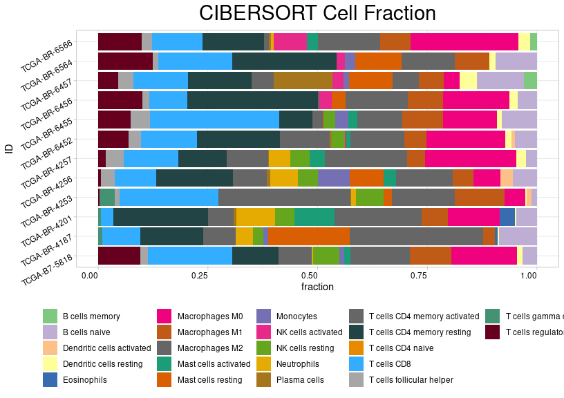

#### <a id="Section.5.1.3.2" style="color:#B7950B;">2) Method 2: EPIC</a>

``` r
help(deconvo_epic)
epic<-deconvo_tme(eset = eset_stad, method = "epic", arrays = FALSE)
#> 
#> >>> Running EPIC
#> Warning in EPIC::EPIC(bulk = eset, reference = ref, mRNA_cell = NULL, scaleExprs = TRUE): The optimization didn't fully converge for some samples:
#> TCGA-BR-6705; TCGA-BR-7958; TCGA-BR-8366; TCGA-BR-A4J4; TCGA-BR-A4J9; TCGA-CD-A4MG; TCGA-FP-8209; TCGA-HU-A4G9
#>  - check fit.gof for the convergeCode and convergeMessage
#> Warning in EPIC::EPIC(bulk = eset, reference = ref, mRNA_cell = NULL, scaleExprs
#> = TRUE): mRNA_cell value unknown for some cell types: CAFs, Endothelial - using
#> the default value of 0.4 for these but this might bias the true cell proportions
#> from all cell types.
head(epic)
#> # A tibble: 6 x 9
#>   ID    Bcells_EPIC CAFs_EPIC CD4_Tcells_EPIC CD8_Tcells_EPIC Endothelial_EPIC
#>   <chr>       <dbl>     <dbl>           <dbl>           <dbl>            <dbl>
#> 1 TCGA…      0.0226    0.0206           0.163          0.110             0.124
#> 2 TCGA…      0.0511    0.0254           0.189          0.107             0.182
#> 3 TCGA…      0.0435    0.0245           0.242          0.0726            0.146
#> 4 TCGA…      0.0353    0.0163           0.212          0.169             0.128
#> 5 TCGA…      0.0330    0.0226           0.208          0.111             0.177
#> 6 TCGA…      0.0145    0.0223           0.205          0.102             0.140
#> # … with 3 more variables: Macrophages_EPIC <dbl>, NKcells_EPIC <dbl>,
#> #   otherCells_EPIC <dbl>
```

#### <a id="Section.5.1.3.3" style="color:#B7950B;">3) Method 3: MCPcounter</a>

``` r
mcp<-deconvo_tme(eset = eset_stad, method = "mcpcounter")
#> 
#> >>> Running MCP-counter
head(mcp)
#> # A tibble: 6 x 11
#>   ID    T_cells_MCPcoun… CD8_T_cells_MCP… Cytotoxic_lymph… B_lineage_MCPco…
#>   <chr>            <dbl>            <dbl>            <dbl>            <dbl>
#> 1 TCGA…             2.26             2.81             1.59             1.62
#> 2 TCGA…             2.07             3.14             1.53             3.25
#> 3 TCGA…             2.28             1.11             1.96             3.46
#> 4 TCGA…             3.69             4.66             3.83             2.98
#> 5 TCGA…             2.71             3.40             2.26             3.01
#> 6 TCGA…             2.06             2.54             1.76             1.68
#> # … with 6 more variables: NK_cells_MCPcounter <dbl>,
#> #   Monocytic_lineage_MCPcounter <dbl>,
#> #   Myeloid_dendritic_cells_MCPcounter <dbl>, Neutrophils_MCPcounter <dbl>,
#> #   Endothelial_cells_MCPcounter <dbl>, Fibroblasts_MCPcounter <dbl>
```

#### <a id="Section.5.1.3.4" style="color:#B7950B;">4) Method 4: xCELL</a>

``` r
xcell<-deconvo_tme(eset = eset_stad, method = "xcell",arrays = FALSE)
```

``` r
head(xcell)
#> # A tibble: 6 x 68
#>   ID    Adipocytes_xCell Astrocytes_xCell `B-cells_xCell` Basophils_xCell
#>   <chr>            <dbl>            <dbl>           <dbl>           <dbl>
#> 1 TCGA…         0.                0.00159          0.0664        1.20e- 1
#> 2 TCGA…         8.96e- 3          0.132            0.0599        8.95e-19
#> 3 TCGA…         1.42e- 3          0.116            0.0504        6.64e-19
#> 4 TCGA…         4.12e-19          0                0.202         7.63e- 2
#> 5 TCGA…         7.68e- 3          0.127            0.0458        2.00e- 1
#> 6 TCGA…         1.34e-19          0.0508           0.0499        4.21e- 2
#> # … with 63 more variables: `CD4+_T-cells_xCell` <dbl>, `CD4+_Tcm_xCell` <dbl>,
#> #   `CD4+_Tem_xCell` <dbl>, `CD4+_memory_T-cells_xCell` <dbl>,
#> #   `CD4+_naive_T-cells_xCell` <dbl>, `CD8+_T-cells_xCell` <dbl>,
#> #   `CD8+_Tcm_xCell` <dbl>, `CD8+_Tem_xCell` <dbl>,
#> #   `CD8+_naive_T-cells_xCell` <dbl>, CLP_xCell <dbl>, CMP_xCell <dbl>,
#> #   Chondrocytes_xCell <dbl>, `Class-switched_memory_B-cells_xCell` <dbl>,
#> #   DC_xCell <dbl>, Endothelial_cells_xCell <dbl>, Eosinophils_xCell <dbl>,
#> #   Epithelial_cells_xCell <dbl>, Erythrocytes_xCell <dbl>,
#> #   Fibroblasts_xCell <dbl>, GMP_xCell <dbl>, HSC_xCell <dbl>,
#> #   Hepatocytes_xCell <dbl>, Keratinocytes_xCell <dbl>, MEP_xCell <dbl>,
#> #   MPP_xCell <dbl>, MSC_xCell <dbl>, Macrophages_xCell <dbl>,
#> #   Macrophages_M1_xCell <dbl>, Macrophages_M2_xCell <dbl>,
#> #   Mast_cells_xCell <dbl>, Megakaryocytes_xCell <dbl>,
#> #   Melanocytes_xCell <dbl>, `Memory_B-cells_xCell` <dbl>,
#> #   Mesangial_cells_xCell <dbl>, Monocytes_xCell <dbl>, Myocytes_xCell <dbl>,
#> #   NK_cells_xCell <dbl>, NKT_xCell <dbl>, Neurons_xCell <dbl>,
#> #   Neutrophils_xCell <dbl>, Osteoblast_xCell <dbl>, Pericytes_xCell <dbl>,
#> #   Plasma_cells_xCell <dbl>, Platelets_xCell <dbl>, Preadipocytes_xCell <dbl>,
#> #   Sebocytes_xCell <dbl>, Skeletal_muscle_xCell <dbl>,
#> #   Smooth_muscle_xCell <dbl>, Tgd_cells_xCell <dbl>, Th1_cells_xCell <dbl>,
#> #   Th2_cells_xCell <dbl>, Tregs_xCell <dbl>, aDC_xCell <dbl>, cDC_xCell <dbl>,
#> #   iDC_xCell <dbl>, ly_Endothelial_cells_xCell <dbl>,
#> #   mv_Endothelial_cells_xCell <dbl>, `naive_B-cells_xCell` <dbl>,
#> #   pDC_xCell <dbl>, `pro_B-cells_xCell` <dbl>, ImmuneScore_xCell <dbl>,
#> #   StromaScore_xCell <dbl>, MicroenvironmentScore_xCell <dbl>
```

#### <a id="Section.5.1.3.5" style="color:#B7950B;">5) Method 5: ESTIMATE</a>

``` r
estimate<-deconvo_tme(eset = eset_stad, method = "estimate")
#> [1] "Merged dataset includes 10156 genes (256 mismatched)."
#> [1] "1 gene set: StromalSignature  overlap= 139"
#> [1] "2 gene set: ImmuneSignature  overlap= 140"
head(estimate)
#> # A tibble: 6 x 5
#>   ID      StromalScore_est… ImmuneScore_esti… ESTIMATEScore_es… TumorPurity_est…
#>   <chr>               <dbl>             <dbl>             <dbl>            <dbl>
#> 1 TCGA-B…             -111.             1762.             1651.            0.662
#> 2 TCGA-B…             2054.             2208.             4262.            0.334
#> 3 TCGA-B…             1411.             1770.             3181.            0.479
#> 4 TCGA-B…              483.             2905.             3389.            0.451
#> 5 TCGA-B…             1659.             2541.             4200.            0.342
#> 6 TCGA-B…              831.             1722.             2553.            0.557
```

#### <a id="Section.5.1.3.6" style="color:#B7950B;">6) Method 6: TIMER</a>

``` r
timer<-deconvo_tme(eset = eset_stad, method = "timer", group_list = rep("stad",dim(eset_stad)[2]))
#> [1] "Outlier genes: FTL IGF2 IGHA1 IGHM IGKC IGKV4-1 LYZ MT-ATP6 MT-CO1 MT-CO2 MT-CO3 MT-CYB MT-ND1 MT-ND2 MT-ND3 MT-ND4 MT-ND4L MT-RNR1 MT-RNR2 MT-TP PGC"
#> Standardizing Data across genes
head(timer)
#> # A tibble: 6 x 7
#>   ID    B_cell_TIMER T_cell_CD4_TIMER T_cell_CD8_TIMER Neutrophil_TIMER
#>   <chr>        <dbl>            <dbl>            <dbl>            <dbl>
#> 1 TCGA…       0.0954            0.130            0.191            0.114
#> 2 TCGA…       0.0983            0.131            0.202            0.125
#> 3 TCGA…       0.0996            0.122            0.200            0.127
#> 4 TCGA…       0.101             0.131            0.240            0.129
#> 5 TCGA…       0.0945            0.133            0.213            0.137
#> 6 TCGA…       0.0907            0.126            0.199            0.121
#> # … with 2 more variables: Macrophage_TIMER <dbl>, DC_TIMER <dbl>
```

#### <a id="Section.5.1.3.7" style="color:#B7950B;">7) Method 7: quanTIseq</a>

``` r
quantiseq<-deconvo_tme(eset = eset_stad, tumor = TRUE, arrays = FALSE, scale_mrna = TRUE, method = "quantiseq")
#> 
#> Running quanTIseq deconvolution module
#> Gene expression normalization and re-annotation (arrays: FALSE)
#> Removing 17 noisy genes
#> Removing 15 genes with high expression in tumors
#> Signature genes found in data set: 138/138 (100%)
#> Mixture deconvolution (method: lsei)
#> Deconvolution sucessful!
head(quantiseq)
#> # A tibble: 6 x 12
#>   ID    B_cells_quantis… Macrophages_M1_… Macrophages_M2_… Monocytes_quant…
#>   <chr>            <dbl>            <dbl>            <dbl>            <dbl>
#> 1 TCGA…          0.00897           0.0943           0.0299                0
#> 2 TCGA…          0.0269            0.0155           0.169                 0
#> 3 TCGA…          0.0160            0.0570           0.0661                0
#> 4 TCGA…          0.0240            0.171            0.128                 0
#> 5 TCGA…          0.0129            0.126            0.0922                0
#> 6 TCGA…          0.0148            0.0685           0.0673                0
#> # … with 7 more variables: Neutrophils_quantiseq <dbl>,
#> #   NK_cells_quantiseq <dbl>, T_cells_CD4_quantiseq <dbl>,
#> #   T_cells_CD8_quantiseq <dbl>, Tregs_quantiseq <dbl>,
#> #   Dendritic_cells_quantiseq <dbl>, Other_quantiseq <dbl>
res<-cell_bar_plot(input = quantiseq[1:12, ], title = "quanTIseq Cell Fraction")
#> There are seven categories you can choose: box, continue2, continue, random, heatmap, heatmap3, tidyheatmap
```

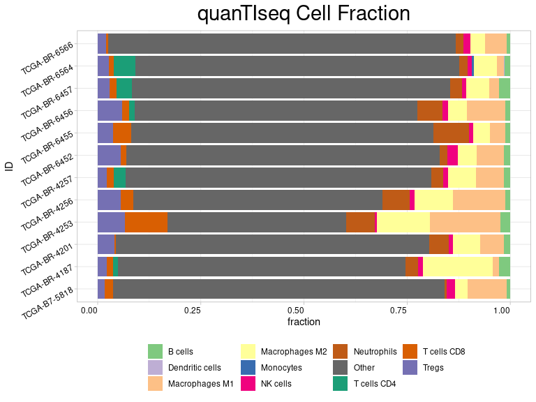

#### <a id="Section.5.1.3.8" style="color:#B7950B;">8) Method 8: IPS</a>

``` r
ips<-deconvo_tme(eset = eset_stad, method = "ips", plot= FALSE)
head(ips)
#> # A tibble: 6 x 7
#>   ID           MHC_IPS EC_IPS SC_IPS CP_IPS AZ_IPS IPS_IPS
#>   <chr>          <dbl>  <dbl>  <dbl>  <dbl>  <dbl>   <dbl>
#> 1 TCGA-B7-5818    3.56   1.09  -1.37 -0.576   2.70       9
#> 2 TCGA-BR-4187    3.37   1.18  -1.71 -0.308   2.53       8
#> 3 TCGA-BR-4201    3.04   1.22  -1.62 -0.439   2.20       7
#> 4 TCGA-BR-4253    3.79   1.63  -1.74 -1.25    2.42       8
#> 5 TCGA-BR-4256    3.65   1.40  -1.95 -0.847   2.25       8
#> 6 TCGA-BR-4257    3.11   1.23  -1.74 -0.529   2.07       7
```

#### <a id="Section.5.1.3.9" style="color:#B7950B;">9) Combination of above deconvolution results</a>

``` r
tme_combine<-cibersort %>% 
  inner_join(.,mcp,by       = "ID") %>% 
  inner_join(.,xcell,by     = "ID") %>%
  inner_join(.,epic,by      = "ID") %>% 
  inner_join(.,estimate,by  = "ID") %>% 
  inner_join(.,timer,by     = "ID") %>% 
  inner_join(.,quantiseq,by = "ID") %>% 
  inner_join(.,ips,by       = "ID")
dim(tme_combine)
#> [1]  98 138
```

## <a id="Section.5.2" style="color:#B7950B;">5.2 Phenotype Module</a>

### <a id="Section.5.2.1" style="color:#B7950B;">5.2.3 Explore Phenotype Relevant Signatures</a>

#### <a id="Section.5.2.1.1" style="color:#B7950B;">1) Load data</a>

Data of [IMvigor210 immunotherapy
cohort](https://www.nature.com/articles/nature25501) was used for batch
analysis of phenotype-related signatures.

``` r
## Load the signatures and Cell fractions calculated in previous steps by IOBR.
data("imvigor210_sig")
imvigor210_sig[1:5, 1:10]
#> # A tibble: 5 x 10
#>   ID    B_cells_naive_C… B_cells_memory_… Plasma_cells_CI… T_cells_CD8_CIB…
#>   <chr>            <dbl>            <dbl>            <dbl>            <dbl>
#> 1 SAMf…           0.0290          0.0457           0                      0
#> 2 SAM6…           0.0812          0.00127          0                      0
#> 3 SAMc…           0.0124          0                0.00127                0
#> 4 SAM8…           0               0                0.00119                0
#> 5 SAMf…           0               0                0.00949                0
#> # … with 5 more variables: T_cells_CD4_naive_CIBERSORT <dbl>,
#> #   T_cells_CD4_memory_resting_CIBERSORT <dbl>,
#> #   T_cells_CD4_memory_activated_CIBERSORT <dbl>,
#> #   T_cells_follicular_helper_CIBERSORT <dbl>,
#> #   `T_cells_regulatory_(Tregs)_CIBERSORT` <dbl>

# Check therapeutic response and survival outcome in the phenotype data.
data("imvigor210_pdata")
imvigor210_pdata[1:5, 1:5]
#> # A tibble: 5 x 5
#>   ID              BOR   BOR_binary OS_days            OS_status
#>   <chr>           <chr> <chr>      <chr>              <chr>    
#> 1 SAM00b9e5c52da9 NA    NA         57.166324439999997 1        
#> 2 SAM0257bbbbd388 SD    NR         469.15811100000002 1        
#> 3 SAM025b45c27e05 PD    NR         263.16221766000001 1        
#> 4 SAM032c642382a7 PD    NR         74.907597539999998 1        
#> 5 SAM04c589eb3fb3 NA    NA         20.698151939999999 0
```

#### <a id="Section.5.2.1.2" style="color:#B7950B;">2)Signature groups</a>

Run `sig_group()` function for latter batch analysis of response
associated signatures.

``` r
# The signature group list.
names(sig_group)
#>  [1] "tumor_signature"        "EMT"                    "io_biomarkers"         
#>  [4] "immu_microenvironment"  "immu_suppression"       "immu_exclusion"        
#>  [7] "immu_exhaustion"        "TCR_BCR"                "tme_signatures1"       
#> [10] "tme_signatures2"        "Bcells"                 "Tcells"                
#> [13] "DCs"                    "Macrophages"            "Neutrophils"           
#> [16] "Monocytes"              "CAFs"                   "NK"                    
#> [19] "tme_cell_types"         "CIBERSORT"              "MCPcounter"            
#> [22] "EPIC"                   "xCell"                  "quanTIseq"             
#> [25] "ESTIMATE"               "IPS"                    "TIMER"                 
#> [28] "fatty_acid_metabolism"  "hypoxia_signature"      "cholesterol_metabolism"
#> [31] "Metabolism"             "hallmark"               "hallmark1"             
#> [34] "hallmark2"              "hallmark3"              "Rooney_et_al"          
#> [37] "Bindea_et_al"           "Li_et_al"               "Peng_et_al"

# The tumor-relevant signatures in first group.
names(sig_group)[1]
#> [1] "tumor_signature"
sig_group[[1]]
#>  [1] "CellCycle_Reg"                            
#>  [2] "Cell_cycle"                               
#>  [3] "DDR"                                      
#>  [4] "Mismatch_Repair"                          
#>  [5] "Histones"                                 
#>  [6] "Homologous_recombination"                 
#>  [7] "Nature_metabolism_Hypoxia"                
#>  [8] "Molecular_Cancer_m6A"                     
#>  [9] "MT_exosome"                               
#> [10] "Positive_regulation_of_exosomal_secretion"
#> [11] "Ferroptosis"                              
#> [12] "EV_Cell_2020"

# The signatures associated with immunotherapy biomarkers.
names(sig_group)[3]
#> [1] "io_biomarkers"
sig_group[[3]]
#>  [1] "TMEscore_CIR"                    "TMEscoreA_CIR"                  
#>  [3] "TMEscoreB_CIR"                   "T_cell_inflamed_GEP_Ayers_et_al"
#>  [5] "CD_8_T_effector"                 "IPS_IPS"                        
#>  [7] "Immune_Checkpoint"               "Exhausted_CD8_Danaher_et_al"    
#>  [9] "Pan_F_TBRs"                      "Mismatch_Repair"                
#> [11] "APM"

# The signatures of immunosuppression.
names(sig_group)[5]
#> [1] "immu_suppression"
sig_group[[5]]
#> [1] "Pan_F_TBRs"                          
#> [2] "Fibroblasts_MCPcounter"              
#> [3] "Immune_Checkpoint"                   
#> [4] "Exhausted_CD8_Danaher_et_al"         
#> [5] "MDSC_Wang_et_al"                     
#> [6] "Macrophages_M2_cibersort"            
#> [7] "Tregs_quantiseq"                     
#> [8] "T_cells_regulatory_(Tregs)_CIBERSORT"
```

#### <a id="Section.5.2.1.3" style="color:#B7950B;">3) Identify phenotype relevant signatures</a>

Construct phenotype group and bath visualize correlation between therapy
response and selected signatures.

``` r
pdata_group<-imvigor210_pdata[!imvigor210_pdata$BOR_binary=="NA",c("ID","BOR","BOR_binary")]
res<-iobr_cor_plot(pdata_group           = pdata_group,
                   id1                   = "ID",
                   feature_data          = imvigor210_sig,
                   id2                   = "ID",
                   target                = NULL,
                   group                 = "BOR_binary",
                   is_target_continuous  = FALSE,
                   padj_cutoff           = 1,
                   index                 = 1,
                   category              = "signature",
                   signature_group       = sig_group[c(1,3,5)],
                   ProjectID             = "IMvigor210",
                   palette_box           = "paired1",
                   palette_corplot       = "pheatmap",
                   palette_heatmap       = 2,
                   feature_limit         = 26,
                   character_limit       = 30,
                   show_heatmap_col_name = FALSE,
                   show_col              = FALSE,
                   show_plot             = TRUE)
#> [1] ">>>  Processing signature: tumor_signature"
```

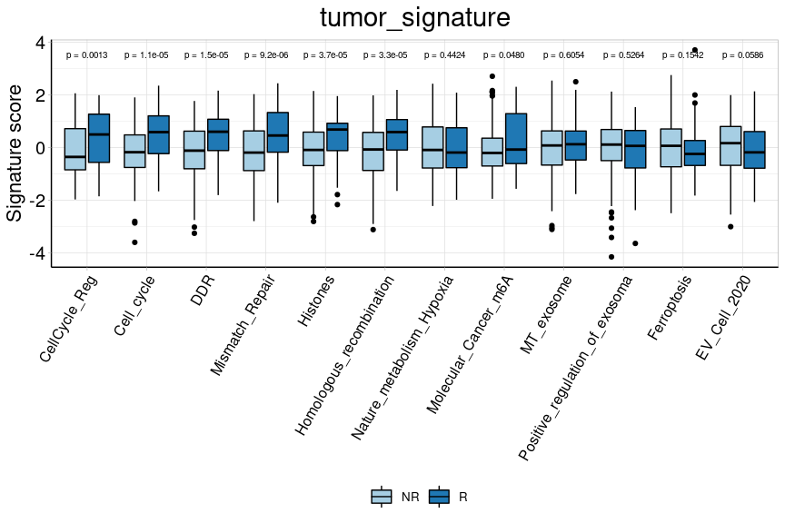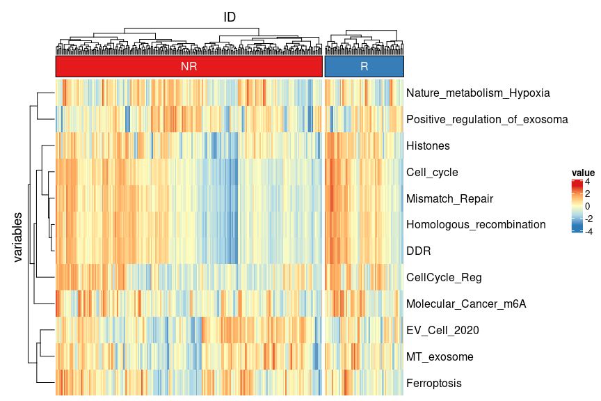

    #> [1] ">>>  Processing signature: io_biomarkers"

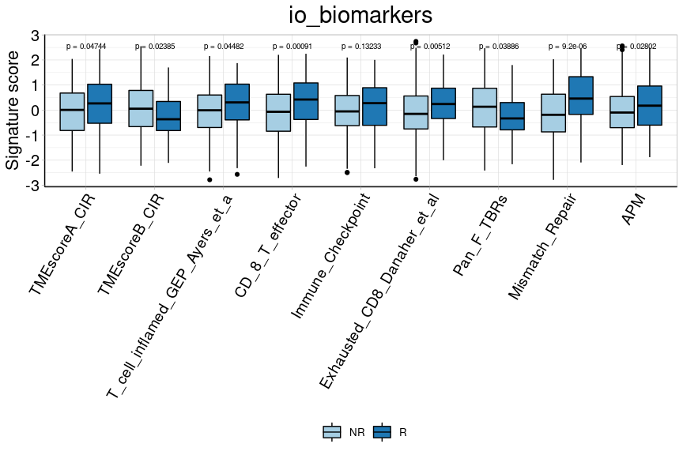

    #> [1] ">>>  Processing signature: immu_suppression"

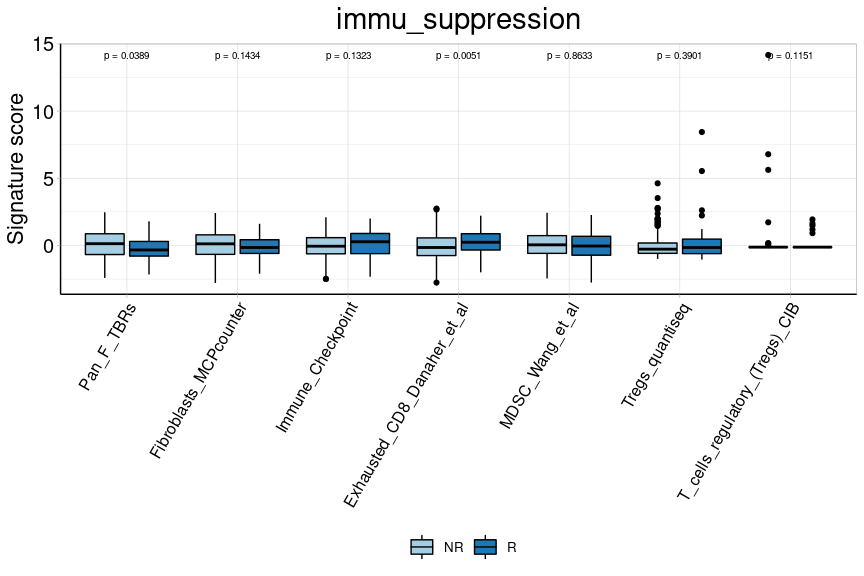

    #> [1] ">>> Proportion of two groups:"
    #>  NR   R 
    #> 230  68
    head(res)
    #> # A tibble: 6 x 8
    #>   sig_names             p.value     NR     R statistic   p.adj log10pvalue stars
    #>   <chr>                   <dbl>  <dbl> <dbl>     <dbl>   <dbl>       <dbl> <fct>
    #> 1 Mismatch_Repair       9.21e-6 -0.142 0.479    -0.620 1.22e-4        5.04 **** 
    #> 2 Cell_cycle            1.05e-5 -0.143 0.484    -0.627 1.22e-4        4.98 **** 
    #> 3 DDR                   1.52e-5 -0.140 0.474    -0.614 1.22e-4        4.82 **** 
    #> 4 Homologous_recombi…   3.31e-5 -0.134 0.453    -0.587 1.79e-4        4.48 **** 
    #> 5 Histones              3.72e-5 -0.127 0.429    -0.556 1.79e-4        4.43 **** 
    #> 6 CD_8_T_effector       9.11e-4 -0.104 0.351    -0.455 3.64e-3        3.04 ***

#### <a id="Section.5.2.1.4" style="color:#B7950B;">4) Visualize phenotype relevant signature genes</a>

Estimate and visualize the expression of response relevant signature
genes.

``` r

imvigor210_eset[1:5, 1:6]
#>              SAMf2ce197162ce SAM698d8d76b934 SAMc1b27bc16435 SAM85e41e7f33f9
#> LOC100093631       3.1009398       2.8207636       3.7058993      2.81012848
#> LOC100126784      -2.6237747      -4.2560520      -5.4104447     -2.07600356
#> LOC100128108      -1.5017841       0.5200520      -0.7665885     -2.07600356
#> LOC100128288      -0.3361981      -1.2204281      -1.9510131     -1.25886761
#> LOC100128361       0.2545468       0.2923847      -0.2009913     -0.02537748
#>              SAMf275eb859a39 SAM7f0d9cc7f001
#> LOC100093631       4.0102463      5.24697867
#> LOC100126784      -3.6376118     -2.23243417
#> LOC100128108      -1.9495558      0.08949393
#> LOC100128288       0.3320146     -0.33431378
#> LOC100128361       0.7698920     -1.16830383

res<-iobr_cor_plot(pdata_group           = pdata_group,
                   id1                   = "ID",
                   feature_data          = imvigor210_eset,
                   id2                   = "ID",
                   target                = NULL,
                   group                 = "BOR_binary",
                   is_target_continuous  = FALSE,
                   padj_cutoff           = 1,
                   index                 = 2,
                   category              = "gene",
                   signature_group       = signature_collection[c(1:2,4)],    
                   ProjectID             = "IMvigor210",
                   palette_box           = "paired1",
                   palette_corplot       = "pheatmap",
                   palette_heatmap       = 4,
                   feature_limit         = 26,
                   character_limit       = 30,
                   show_heatmap_col_name = FALSE,
                   show_col              = FALSE,
                   show_plot             = TRUE)
#> [1] ">>>  Processing signature: CD_8_T_effector"
```

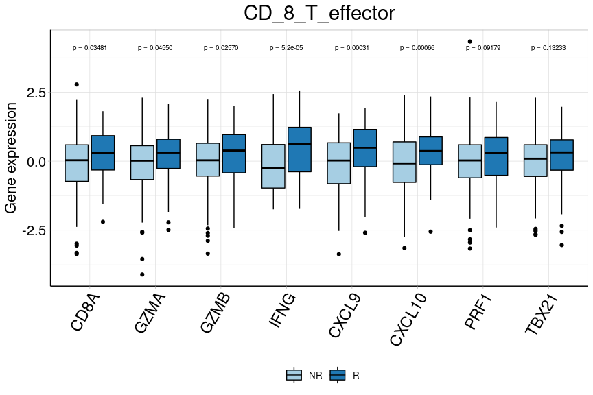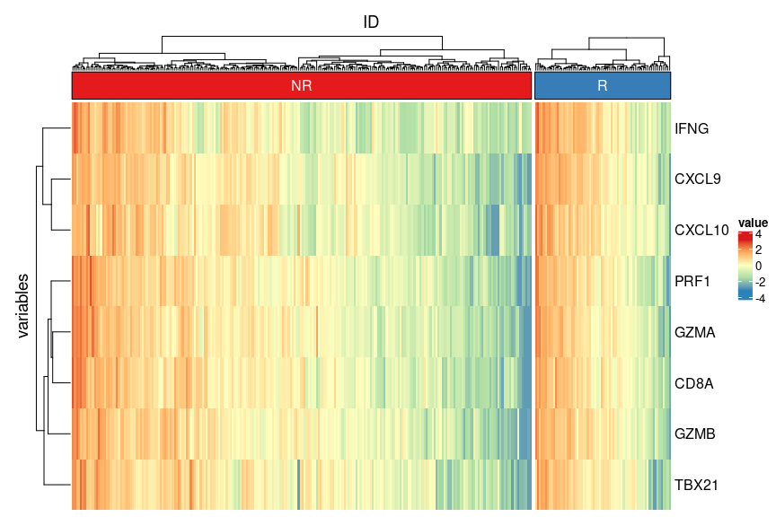

    #> [1] ">>>  Processing signature: DDR"

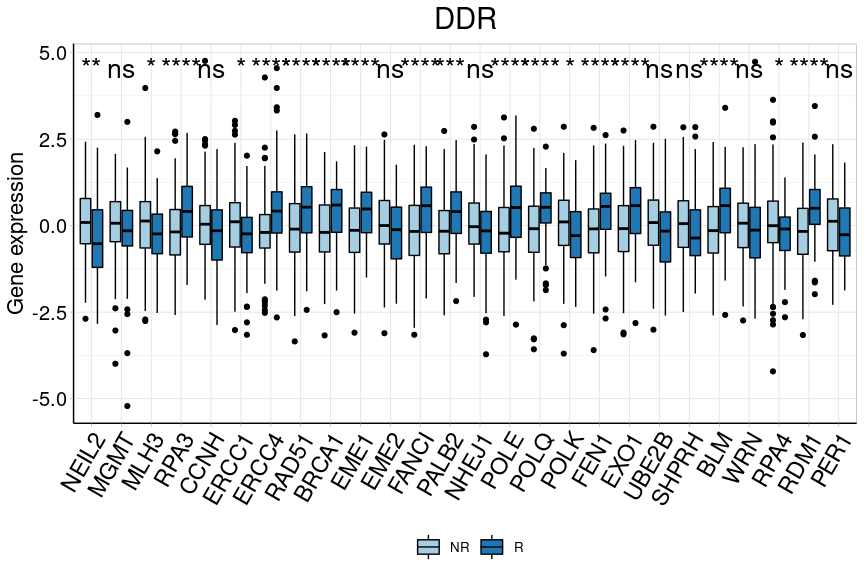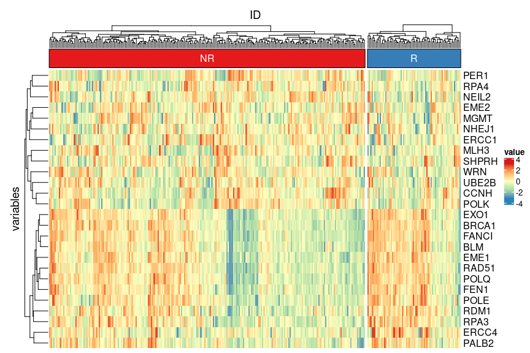

    #> [1] ">>>  Processing signature: Immune_Checkpoint"

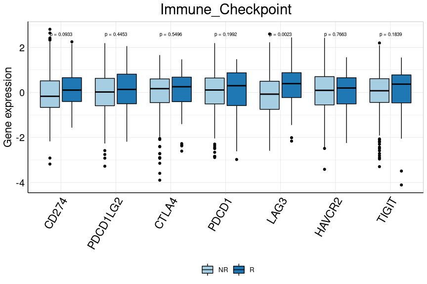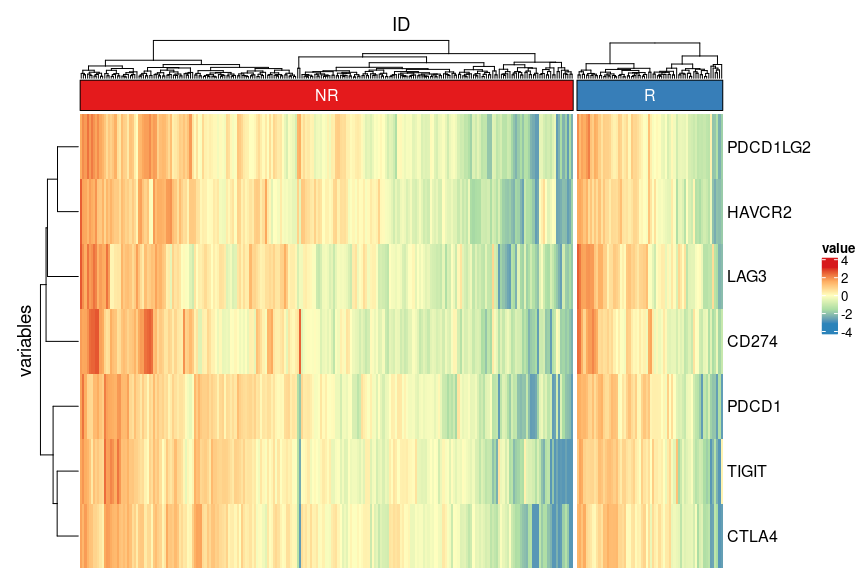

    #> [1] ">>> Proportion of two groups:"
    #>  NR   R 
    #> 230  68
    head(res)
    #> # A tibble: 6 x 8
    #>   sig_names    p.value     NR     R statistic    p.adj log10pvalue stars
    #>   <chr>          <dbl>  <dbl> <dbl>     <dbl>    <dbl>       <dbl> <fct>
    #> 1 RDM1      0.00000113 -0.147 0.499    -0.646 0.000205        5.95 **** 
    #> 2 ERCC4     0.00000301 -0.154 0.522    -0.677 0.000272        5.52 **** 
    #> 3 FANCI     0.00000643 -0.140 0.473    -0.612 0.000388        5.19 **** 
    #> 4 EME1      0.0000173  -0.132 0.446    -0.578 0.000783        4.76 **** 
    #> 5 POLE      0.0000246  -0.133 0.451    -0.584 0.000890        4.61 **** 
    #> 6 BLM       0.0000295  -0.130 0.441    -0.571 0.000891        4.53 ****

#### <a id="Section.5.2.1.5" style="color:#B7950B;">5) Estimate lncRNA associated signatures</a>

``` r
## Load the signatures and Cell fractions calculated in previous steps by IOBR.
head(as_tibble(imvigor210_sig))
#> # A tibble: 6 x 456
#>   ID    B_cells_naive_C… B_cells_memory_… Plasma_cells_CI… T_cells_CD8_CIB…
#>   <chr>            <dbl>            <dbl>            <dbl>            <dbl>
#> 1 SAMf…           0.0290          0.0457           0                      0
#> 2 SAM6…           0.0812          0.00127          0                      0
#> 3 SAMc…           0.0124          0                0.00127                0
#> 4 SAM8…           0               0                0.00119                0
#> 5 SAMf…           0               0                0.00949                0
#> 6 SAM7…           0.0582          0.129            0                      0
#> # … with 451 more variables: T_cells_CD4_naive_CIBERSORT <dbl>,
#> #   T_cells_CD4_memory_resting_CIBERSORT <dbl>,
#> #   T_cells_CD4_memory_activated_CIBERSORT <dbl>,
#> #   T_cells_follicular_helper_CIBERSORT <dbl>,
#> #   `T_cells_regulatory_(Tregs)_CIBERSORT` <dbl>,
#> #   T_cells_gamma_delta_CIBERSORT <dbl>, NK_cells_resting_CIBERSORT <dbl>,
#> #   NK_cells_activated_CIBERSORT <dbl>, Monocytes_CIBERSORT <dbl>,
#> #   Macrophages_M0_CIBERSORT <dbl>, Macrophages_M1_CIBERSORT <dbl>,
#> #   Macrophages_M2_CIBERSORT <dbl>, Dendritic_cells_resting_CIBERSORT <dbl>,
#> #   Dendritic_cells_activated_CIBERSORT <dbl>,
#> #   Mast_cells_resting_CIBERSORT <dbl>, Mast_cells_activated_CIBERSORT <dbl>,
#> #   Eosinophils_CIBERSORT <dbl>, Neutrophils_CIBERSORT <dbl>,
#> #   T_cells_MCPcounter <dbl>, CD8_T_cells_MCPcounter <dbl>,
#> #   Cytotoxic_lymphocytes_MCPcounter <dbl>, NK_cells_MCPcounter <dbl>,
#> #   B_lineage_MCPcounter <dbl>, Monocytic_lineage_MCPcounter <dbl>,
#> #   Myeloid_dendritic_cells_MCPcounter <dbl>, Neutrophils_MCPcounter <dbl>,
#> #   Endothelial_cells_MCPcounter <dbl>, Fibroblasts_MCPcounter <dbl>,
#> #   aDC_xCell <dbl>, Adipocytes_xCell <dbl>, Astrocytes_xCell <dbl>,
#> #   `B-cells_xCell` <dbl>, Basophils_xCell <dbl>,
#> #   `CD4+_memory_T-cells_xCell` <dbl>, `CD4+_naive_T-cells_xCell` <dbl>,
#> #   `CD4+_T-cells_xCell` <dbl>, `CD4+_Tcm_xCell` <dbl>, `CD4+_Tem_xCell` <dbl>,
#> #   `CD8+_naive_T-cells_xCell` <dbl>, `CD8+_T-cells_xCell` <dbl>,
#> #   `CD8+_Tcm_xCell` <dbl>, `CD8+_Tem_xCell` <dbl>, cDC_xCell <dbl>,
#> #   Chondrocytes_xCell <dbl>, `Class-switched_memory_B-cells_xCell` <dbl>,
#> #   CLP_xCell <dbl>, CMP_xCell <dbl>, DC_xCell <dbl>,
#> #   Endothelial_cells_xCell <dbl>, Eosinophils_xCell <dbl>,
#> #   Epithelial_cells_xCell <dbl>, Erythrocytes_xCell <dbl>,
#> #   Fibroblasts_xCell <dbl>, GMP_xCell <dbl>, Hepatocytes_xCell <dbl>,
#> #   HSC_xCell <dbl>, iDC_xCell <dbl>, Keratinocytes_xCell <dbl>,
#> #   ly_Endothelial_cells_xCell <dbl>, Macrophages_xCell <dbl>,
#> #   Macrophages_M1_xCell <dbl>, Macrophages_M2_xCell <dbl>,
#> #   Mast_cells_xCell <dbl>, Megakaryocytes_xCell <dbl>,
#> #   Melanocytes_xCell <dbl>, `Memory_B-cells_xCell` <dbl>, MEP_xCell <dbl>,
#> #   Mesangial_cells_xCell <dbl>, Monocytes_xCell <dbl>, MPP_xCell <dbl>,
#> #   MSC_xCell <dbl>, mv_Endothelial_cells_xCell <dbl>, Myocytes_xCell <dbl>,
#> #   `naive_B-cells_xCell` <dbl>, Neurons_xCell <dbl>, Neutrophils_xCell <dbl>,
#> #   NK_cells_xCell <dbl>, NKT_xCell <dbl>, Osteoblast_xCell <dbl>,
#> #   pDC_xCell <dbl>, Pericytes_xCell <dbl>, Plasma_cells_xCell <dbl>,
#> #   Platelets_xCell <dbl>, Preadipocytes_xCell <dbl>,
#> #   `pro_B-cells_xCell` <dbl>, Sebocytes_xCell <dbl>,
#> #   Skeletal_muscle_xCell <dbl>, Smooth_muscle_xCell <dbl>,
#> #   Tgd_cells_xCell <dbl>, Th1_cells_xCell <dbl>, Th2_cells_xCell <dbl>,
#> #   Tregs_xCell <dbl>, ImmuneScore_xCell <dbl>, StromaScore_xCell <dbl>,
#> #   MicroenvironmentScore_xCell <dbl>, Bcells_EPIC <dbl>, CAFs_EPIC <dbl>,
#> #   CD4_Tcells_EPIC <dbl>, CD8_Tcells_EPIC <dbl>, Endothelial_EPIC <dbl>, …

# Check therapeutic response and survival outcome in the phenotype data.
head(as_tibble(imvigor210_pdata))
#> # A tibble: 6 x 12
#>   ID    BOR   BOR_binary OS_days OS_status Mutation_Load Neo_antigen_Load
#>   <chr> <chr> <chr>      <chr>   <chr>     <chr>         <chr>           
#> 1 SAM0… NA    NA         57.166… 1         NA            NA              
#> 2 SAM0… SD    NR         469.15… 1         18            4.6862745099999…
#> 3 SAM0… PD    NR         263.16… 1         1             0.31372549      
#> 4 SAM0… PD    NR         74.907… 1         44            6.1960784310000…
#> 5 SAM0… NA    NA         20.698… 0         50            NA              
#> 6 SAM0… SD    NR         136.01… 1         2             1.4705882349999…
#> # … with 5 more variables: CD_8_T_effector <dbl>, Immune_Checkpoint <dbl>,
#> #   Pan_F_TBRs <chr>, Mismatch_Repair <chr>, TumorPurity <dbl>
```

#### Define the latent molecur functions of non-coding RNA by exploring lncRNA related signatures.

  - Multiple literatures have reported that *HCP5* is correlated with
    tumor microenvironment and immunotherapeutic
    responses.[Citation-1](https://www.mdpi.com/2073-4409/8/5/480),[Citation-2](https://www.nature.com/articles/s41467-020-14802-2),[Citation-3](https://jitc.bmj.com/content/8/1/e000110);

  - Reports also suggested the association between *LINC00657* and
    progression of multiple
    cancers.[Citation-1](https://www.mdpi.com/1422-0067/21/1/258/htm),[Citation-2](https://www.sciencedirect.com/science/article/abs/pii/S0304383520305784)，[Citation-3](https://www.ncbi.nlm.nih.gov/pmc/articles/PMC7268253/)

  - Taken *HCP5* and *LINC00657* for example, we explore their
    relationships with TME and other well-recognized signatures, to
    better reveal their potential functions.

<!-- end list -->

``` r

# Load the test data: the gene expression matrix of IMvigor210 cohort has been normalized using method `voom`.
imvigor210_eset[1:5,1:5]
#>              SAMf2ce197162ce SAM698d8d76b934 SAMc1b27bc16435 SAM85e41e7f33f9
#> LOC100093631       3.1009398       2.8207636       3.7058993      2.81012848
#> LOC100126784      -2.6237747      -4.2560520      -5.4104447     -2.07600356
#> LOC100128108      -1.5017841       0.5200520      -0.7665885     -2.07600356
#> LOC100128288      -0.3361981      -1.2204281      -1.9510131     -1.25886761
#> LOC100128361       0.2545468       0.2923847      -0.2009913     -0.02537748
#>              SAMf275eb859a39
#> LOC100093631       4.0102463
#> LOC100126784      -3.6376118
#> LOC100128108      -1.9495558
#> LOC100128288       0.3320146
#> LOC100128361       0.7698920
# Extract the significant genes as a phenotype of the patients based on the exploration of expression matrix.
pdata_group<-rownames_to_column(as.data.frame(t(imvigor210_eset)),var = "ID")

pdata_group<-as.data.frame(pdata_group[,c("ID","HCP5","LINC00657")])
head(pdata_group)
#>                ID       HCP5 LINC00657
#> 1 SAMf2ce197162ce -1.8532565  2.746143
#> 2 SAM698d8d76b934 -1.7199991  1.636339
#> 3 SAMc1b27bc16435 -2.6030898  3.863351
#> 4 SAM85e41e7f33f9 -0.5375836  2.989060
#> 5 SAMf275eb859a39  0.4685876  2.599731
#> 6 SAM7f0d9cc7f001 -1.4439383  2.029233
```

Utilize `iobr_cor_plot`function for batch statistical analysis and
visualization of the correlation between *HCP5* and TME.

``` r
res<-iobr_cor_plot(pdata_group           = pdata_group,
                   id1                   = "ID",
                   feature_data          = imvigor210_sig,
                   id2                   = "ID",
                   target                = "HCP5",
                   group                 = "group3",
                   is_target_continuous  = TRUE,
                   padj_cutoff           = 1,
                   index                 = 3,
                   category              = "signature",
                   signature_group       = sig_group[1:3],
                   ProjectID             = "IMvigor210",
                   palette_box           = "set2",
                   palette_corplot       = "pheatmap",
                   palette_heatmap       = 2,
                   feature_limit         = 26,
                   character_limit       = 30,
                   show_heatmap_col_name = FALSE,
                   show_col              = FALSE,
                   show_plot             = TRUE)
#> [1] ">>>  Processing signature: tumor_signature"
```

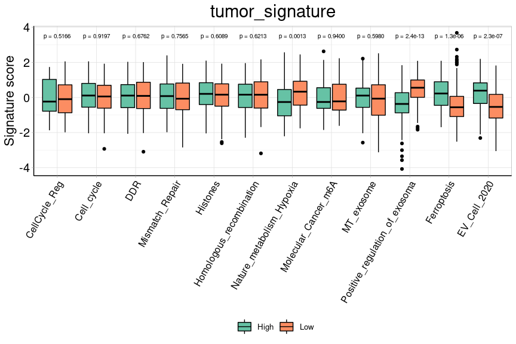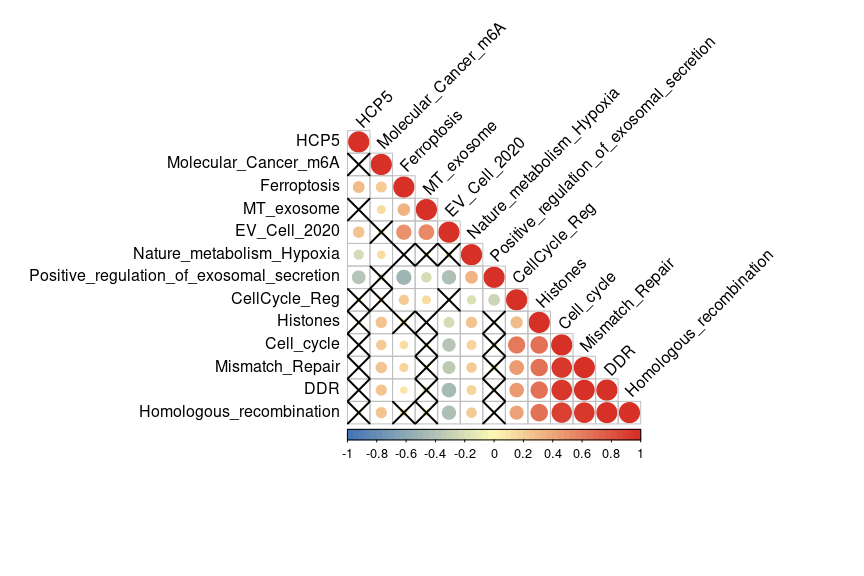

    #> [1] ">>>  Processing signature: EMT"

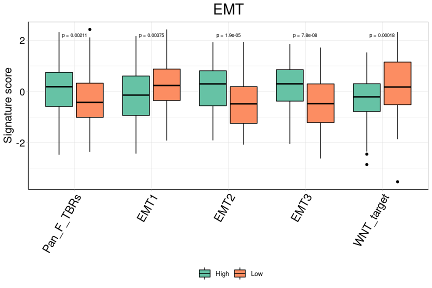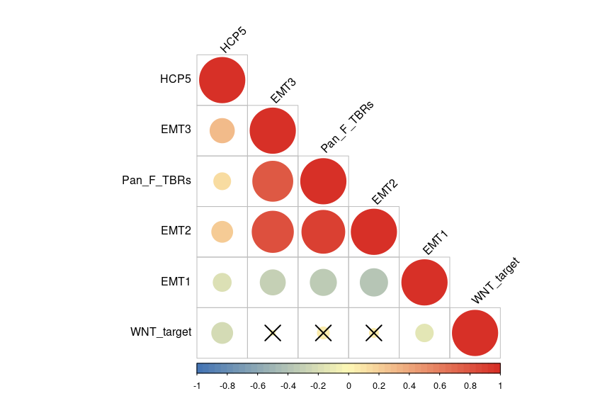

    #> [1] ">>>  Processing signature: io_biomarkers"

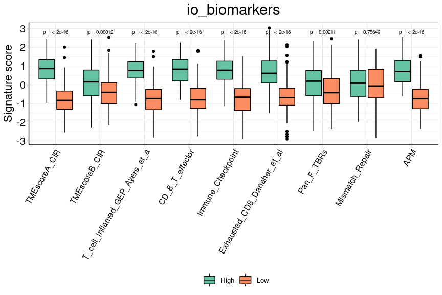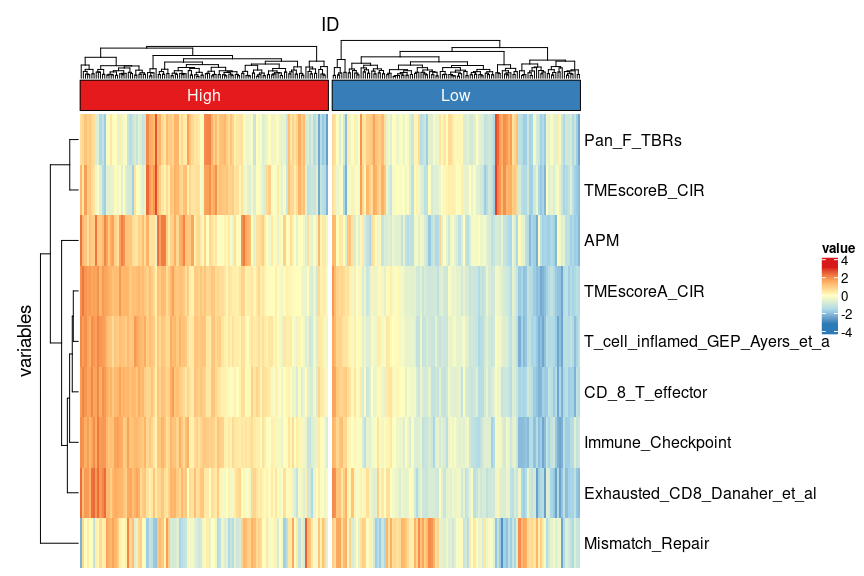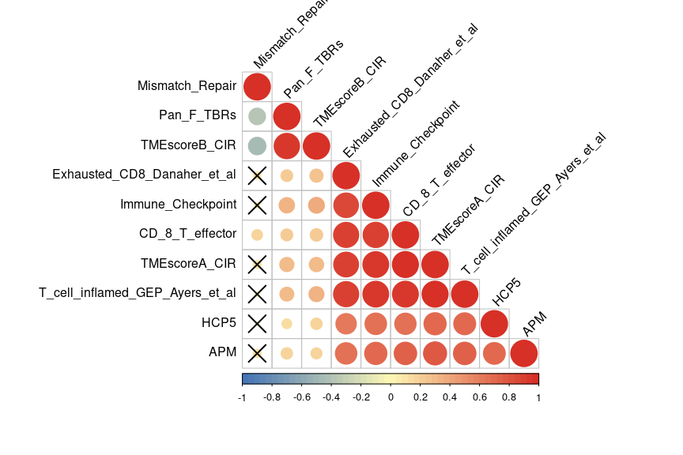

``` r

# Check targeted genes and the statistical correlations with all analyzed signatures. (determined by Spearman's rank correlation coefficient.)  
head(res)
#> # A tibble: 6 x 6
#>   sig_names                        p.value statistic    p.adj log10pvalue stars
#>   <chr>                              <dbl>     <dbl>    <dbl>       <dbl> <fct>
#> 1 TMEscoreA_CIR                   1.44e-54     0.710 3.45e-53        53.8 **** 
#> 2 T_cell_inflamed_GEP_Ayers_et_al 3.09e-51     0.694 3.71e-50        50.5 **** 
#> 3 APM                             2.58e-49     0.684 2.07e-48        48.6 **** 
#> 4 Immune_Checkpoint               1.07e-46     0.670 6.44e-46        46.0 **** 
#> 5 CD_8_T_effector                 3.38e-44     0.656 1.62e-43        43.5 **** 
#> 6 Exhausted_CD8_Danaher_et_al     6.81e-36     0.603 2.72e-35        35.2 ****
```

Utilize `iobr_cor_plot`function for batch statistical analysis and
visualization of the correlation between *LINC00657* and TME.

``` r
# Only part of the sign_group was exhibited, as an example of the more extensive results.
names(sig_group)
#>  [1] "tumor_signature"        "EMT"                    "io_biomarkers"         
#>  [4] "immu_microenvironment"  "immu_suppression"       "immu_exclusion"        
#>  [7] "immu_exhaustion"        "TCR_BCR"                "tme_signatures1"       
#> [10] "tme_signatures2"        "Bcells"                 "Tcells"                
#> [13] "DCs"                    "Macrophages"            "Neutrophils"           
#> [16] "Monocytes"              "CAFs"                   "NK"                    
#> [19] "tme_cell_types"         "CIBERSORT"              "MCPcounter"            
#> [22] "EPIC"                   "xCell"                  "quanTIseq"             
#> [25] "ESTIMATE"               "IPS"                    "TIMER"                 
#> [28] "fatty_acid_metabolism"  "hypoxia_signature"      "cholesterol_metabolism"
#> [31] "Metabolism"             "hallmark"               "hallmark1"             
#> [34] "hallmark2"              "hallmark3"              "Rooney_et_al"          
#> [37] "Bindea_et_al"           "Li_et_al"               "Peng_et_al"
res<-iobr_cor_plot(pdata_group           = pdata_group,
                   id1                   = "ID",
                   feature_data          = imvigor210_sig,
                   id2                   = "ID",
                   target                = "LINC00657",
                   group                 = "group3",
                   is_target_continuous  = TRUE,
                   padj_cutoff           = 1,
                   index                 = 4,
                   category              = "signature",
                   signature_group       = sig_group[c(1,3:4)],
                   ProjectID             = "IMvigor210",
                   palette_box           = "jco",
                   palette_corplot       = "pheatmap",
                   palette_heatmap       = 4,
                   feature_limit         = 26,
                   character_limit       = 30,
                   show_heatmap_col_name = FALSE,
                   show_col              = FALSE,
                   show_plot             = TRUE)
#> [1] ">>>  Processing signature: tumor_signature"
```

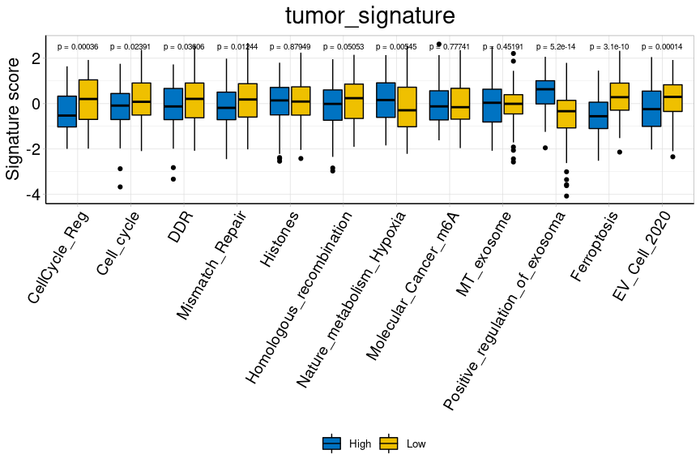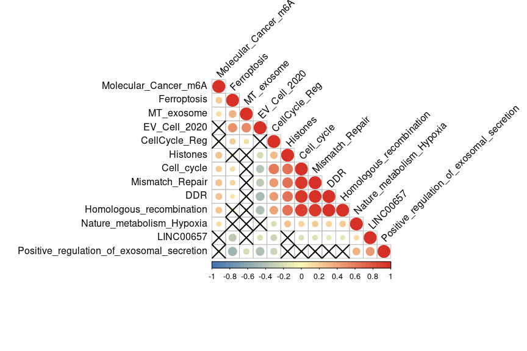

    #> [1] ">>>  Processing signature: io_biomarkers"

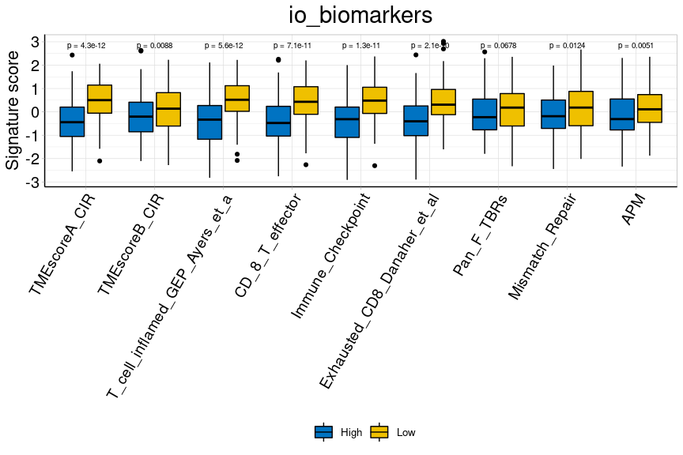

    #> [1] ">>>  Processing signature: immu_microenvironment"

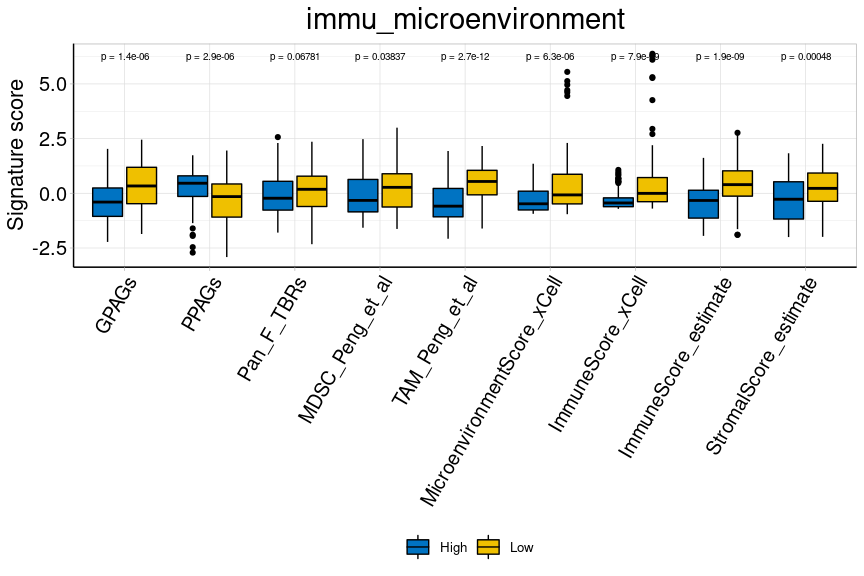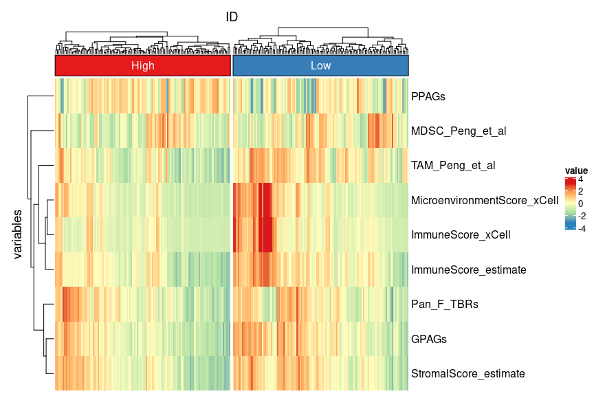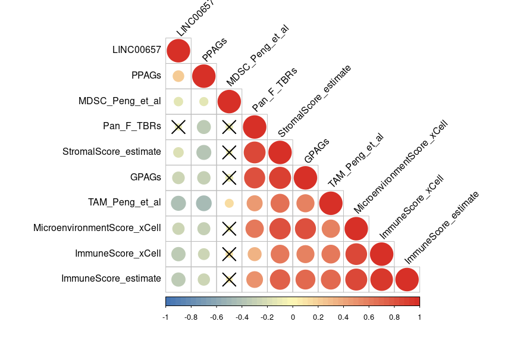

``` r
# # Check targeted genes and the statistical correlations with all analyzed signatures. (determined by Spearman's rank correlation coefficient.)  
head(res)
#> # A tibble: 6 x 6
#>   sig_names                         p.value statistic    p.adj log10pvalue stars
#>   <chr>                               <dbl>     <dbl>    <dbl>       <dbl> <fct>
#> 1 Positive_regulation_of_exosomal… 5.21e-19     0.453 1.46e-17        18.3 **** 
#> 2 TMEscoreA_CIR                    1.37e-16    -0.424 1.92e-15        15.9 **** 
#> 3 T_cell_inflamed_GEP_Ayers_et_al  2.94e-16    -0.419 2.74e-15        15.5 **** 
#> 4 CD_8_T_effector                  4.08e-15    -0.404 2.86e-14        14.4 **** 
#> 5 TAM_Peng_et_al                   7.10e-15    -0.401 3.36e-14        14.1 **** 
#> 6 Immune_Checkpoint                7.19e-15    -0.401 3.36e-14        14.1 ****
```

### <a id="Section.5.2.2" style="color:#B7950B;">5.2.4 Identify Signatures Relevant to Targeted Signature</a>

#### <a id="Section.5.2.2.1" style="color:#B7950B;">1) Construct phenotype group</a>

Construct the `pdata_group`as a phenotype data frame of patients.

``` r
# The data have been saved in `imvigor210_pdata`.
# head(imvigor210_pdata)
pdata_group<-as.data.frame(imvigor210_pdata[,c("ID","Pan_F_TBRs")])
pdata_group$Pan_F_TBRs<-scale(as.numeric(pdata_group$Pan_F_TBRs))
head(pdata_group)
#>                ID Pan_F_TBRs
#> 1 SAM00b9e5c52da9  0.2681507
#> 2 SAM0257bbbbd388  0.4618378
#> 3 SAM025b45c27e05 -0.8229645
#> 4 SAM032c642382a7 -0.4156874
#> 5 SAM04c589eb3fb3  9.0208975
#> 6 SAM0571f17f4045 -0.4462966
```

#### <a id="Section.5.2.2.2" style="color:#B7950B;">2) Analyze Pan-F-TBRs correlated signatures</a>

`Pan-F-TBRs` is an immune-exclusion signature published in Nature in
2018: S. Mariathasan et al., TGFbeta attenuates tumour response to PD-L1
blockade by contributing to exclusion of T cells. Nature 554, 544-548
(2018).

The Pan-F-TBRs score obtained could be used to batch analyze and
visualize the interaction between this immune-exclusion signature and
other interested `signatures` , as well as its significant `cell
fractions`, and to further explore other biomarkers may impact
corresponding biological process.

``` r
res<-iobr_cor_plot(pdata_group           = pdata_group,
                   id1                   = "ID",
                   feature_data          = imvigor210_sig,
                   id2                   = "ID",
                   target                = "Pan_F_TBRs",
                   group                 = "group3",
                   is_target_continuous  = TRUE,
                   padj_cutoff           = 1,
                   index                 = 5,
                   category              = "signature",
                   signature_group       =sig_group[1:2],
                   ProjectID             = "IMvigor210",
                   palette_box           = "set2",
                   palette_corplot       = "pheatmap",
                   palette_heatmap       = 2,
                   feature_limit         = 26,
                   character_limit       = 30,
                   show_heatmap_col_name = FALSE,
                   show_col              = FALSE,
                   show_plot             = TRUE)
#> [1] ">>>  Processing signature: tumor_signature"
```

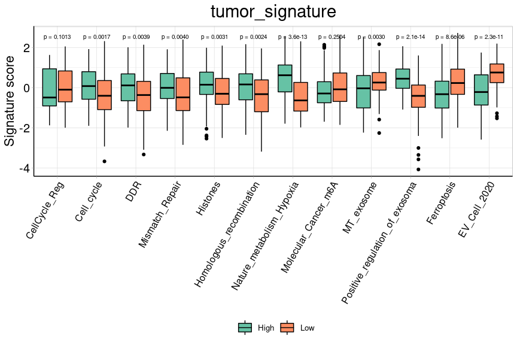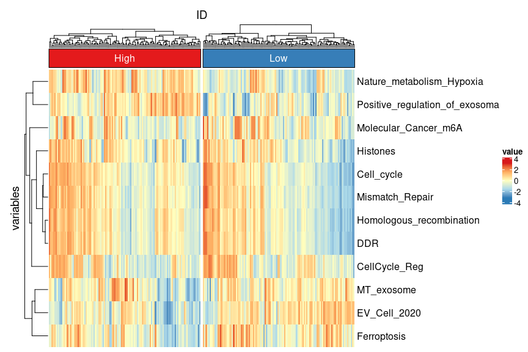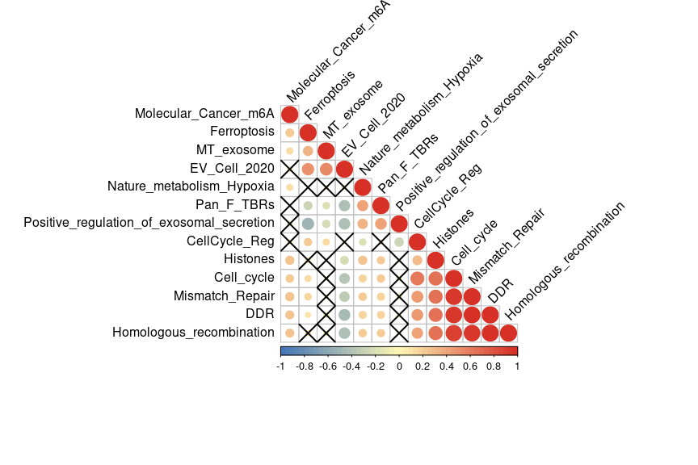

    #> [1] ">>>  Processing signature: EMT"

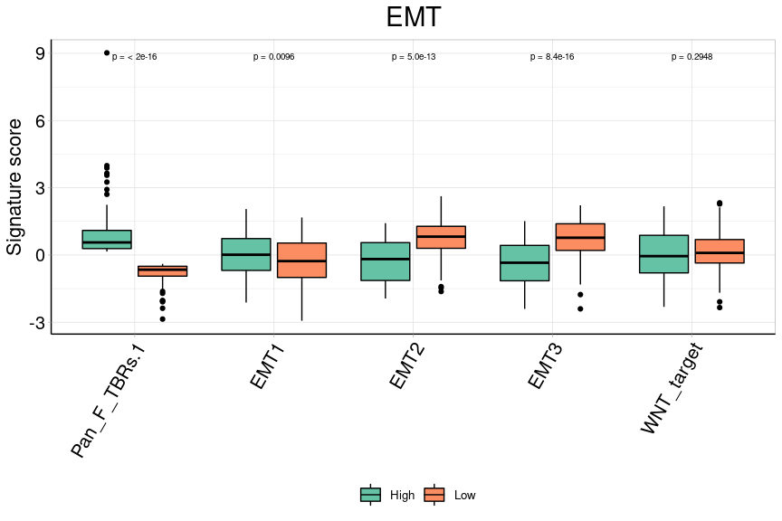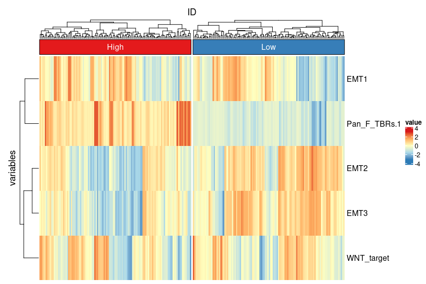

``` r
head(res)
#> # A tibble: 6 x 6
#>   sig_names                         p.value statistic    p.adj log10pvalue stars
#>   <chr>                               <dbl>     <dbl>    <dbl>       <dbl> <fct>
#> 1 EMT3                             1.34e-21    -0.482 2.14e-20       20.9  **** 
#> 2 Positive_regulation_of_exosomal… 9.69e-18     0.438 7.75e-17       17.0  **** 
#> 3 EMT2                             4.30e-17    -0.430 2.29e-16       16.4  **** 
#> 4 EV_Cell_2020                     6.95e-16    -0.415 2.78e-15       15.2  **** 
#> 5 Nature_metabolism_Hypoxia        7.70e-15     0.401 2.46e-14       14.1  **** 
#> 6 Ferroptosis                      2.27e- 6    -0.250 6.05e- 6        5.64 ****
```

#### <a id="Section.5.2.2.3" style="color:#B7950B;">3) Evaluate Pan-F-TBRs related TME cell infiltration</a>

Analyze the immune cell infiltration landscape related to Pan-F-TBRs.

``` r
names(sig_group)
#>  [1] "tumor_signature"        "EMT"                    "io_biomarkers"         
#>  [4] "immu_microenvironment"  "immu_suppression"       "immu_exclusion"        
#>  [7] "immu_exhaustion"        "TCR_BCR"                "tme_signatures1"       
#> [10] "tme_signatures2"        "Bcells"                 "Tcells"                
#> [13] "DCs"                    "Macrophages"            "Neutrophils"           
#> [16] "Monocytes"              "CAFs"                   "NK"                    
#> [19] "tme_cell_types"         "CIBERSORT"              "MCPcounter"            
#> [22] "EPIC"                   "xCell"                  "quanTIseq"             
#> [25] "ESTIMATE"               "IPS"                    "TIMER"                 
#> [28] "fatty_acid_metabolism"  "hypoxia_signature"      "cholesterol_metabolism"
#> [31] "Metabolism"             "hallmark"               "hallmark1"             
#> [34] "hallmark2"              "hallmark3"              "Rooney_et_al"          
#> [37] "Bindea_et_al"           "Li_et_al"               "Peng_et_al"
res<-iobr_cor_plot(pdata_group           = pdata_group,
                   id1                   = "ID",
                   feature_data          = imvigor210_sig,
                   id2                   = "ID",
                   target                = "Pan_F_TBRs",
                   group                 = "group3",
                   is_target_continuous  = TRUE,
                   padj_cutoff           = 1,
                   index                 = 6,
                   category              = "signature",
                   signature_group       = sig_group[20:24],
                   ProjectID             = "IMvigor210",
                   palette_box           = "jco",
                   palette_corplot       = "pheatmap",
                   palette_heatmap       = 3,
                   feature_limit         = 26,
                   character_limit       = 30,
                   show_heatmap_col_name = FALSE,
                   show_col              = FALSE,
                   show_plot             = TRUE)
#> [1] ">>>  Processing signature: CIBERSORT"
```

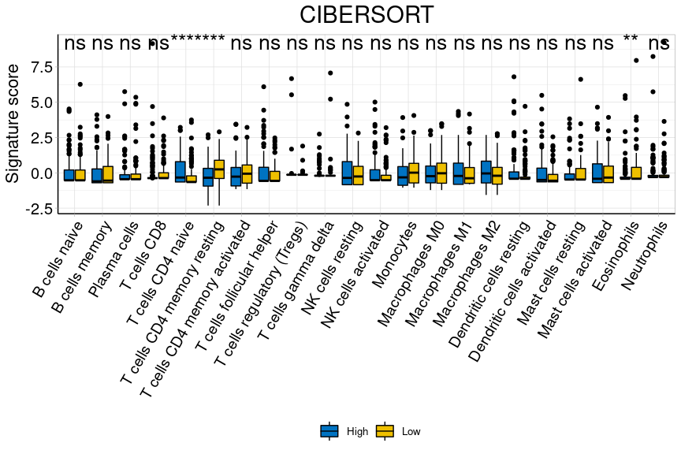

    #> [1] ">>>  Processing signature: MCPcounter"

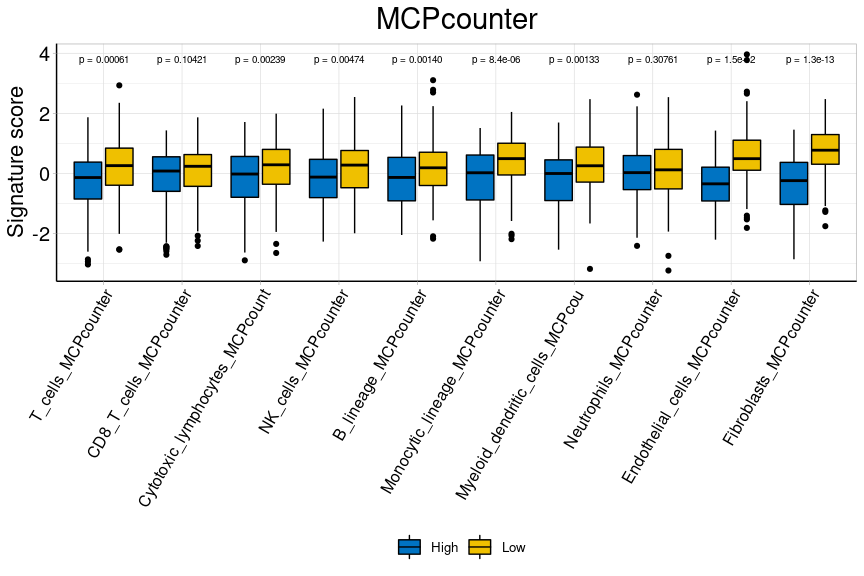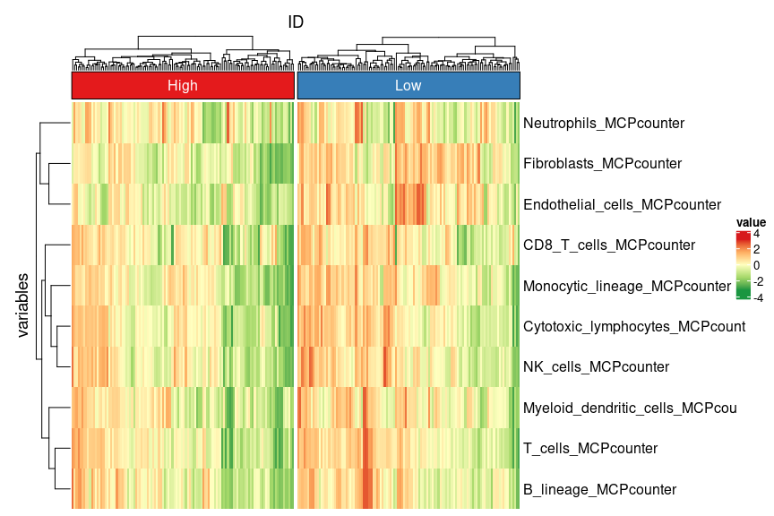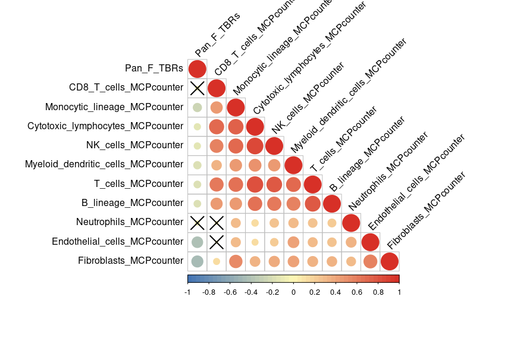

    #> [1] ">>>  Processing signature: EPIC"

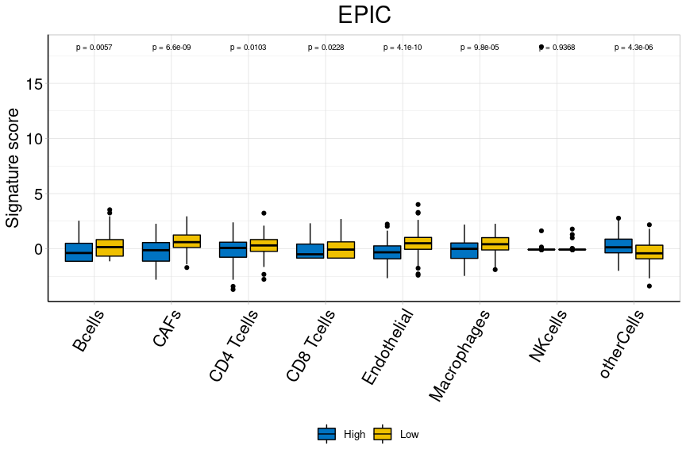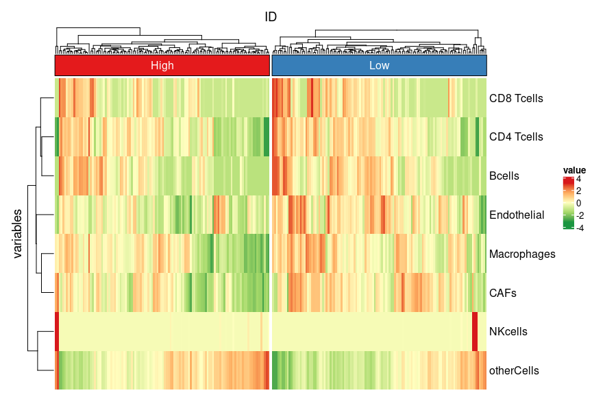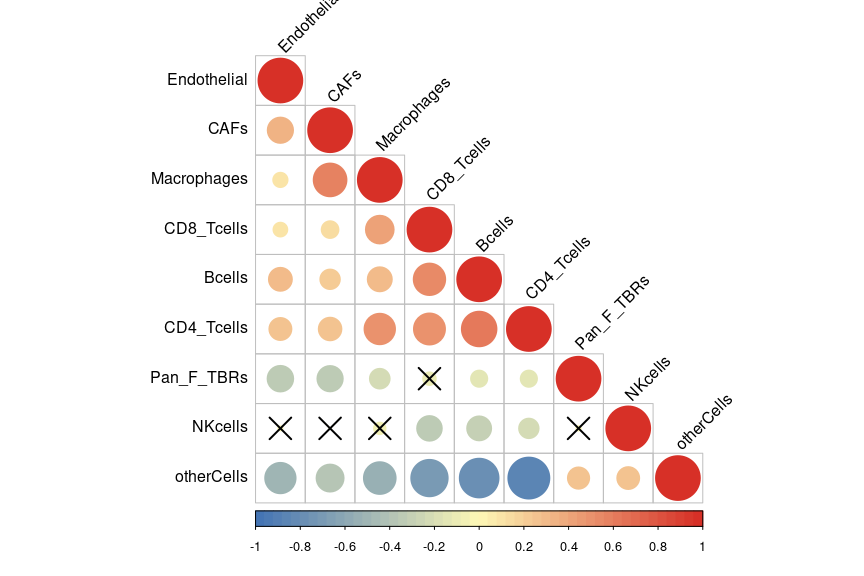

    #> [1] ">>>  Processing signature: xCell"

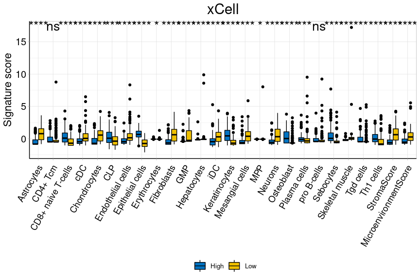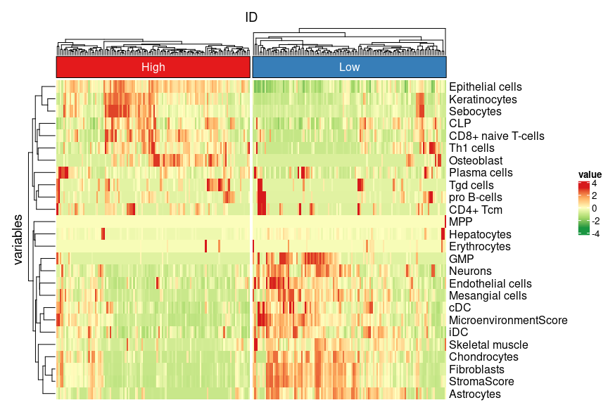

    #> [1] ">>>  Processing signature: quanTIseq"

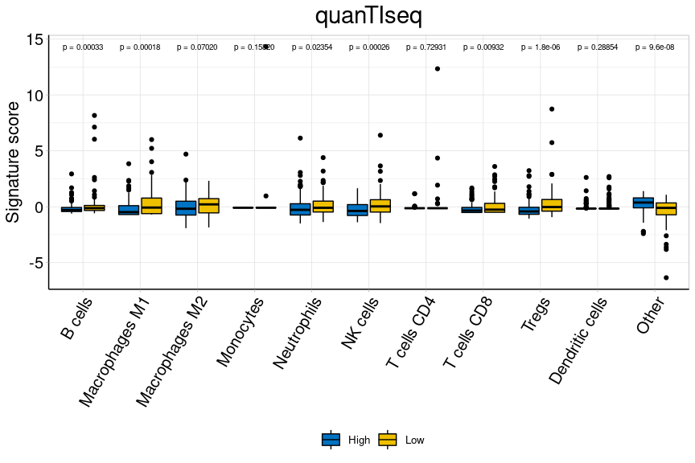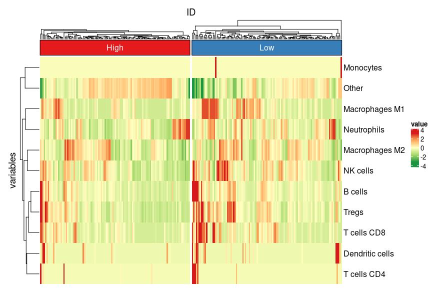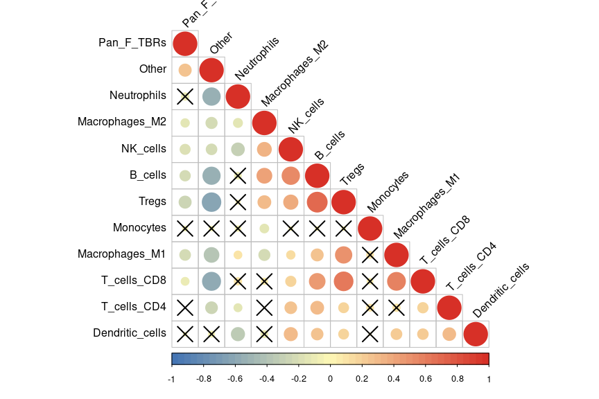

``` r
head(res)
#> # A tibble: 6 x 6
#>   sig_names               p.value statistic    p.adj log10pvalue stars
#>   <chr>                     <dbl>     <dbl>    <dbl>       <dbl> <fct>
#> 1 Epithelial_cells_xCell 8.39e-42     0.642 9.91e-40        41.1 **** 
#> 2 Sebocytes_xCell        1.31e-26     0.530 7.71e-25        25.9 **** 
#> 3 Astrocytes_xCell       8.94e-26    -0.523 3.52e-24        25.0 **** 
#> 4 StromaScore_xCell      7.31e-24    -0.504 2.16e-22        23.1 **** 
#> 5 Fibroblasts_xCell      1.66e-23    -0.501 3.92e-22        22.8 **** 
#> 6 Keratinocytes_xCell    7.31e-21     0.474 1.44e-19        20.1 ****
```

### <a id="Section.5.2.3" style="color:#B7950B;">5.2.5 Batch Analyses and Visualization</a>

IOBR provide multiple batch analytic functions for statistical analysis,
data operation and transformation. For instance,batch survival analysis
could be employed for batch analysis of the best cutoff value for
subsequent batch survival analysis, varied batch statistical tests, etc.

#### <a id="Section.5.2.3.1" style="color:#B7950B;">1) Batch survival analyses</a>

``` r
input<-imvigor210_pdata %>% 
  filter(!is.na(.$OS_days)) %>% 
  filter(!is.na(.$OS_status)) %>% 
  mutate(OS_days = as.numeric(.$OS_days)) %>% 
  mutate(OS_status = as.numeric(.$OS_status)) %>% 
  dplyr::select(ID,OS_days,OS_status) %>% 
  inner_join(.,imvigor210_sig, by= "ID")

res <- batch_surv(pdata    = input, 
                  variable = c(4:ncol(input)), 
                  time     = "OS_days",
                  status   = "OS_status")
#> Warning in fitter(X, Y, istrat, offset, init, control, weights = weights, :
#> Loglik converged before variable 1 ; coefficient may be infinite.
head(res)
#> # A tibble: 6 x 5
#>   ID                                P       HR CI_low_0.95 CI_up_0.95
#>   <chr>                         <dbl>    <dbl>       <dbl>      <dbl>
#> 1 Hepatocytes_xCell          0        Inf           78.8     Inf     
#> 2 IFNG_signature_Ayers_et_al 0.0001     0.814        0.733     0.905 
#> 3 Macrophages_M1_CIBERSORT   0.0002     0.0014       0         0.0421
#> 4 Lysine_Degradation         0.0004     1.32         1.13      1.53  
#> 5 TMEscoreA_plus             0.000600   0.886        0.827     0.950 
#> 6 CD_8_T_effector            0.0008     0.856        0.781     0.937
```

#### <a id="Section.5.2.3.2" style="color:#B7950B;">2) Subgroup survival analyses</a>

``` r
##loading data and filter NA
data(subgroup_data)
input <- subgroup_data %>% 
   filter(time > 0) %>% 
   filter(!is.na(status)) %>% 
   filter(!is.na(AJCC_stage))

##for binary variable
res <- subgroup_survival(pdata    = input,
                         time     = "time", 
                         status   = "status",
                         variable = c("ProjectID", "AJCC_stage"),
                         object   = "score_binary" )
res
#>                         P     HR CI_low_0.95 CI_up_0.95
#> ProjectID_Dataset1 0.0000 3.0901      1.8648     5.1205
#> ProjectID_Dataset2 0.0023 2.1049      1.3057     3.3931
#> ProjectID_Dataset3 0.1397 2.4431      0.7467     7.9940
#> ProjectID_Dataset4 0.0024 2.0312      1.2854     3.2097
#> ProjectID_Dataset5 0.0000 4.6375      2.3759     9.0520
#> AJCC_stage_1       0.2533 1.7307      0.6753     4.4354
#> AJCC_stage_2       0.0000 2.9450      1.7858     4.8569
#> AJCC_stage_3       0.0000 2.2821      1.5551     3.3490
#> AJCC_stage_4       0.0510 1.5941      0.9979     2.5466
```

#### <a id="Section.5.2.3.3" style="color:#B7950B;">3) Batch statistical analyses</a>

``` r
data("imvigor210_sig")
data("imvigor210_pdata")
# For analyses of binary variables
input<-merge(imvigor210_pdata[,c("ID","BOR_binary")],imvigor210_sig,by="ID",all = F)
input<-input[!input$BOR_binary=="NA",]
input[1:5,1:5]
#>                ID BOR_binary B_cells_naive_CIBERSORT B_cells_memory_CIBERSORT
#> 2 SAM0257bbbbd388         NR              0.00000000               0.03161044
#> 3 SAM025b45c27e05         NR              0.00000000               0.00000000
#> 4 SAM032c642382a7         NR              0.08022624               0.00000000
#> 6 SAM0571f17f4045         NR              0.31954131               0.13731249
#> 7 SAM065890737112          R              0.10875636               0.00000000
#>   Plasma_cells_CIBERSORT
#> 2             0.03799257
#> 3             0.00167134
#> 4             0.01413286
#> 6             0.00000000
#> 7             0.01061609
res<-batch_wilcoxon(data    = input,
                    target  = "BOR_binary", 
                    group_names = c("NR","R"),
                    feature = colnames(imvigor210_sig)[3:ncol(imvigor210_sig)])
head(res, n=10)
#> # A tibble: 10 x 8
#>    sig_names         p.value      NR       R statistic   p.adj log10pvalue stars
#>    <chr>               <dbl>   <dbl>   <dbl>     <dbl>   <dbl>       <dbl> <fct>
#>  1 Mismatch_Repair   9.21e-6 -0.111   0.246    -0.357  0.00138        5.04 **** 
#>  2 Cell_cycle        1.05e-5 -0.297   0.673    -0.969  0.00138        4.98 **** 
#>  3 TMEscoreB_plus    1.35e-5  0.149  -0.432     0.581  0.00138        4.87 **** 
#>  4 DNA_replication   1.38e-5 -0.147   0.353    -0.500  0.00138        4.86 **** 
#>  5 DDR               1.52e-5 -0.229   0.532    -0.760  0.00138        4.82 **** 
#>  6 Nucleotide_excis… 2.16e-5 -0.106   0.244    -0.350  0.00154        4.67 **** 
#>  7 Homologous_recom… 3.31e-5 -0.118   0.272    -0.390  0.00154        4.48 **** 
#>  8 HALLMARK_E2F_TAR… 3.33e-5  0.231   0.256    -0.0251 0.00154        4.48 **** 
#>  9 T_cells_follicul… 3.48e-5  0.0164  0.0380   -0.0216 0.00154        4.46 **** 
#> 10 HALLMARK_WNT_BET… 3.70e-5  0.144   0.132     0.0119 0.00154        4.43 ****
#Note: Features with statistically significant p value could be used to construct model in the next module.
model_feas<-as.character(res[res$p.value<0.05,"sig_names"])

# For analyses of continuous variables
# head(imvigor210_sig)
res<-batch_cor(data    = imvigor210_sig,
               target  = "Pan_F_TBRs",
               feature = colnames(imvigor210_sig)[3:ncol(imvigor210_sig)],
               method  = "spearman")
head(res, n=10)
#> # A tibble: 10 x 6
#>    sig_names                       p.value statistic     p.adj log10pvalue stars
#>    <chr>                             <dbl>     <dbl>     <dbl>       <dbl> <fct>
#>  1 Normal_mucosa_Bindea_et_al    2.28e-146     0.924 1.03e-143        146. **** 
#>  2 TMEscoreB_CIR                 6.06e-145     0.922 1.37e-142        144. **** 
#>  3 Fibroblasts_MCPcounter        1.07e-144     0.922 1.62e-142        144. **** 
#>  4 CAF_Peng_et_al                2.48e-127     0.901 2.81e-125        127. **** 
#>  5 EMT2                          7.72e-124     0.896 7.00e-122        123. **** 
#>  6 HALLMARK_EPITHELIAL_MESENCHY… 1.63e-123     0.895 1.23e-121        123. **** 
#>  7 HALLMARK_MYOGENESIS           2.02e-113     0.879 1.31e-111        113. **** 
#>  8 HALLMARK_APICAL_JUNCTION      8.79e-112     0.876 4.98e-110        111. **** 
#>  9 TMEscoreB_plus                2.82e-106     0.866 1.42e-104        106. **** 
#> 10 StromalScore_estimate         1.21e-104     0.863 5.46e-103        104. ****
```

#### <a id="Section.5.2.3.4" style="color:#B7950B;">4) Batch analyses of Pearson’s correlation coefficient</a>

Detail code to perform `batch_pcc()`function for batch analyses of
Partial Correlation coefficient(PCC) is shown below.

Herein, we utilized the data of the Pan\_F\_TBRs relevant signatures
after adjusting TumorPurity as an example input. The major limitation of
this method is that it may merely suitable for correlation estimation
between two continuous variables.

``` r
pdata_group <- imvigor210_pdata[, c("ID", "TumorPurity", "Pan_F_TBRs")] %>% 
  rename(target = Pan_F_TBRs) %>% mutate(target = as.numeric(target))
res <- batch_pcc(pdata_group    = pdata_group, 
                 id1            = "ID", 
                 feature_data   = imvigor210_sig, 
                 id2            = "ID", 
                 interferenceid = "TumorPurity",
                 target         = "target",
                 method         = "pearson")
head(res, n = 8)
#> # A tibble: 8 x 6
#>   sig_names                         p.value statistic    p.adj log10pvalue stars
#>   <chr>                               <dbl>     <dbl>    <dbl>       <dbl> <fct>
#> 1 Epithelial_cells_xCell           1.26e-25     0.522 5.72e-23        24.9 **** 
#> 2 Keratinocytes_xCell              1.24e-16     0.425 2.82e-14        15.9 **** 
#> 3 MHC_Class_I                      6.63e-15     0.402 1.01e-12        14.2 **** 
#> 4 APM                              1.78e-13     0.382 2.03e-11        12.7 **** 
#> 5 Sebocytes_xCell                  2.38e-13     0.380 2.17e-11        12.6 **** 
#> 6 Riboflavin_Metabolism            9.02e-12     0.355 6.84e-10        11.0 **** 
#> 7 HALLMARK_PI3K_AKT_MTOR_SIGNALING 1.13e-11     0.354 7.35e-10        10.9 **** 
#> 8 HALLMARK_P53_PATHWAY             1.98e-11     0.350 1.13e- 9        10.7 ****
```

## <a id="Section.5.3" style="color:#B7950B;">5.3 Mutation Module</a>

### <a id="Section.5.3.1" style="color:#B7950B;">5.3.1 Load Mutation MAF data</a>

The input Mutation matrix with MAF data format is loaded for further
analyses.

MAF data of TCGA-STAD was obtained from [UCSC Xena
website](https://api.gdc.cancer.gov/data/c06465a3-50e7-46f7-b2dd-7bd654ca206b)

``` r
# help("make_mut_matrix")

maf_file<-"TCGA.STAD.mutect.c06465a3-50e7-46f7-b2dd-7bd654ca206b.DR-10.0.somatic.maf"
mut_list<-make_mut_matrix(maf      = maf_file,
                          isTCGA   = T, 
                          category = "multi")
#> -Reading
#> -Validating
#> --Removed 2 duplicated variants
#> -Silent variants: 70966 
#> -Summarizing
#> --Possible FLAGS among top ten genes:
#>   TTN
#>   MUC16
#>   SYNE1
#>   FLG
#> -Processing clinical data
#> --Missing clinical data
#> -Finished in 11.1s elapsed (23.6s cpu) 
#>        Frame_Shift_Del        Frame_Shift_Ins           In_Frame_Del 
#>                  18418                   4461                    692 
#>           In_Frame_Ins      Missense_Mutation      Nonsense_Mutation 
#>                    268                 109668                   6011 
#>       Nonstop_Mutation            Splice_Site Translation_Start_Site 
#>                    107                   2445                    106 
#>    DEL    INS    SNP 
#>  19387   4900 117889
#> Aggregation function missing: defaulting to length
#> Aggregation function missing: defaulting to length
#> Aggregation function missing: defaulting to length
#> Aggregation function missing: defaulting to length
# If "multi" is set in above "category" parameter, four data frames will be returned, which evaluate all the mutations of every gene or estimate only SNP, indel and frameshift as follow:

# NOTE: UCSCXenaTools can be applied to access variant data of TCGA data sets.
var_stad<-XenaGenerate(subset = XenaCohorts =="GDC TCGA Stomach Cancer (STAD)") %>% 
  XenaFilter(filterDatasets    = "TCGA-STAD.mutect2_snv.tsv") %>% 
  XenaQuery() %>%
  XenaDownload() %>% 
  XenaPrepare()
#> This will check url status, please be patient.
#> All downloaded files will under directory /tmp/Rtmp9OZ6DM.
#> The 'trans_slash' option is FALSE, keep same directory structure as Xena.
#> Creating directories for datasets...
#> Downloading TCGA-STAD.mutect2_snv.tsv.gz
head(var_stad)
#> # A tibble: 6 x 11
#>   Sample_ID gene  chrom  start    end ref   alt   Amino_Acid_Chan… effect filter
#>   <chr>     <chr> <chr>  <dbl>  <dbl> <chr> <chr> <chr>            <chr>  <chr> 
#> 1 TCGA-CD-… C1or… chr1  2.19e6 2.19e6 G     -     p.P72Rfs*87      frame… PASS  
#> 2 TCGA-CD-… ERRF… chr1  8.01e6 8.01e6 C     T     p.P327P          synon… panel…
#> 3 TCGA-CD-… CLCN6 chr1  1.18e7 1.18e7 G     A     p.S486N          misse… PASS  
#> 4 TCGA-CD-… PRAM… chr1  1.28e7 1.28e7 G     A     p.G341R          misse… panel…
#> 5 TCGA-CD-… PRAM… chr1  1.32e7 1.32e7 G     T     p.P148H          misse… PASS  
#> 6 TCGA-CD-… CELA… chr1  1.55e7 1.55e7 G     A     p.G59R           misse… PASS  
#> # … with 1 more variable: dna_vaf <dbl>
# Then function `make_mut_matrix` can be used to transform data frame into mutation matrix
mut_list2<-make_mut_matrix(mut_data               = var_stad,
                           category               = "multi",
                           Tumor_Sample_Barcode   = "Sample_ID",
                           Hugo_Symbol            = "gene",
                           Variant_Classification = "effect",
                           Variant_Type           = "Variant_Type")
#> Aggregation function missing: defaulting to length
#> Aggregation function missing: defaulting to length
#> Aggregation function missing: defaulting to length
#> Aggregation function missing: defaulting to length

# NOTE: IOBR provides mutation matrix(`tcga_stad_var`), if MAF data or UCSC can not be accessed. 
tcga_stad_var[1:5,1:5]
#>              ABCA12 ABCA13 ABCA2 ABCB1 ABCC9
#> TCGA-3M-AB46      0      0     0     0     0
#> TCGA-3M-AB47      0      0     0     0     0
#> TCGA-B7-5816      0      2     0     1     1
#> TCGA-B7-5818      0      0     0     0     0
#> TCGA-B7-A5TI      0      0     0     1     0
```

### <a id="Section.5.3.2" style="color:#B7950B;">5.3.2 Analyze Signature Associated Mutations</a>

Utilize `sig_group()` function for batch analyses and visualization of
response associated signatures.

``` r
names(mut_list)
#> [1] "all"        "snp"        "indel"      "frameshift"
mut_list$all[1:5, 1:10]
#>              A1BG A1CF A2M A2ML1 A3GALT2 A4GALT A4GNT AAAS AACS AADAC
#> TCGA-3M-AB46    1    1   0     0       0      0     0    0    0     0
#> TCGA-3M-AB47    0    0   0     0       0      0     0    0    0     0
#> TCGA-B7-5816    0    0   1     0       0      0     0    1    0     0
#> TCGA-B7-5818    0    0   0     0       0      0     0    0    0     0
#> TCGA-B7-A5TI    0    0   0     0       0      0     0    0    0     0

# choose SNP mutation matrix as input
mut<-mut_list$snp
# NOTE: If the maximum of mutation counts of a single gene of a person in is over 4, the mutation data would be standardized according to following principles.
# mut[mut>=3&mut<=5]<-3
# mut[mut>5]<-4
# Each gene of every samples is categorized as binary variables(mutation or non-mutation) in the MAF data. 
##########################
res<-find_mutations(mutation_matrix     = mut, 
                    signature_matrix    = tcga_stad_sig,
                    id_signature_matrix = "ID",
                    signature           = "CD_8_T_effector",
                    min_mut_freq        = 0.01,
                    plot                = TRUE,
                    method              = "Wilcoxon",
                    save_path           = paste0("CD_8_T_effector-relevant-mutations"),
                    palette             = "jco",
                    show_plot           = T)
#> [1] ">>>> Result of Wilcoxon test"
#>             p.value  names statistic adjust_pvalue
#> PIK3CA 1.921035e-10 PIK3CA      4125  9.605174e-08
#> TCHH   1.961642e-05   TCHH      3312  4.904106e-03
#> SPEG   3.532750e-05   SPEG      1947  5.887916e-03
#> LRP1   7.511741e-05   LRP1      2649  9.389676e-03
#> WDFY3  1.257659e-04  WDFY3      2964  1.257659e-02
#> ARID1A 2.468609e-04 ARID1A      4878  2.057174e-02
#> PLXNA4 4.215809e-04 PLXNA4      3638  3.011292e-02
#> ANK3   6.399572e-04   ANK3      4446  3.933979e-02
#> DMD    7.364591e-04    DMD      5311  3.933979e-02
#> PLEC   8.026240e-04   PLEC      5562  3.933979e-02
```

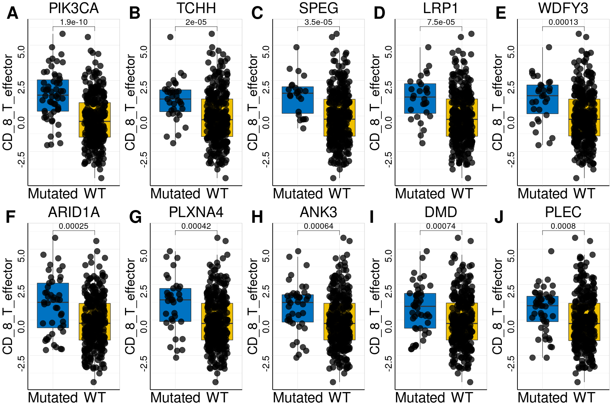

## <a id="Section.5.4" style="color:#B7950B;">5.4 Model Construction Module</a>

For effective application of the signatures in clinical interpretation,
IOBR also provides functions for feature selection, robust biomarker
identification, and model construction based on priorly identified
phenotype associated biomarkers in [5.2.1 Explore Phenotype Relevant
Signatures](#Section.5.2.1). For predictive model construction.

``` r
data("imvigor210_sig")
data("imvigor210_pdata")
# For analyses of binary variables
input<-imvigor210_pdata %>% 
  dplyr::select(ID,BOR_binary) %>% 
  inner_join(.,imvigor210_sig,by="ID") %>% 
  filter(!is.na(.$BOR_binary)) %>% 
  filter(!.$BOR_binary=="NA")

# Feature engineering
res<-batch_wilcoxon(data    = as.data.frame(input),
                    target  = "BOR_binary",
                    group_names = c("NR","R"),
                    feature = colnames(input)[3:ncol(input)])
head(res)
#> # A tibble: 6 x 8
#>   sig_names            p.value     NR      R statistic   p.adj log10pvalue stars
#>   <chr>                  <dbl>  <dbl>  <dbl>     <dbl>   <dbl>       <dbl> <fct>
#> 1 Mismatch_Repair      9.21e-6 -0.111  0.246    -0.357 0.00138        5.04 **** 
#> 2 Cell_cycle           1.05e-5 -0.297  0.673    -0.969 0.00138        4.98 **** 
#> 3 TMEscoreB_plus       1.35e-5  0.149 -0.432     0.581 0.00138        4.87 **** 
#> 4 DNA_replication      1.38e-5 -0.147  0.353    -0.500 0.00138        4.86 **** 
#> 5 DDR                  1.52e-5 -0.229  0.532    -0.760 0.00138        4.82 **** 
#> 6 Nucleotide_excisio…  2.16e-5 -0.106  0.244    -0.350 0.00154        4.67 ****
model_feas<-as.character(res[res$p.value<0.05,]$sig_names)

input<-as.data.frame(imvigor210_sig)
feas<-colnames(input)[colnames(input)%in%model_feas]
input<-input[, c("ID",feas)]

# target data
pdata_group <- imvigor210_pdata[!imvigor210_pdata$BOR_binary=="NA",c("ID","BOR_binary")]
pdata_group$BOR_binary <- ifelse(pdata_group$BOR_binary == "R", 1, 0)

#Feature selection
binomial_result <- BinomialModel(x           = input, 
                                 y           = pdata_group, 
                                 seed        = "123456", 
                                 scale       = TRUE,
                                 train_ratio = 0.7, 
                                 nfold       = 10, 
                                 plot        = T)
#> NULL
#> NULL
#> NULL
#> NULL
```

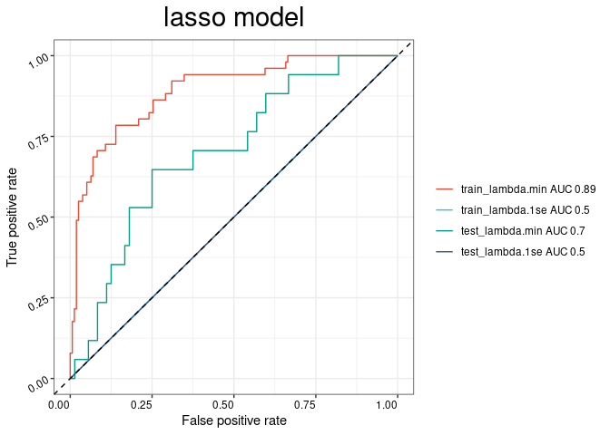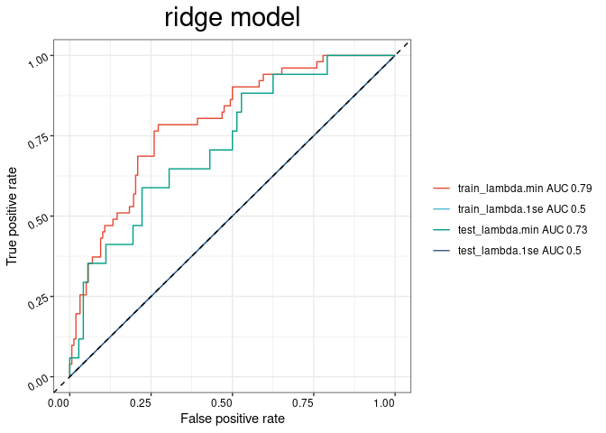

    #> NULL
    
    plot(binomial_result$lasso_result$model)

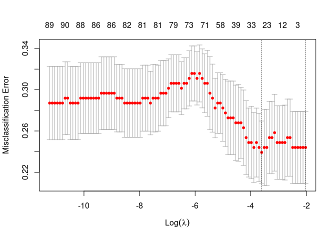

``` r
plot(binomial_result$ridge_result$model)
```

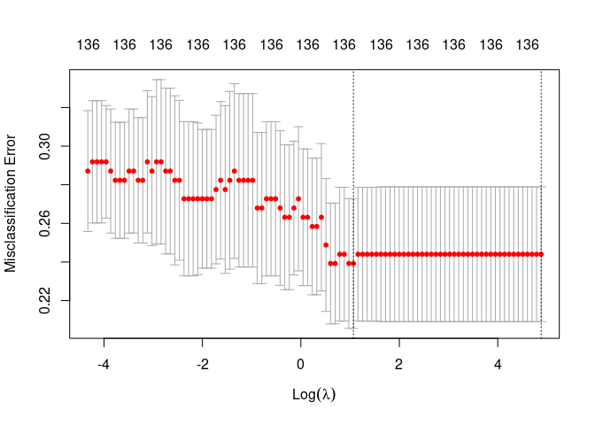

``` r
lapply(binomial_result[1:2], function(z)z$AUC)
#> $lasso_result
#>       lambda.min lambda.1se
#> train  0.8911641        0.5
#> test   0.7017974        0.5
#> 
#> $ridge_result
#>       lambda.min lambda.1se
#> train  0.7915115        0.5
#> test   0.7263072        0.5
```

For prognostic model construction.

``` r
data("imvigor210_pdata")
pdata_prog<-imvigor210_pdata %>% 
  dplyr::select(ID, OS_days, OS_status) %>% 
  filter(!is.na(.$OS_days)) %>% 
  filter(!.$OS_days=="NA") %>% 
  dplyr:: rename(time = OS_days) %>% 
  dplyr:: rename(status = OS_status) %>% 
  mutate(time = as.numeric(.$time)) %>%
  mutate(status = as.numeric(.$status))

pdata_prog<-as.data.frame(pdata_prog)
input<-as.data.frame(imvigor210_sig)

prognostic_result <- PrognosticModel(x           = input, 
                                     y           = pdata_prog, 
                                     scale       = T, 
                                     seed        = "123456", 
                                     train_ratio = 0.8,
                                     nfold       = 10,
                                     plot        = T)
#> NULL
#> NULL
#> NULL
```


``` r
plot(prognostic_result$lasso_result$model)
```

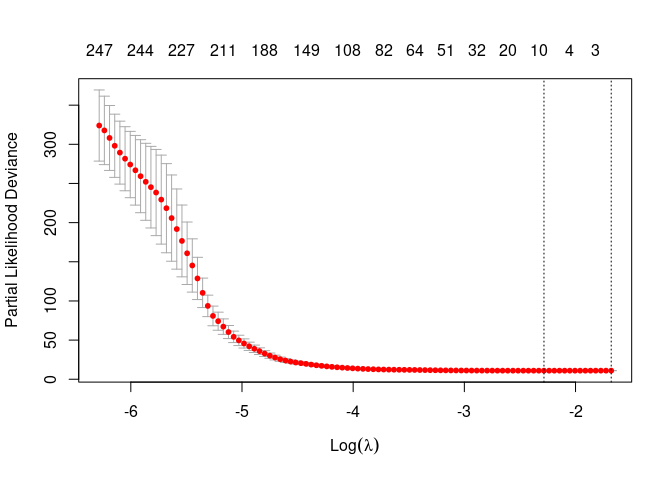

``` r
plot(prognostic_result$ridge_result$model)
```


# <a id="Section.6" style="color:#B7950B;">6. Demonstration of IOBR Pipeline with An Example Dataset</a>

The detailed the implementation of IOBR was illustrated in the following
complete analysis pipeline. To note, in a recent published
[literature](https://www.thno.org/v10p7002.html) with multi-omics data
from IMvigor210 cohort, we generated immunotherapy associated risk
score, determined TME infiltration pattern and further located in
macrophage as a robust predictive biomarker, subsequently unveiled the
predominant genomic alterations and significant metabolic
characteristics.

``` r
# Download package through this website (http://research-pub.gene.com/IMvigor210CoreBiologies/packageVersions/) and install it.
if (!requireNamespace("IMvigor210CoreBiologies", quietly = TRUE))
  install.packages("IMvigor210CoreBiologies_1.0.0.tar.gz", repos=NULL)

library(IMvigor210CoreBiologies)
```

Step 1: Preparing expression data for TME and signatures deconvolution

``` r
data(cds)
head(fData(cds))
#>           entrez_id  symbol n_exons length source  Symbol
#> 1                 1    A1BG       8   1766   IGIS    A1BG
#> 10               10    NAT2       2   1317   IGIS    NAT2
#> 100             100     ADA      26   3386   IGIS     ADA
#> 1000           1000    CDH2      18   4504   IGIS    CDH2
#> 10000         10000    AKT3      99  39468   IGIS    AKT3
#> 100008586 100008586 GAGE12F       5    598   IGIS GAGE12F
expMatrix<-counts(cds)

eff_length2 <-fData(cds)[,c("entrez_id","length","symbol")]
rownames(eff_length2)<-eff_length2$entrez_id
head(eff_length2)
#>           entrez_id length  symbol
#> 1                 1   1766    A1BG
#> 10               10   1317    NAT2
#> 100             100   3386     ADA
#> 1000           1000   4504    CDH2
#> 10000         10000  39468    AKT3
#> 100008586 100008586    598 GAGE12F
###############################
feature_ids <- rownames(expMatrix)
# trim the expression matrix and effective gene length
expMatrix <- expMatrix[feature_ids %in% rownames(eff_length2),]
mm <- match(rownames(expMatrix), rownames(eff_length2))
eff_length2 <- eff_length2[mm, ]
#################################
# transform count data to TPM
x <- expMatrix / eff_length2$length
eset <- t( t(x) / colSums(x) ) * 1e6 
summary(duplicated(rownames(eset)))
#>    Mode   FALSE 
#> logical   31286
#################################
# annotating expression set
eset<-IOBR::anno_eset(eset       = eset,
                      annotation = eff_length2,
                      symbol     = "symbol",
                      probe      = "entrez_id",
                      method     = "mean")
eset[1:5,1:5]
#>          SAMf2ce197162ce SAM698d8d76b934 SAMc1b27bc16435 SAM85e41e7f33f9
#> SNORA73A       50826.959       92198.347        93927.79       23823.820
#> RMRP           43343.720       44871.186        57334.86       33522.250
#> SNORA73B       36847.962       40180.165        41911.98       12206.282
#> MALAT1          8734.592        8784.605        13461.92       14320.427
#> SNORD3A         6759.949       11223.349        31561.72        3476.927
#>          SAMf275eb859a39
#> SNORA73A        49781.49
#> RMRP            29562.21
#> SNORA73B        27762.30
#> MALAT1          18008.88
#> SNORD3A         11736.15
```

Step 2: TME cell estimation

``` r
tumor_type<-"blca"
if(max(eset)>100) eset<-log2(eset+1)
cibersort<-deconvo_tme(eset = eset,method = "cibersort",arrays = FALSE,perm = 1000 )
epic     <-deconvo_tme(eset = eset,method = "epic",arrays = FALSE)
mcp      <-deconvo_tme(eset = eset,method = "mcpcounter")
```

``` r
xcell    <-deconvo_tme(eset = eset,method = "xcell",arrays = FALSE)
```

``` r
estimate <-deconvo_tme(eset = eset,method = "estimate")
#> [1] "Merged dataset includes 10225 genes (187 mismatched)."
#> [1] "1 gene set: StromalSignature  overlap= 139"
#> [1] "2 gene set: ImmuneSignature  overlap= 141"
timer    <-deconvo_tme(eset = eset,method = "timer",group_list = rep(tumor_type,dim(eset)[2]))
#> [1] "Outlier genes: ACTB ALB B2M CCT2 COL1A1 COL1A2 COL3A1 CSTB FN1 FTL GSTM1 HBA1 HBA2 HBB HP IGLL5 KRT1 KRT13 KRT14 KRT16 KRT5 KRT6A MALAT1 MGP MUC4 OLFM4 ORM1 PABPC1 PSAP REN RMRP RPL23 RPS11 RPS6 S100A11 S100A7 SCARNA10 SCARNA5 SCARNA7 SEC61G SNORA63 SNORA73A SNORA73B SNORD116-24 SNORD17 SNORD3A SPINK1 TMSB10"
#> Standardizing Data across genes
quantiseq<-deconvo_tme(eset = eset,method = "quantiseq", tumor = TRUE, arrays = FALSE, scale_mrna = TRUE)
ips      <-deconvo_tme(eset = eset,method = "ips",plot= FALSE)

tme_combine<-cibersort %>% 
  inner_join(.,mcp,by       = "ID") %>% 
  inner_join(.,xcell,by     = "ID") %>%
  inner_join(.,epic,by      = "ID") %>% 
  inner_join(.,estimate,by  = "ID") %>% 
  inner_join(.,quantiseq,by = "ID") %>% 
  inner_join(.,timer,by     = "ID") %>% 
  inner_join(.,ips,by       = "ID") 

if("Index"%in%colnames(tme_combine))  tme_combine<-tme_combine[,-which(colnames(tme_combine)=="index")]
```

Step 3: Collected gene Signatures estimation

``` r
sig_res<-calculate_sig_score(pdata           = NULL,
                             eset            = eset,
                             signature       = signature_collection,
                             method          = "pca",
                             mini_gene_count = 2)
#> 
#> >>> Calculating signature score with PCA method
```

Step 4: Evaluation of Gene signatures and pathway obtained from MsigDB
of Broad Institute.

``` r
sig_go_kegg<-calculate_sig_score(pdata = NULL,
                                 eset = eset,
                                 signature = c(hallmark,go_bp,go_cc,go_mf,kegg,reactome),
                                 method = "ssgsea",
                                 mini_gene_count = 2)

tme_sig_com<-tme_combine %>% 
  inner_join(.,sig_res,by = "ID") %>% 
  inner_join(.,sig_go_kegg,by = "ID")
save(tme_sig_com,file = paste0("0-IMvigor210-Merge-TME-Signature-Hallmark-GO-KEGG-Reactome.RData"))
```

Step 5: Preparing phenotype data

``` r

pdata<-pData(cds)
colnames(pdata)<-gsub(colnames(pdata),pattern = " ",replacement = "_")
pdata<-rownames_to_column(pdata[,c("binaryResponse",
                                   "FMOne_mutation_burden_per_MB",
                                   "Neoantigen_burden_per_MB",
                                   "censOS","os")],var = "ID")
head(pdata)
#>                ID binaryResponse FMOne_mutation_burden_per_MB
#> 1 SAMf2ce197162ce           <NA>                            3
#> 2 SAM698d8d76b934           <NA>                            6
#> 3 SAMc1b27bc16435          CR/PR                            5
#> 4 SAM85e41e7f33f9           <NA>                           10
#> 5 SAMf275eb859a39          CR/PR                            9
#> 6 SAM7f0d9cc7f001          SD/PD                           NA
#>   Neoantigen_burden_per_MB censOS         os
#> 1                0.5686275      1  1.5770021
#> 2                1.0196078      1  0.4271047
#> 3                1.4117647      0 24.1806982
#> 4                1.2549020      1  0.6242300
#> 5                       NA      0 24.4763860
#> 6                       NA      1  4.6324435
colnames(pdata)<-c("ID","BOR_binary","TMB","TNB","status","time")
pdata<-pdata[!is.na(pdata$BOR_binary),]
pdata$BOR_binary<-ifelse(pdata$BOR_binary=="CR/PR","R","NR")
```

Step 6: Feature engineering (1 Selecting features associated with
treatment response (BOR based on RECIST)

``` r

input1<-merge(pdata[,c("ID","BOR_binary")],tme_sig_com,by="ID",all = FALSE)
res<-batch_wilcoxon(data    = input1,
                    target  = "BOR_binary",
                    group_names = c("NR","R"),
                    feature = colnames(input1)[3:ncol(input1)])
feas1<-as.character(res[res$p.value<0.05,]$sig_names)
```

(2 Selecting features associated with treatment outcome (Overall
survival)

``` r
input2<-pdata %>% 
  filter(!is.na(.$time)) %>% 
  filter(!is.na(.$status)) %>% 
  mutate(time = as.numeric(.$time)) %>% 
  mutate(status = as.numeric(.$status)) %>% 
  dplyr::select(ID,time,status) %>% 
  inner_join(.,tme_sig_com, by= "ID")

res <- batch_surv(pdata    = input2, 
                  variable = c(4:ncol(input2)), 
                  time     = "time",
                  status   = "status")
feas2<-as.character(res[res$P < 0.01,]$ID)

feas<-intersect(feas1, feas2)
target<-input2[,c("ID","time","status")]
fea_data<-input2[,c("ID",feas)]
```

Step 7: Integrating LASSO cox regression and bootstrapping algorithm to
find best prognostic features

In order to find best predictive or prognostic signature, we recommend
[Blasso](https://github.com/DongqiangZeng0808/Blasso) package to
determine the most robust markers. If *Blasso* R package is utilized in
your published research, please cite: DQ Zeng, ZL Ye, et al., Macrophage
correlates with immunophenotype and predicts anti-PD-L1 response of
urothelial cancer. Theranostics 2020; 10(15):7002-7014.
[doi:10.7150/thno.46176](https://www.thno.org/v10p7002.html)

``` r
if (!requireNamespace("Blasso", quietly = TRUE))  
  devtools::install_github("DongqiangZeng0808/Blasso")
library("Blasso")
#For prognostic biomarkers
res<-best_predictor_cox(target_data        = target,
                        features           = fea_data,
                        status             = "status",
                        time               = "time",
                        nfolds             = 10,
                        permutation        = 2000,
                        plot_vars          = 12,
                        show_progress      = FALSE)
```

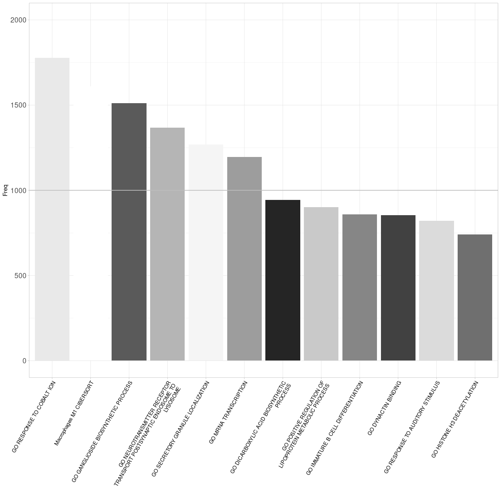

# <a id="Section.7" style="color:#B7950B;">7. Summary</a>

IOBR provides four major analytic modules allowing effective and
flexible analysis of tumor immunologic, clinical, genomics, and
single-cell data. There might be some limitations in this package, we
will put our efforts into its improvement for more functionality in the
future. Any questions, bug reports, or suggestions about IOBR R package
is appreciated. Please contact us through E-mail to
<dongqiangzeng0808@gmail.com> or <yzlsibyl@163.com>.

# <a id="Section.8" style="color:#B7950B;">8. Session Information</a>

``` r
sessionInfo()
#> R version 3.6.3 (2020-02-29)
#> Platform: x86_64-pc-linux-gnu (64-bit)
#> Running under: CentOS Linux 7 (Core)
#> 
#> Matrix products: default
#> BLAS/LAPACK: /usr/lib64/libopenblasp-r0.3.3.so
#> 
#> locale:
#>  [1] LC_CTYPE=en_US.UTF-8 LC_NUMERIC=C         LC_TIME=C           
#>  [4] LC_COLLATE=C         LC_MONETARY=C        LC_MESSAGES=C       
#>  [7] LC_PAPER=C           LC_NAME=C            LC_ADDRESS=C        
#> [10] LC_TELEPHONE=C       LC_MEASUREMENT=C     LC_IDENTIFICATION=C 
#> 
#> attached base packages:
#> [1] parallel  stats     graphics  grDevices utils     datasets  methods  
#> [8] base     
#> 
#> other attached packages:
#>  [1] Blasso_0.1.0                  progress_1.2.2               
#>  [3] RColorBrewer_1.1-2            glmnet_4.0-2                 
#>  [5] Matrix_1.2-18                 IMvigor210CoreBiologies_1.0.0
#>  [7] GEOquery_2.54.1               Biobase_2.46.0               
#>  [9] BiocGenerics_0.32.0           UCSCXenaTools_1.3.4          
#> [11] maftools_2.2.10               tidyHeatmap_1.1.5            
#> [13] forcats_0.5.0                 stringr_1.4.0                
#> [15] purrr_0.3.4                   readr_1.3.1                  
#> [17] tidyr_1.1.0                   tidyverse_1.3.0              
#> [19] MCPcounter_1.2.0              curl_4.3                     
#> [21] estimate_1.0.13               EPIC_1.1.5                   
#> [23] IOBR_0.99.9                   survival_3.2-7               
#> [25] ggpubr_0.4.0                  ggplot2_3.3.2                
#> [27] dplyr_1.0.0                   tibble_3.0.1                 
#> 
#> loaded via a namespace (and not attached):
#>   [1] utf8_1.1.4                  tidyselect_1.1.0           
#>   [3] RSQLite_2.2.0               AnnotationDbi_1.48.0       
#>   [5] htmlwidgets_1.5.1           grid_3.6.3                 
#>   [7] BiocParallel_1.20.1         lpSolve_5.6.15             
#>   [9] DESeq_1.38.0                munsell_0.5.0              
#>  [11] pec_2019.11.03              codetools_0.2-16           
#>  [13] preprocessCore_1.48.0       withr_2.2.0                
#>  [15] colorspace_1.4-1            limSolve_1.5.6             
#>  [17] knitr_1.29                  rstudioapi_0.11            
#>  [19] ROCR_1.0-11                 stats4_3.6.3               
#>  [21] ggsignif_0.6.0              labeling_0.3               
#>  [23] GenomeInfoDbData_1.2.2      KMsurv_0.1-5               
#>  [25] farver_2.0.3                bit64_0.9-7                
#>  [27] vctrs_0.3.1                 generics_0.1.0             
#>  [29] xfun_0.15                   BiocFileCache_1.10.2       
#>  [31] R6_2.4.1                    GenomeInfoDb_1.22.1        
#>  [33] clue_0.3-57                 timereg_1.9.8              
#>  [35] locfit_1.5-9.4              bitops_1.0-6               
#>  [37] DelayedArray_0.12.3         assertthat_0.2.1           
#>  [39] promises_1.1.1              scales_1.1.1               
#>  [41] nnet_7.3-12                 gtable_0.3.0               
#>  [43] sva_3.34.0                  rlang_0.4.6                
#>  [45] genefilter_1.68.0           GlobalOptions_0.1.2        
#>  [47] splines_3.6.3               rstatix_0.6.0              
#>  [49] acepack_1.4.1               wordcloud_2.6              
#>  [51] broom_0.5.6                 checkmate_2.0.0            
#>  [53] reshape2_1.4.4              yaml_2.2.1                 
#>  [55] abind_1.4-5                 modelr_0.1.8               
#>  [57] backports_1.1.8             httpuv_1.5.4               
#>  [59] Hmisc_4.4-0                 lava_1.6.8.1               
#>  [61] tools_3.6.3                 ellipsis_0.3.1             
#>  [63] plyr_1.8.6                  Rcpp_1.0.5                 
#>  [65] base64enc_0.1-3             zlibbioc_1.32.0            
#>  [67] RCurl_1.98-1.2              prettyunits_1.1.1          
#>  [69] rpart_4.1-15                openssl_1.4.2              
#>  [71] GetoptLong_1.0.4            viridis_0.5.1              
#>  [73] cowplot_1.0.0               S4Vectors_0.24.4           
#>  [75] zoo_1.8-8                   SummarizedExperiment_1.16.1
#>  [77] haven_2.3.1                 cluster_2.1.0              
#>  [79] fs_1.4.1                    magrittr_1.5               
#>  [81] data.table_1.12.8           openxlsx_4.1.5             
#>  [83] circlize_0.4.11             reprex_0.3.0               
#>  [85] survminer_0.4.8             mvtnorm_1.1-1              
#>  [87] timeROC_0.4                 matrixStats_0.56.0         
#>  [89] hms_0.5.3                   mime_0.9                   
#>  [91] evaluate_0.14               GSVA_1.34.0                
#>  [93] xtable_1.8-4                XML_3.99-0.3               
#>  [95] rio_0.5.16                  jpeg_0.1-8.1               
#>  [97] readxl_1.3.1                IRanges_2.20.2             
#>  [99] gridExtra_2.3               shape_1.4.5                
#> [101] compiler_3.6.3              biomaRt_2.42.1             
#> [103] crayon_1.3.4                htmltools_0.5.0            
#> [105] mgcv_1.8-31                 later_1.1.0.1              
#> [107] Formula_1.2-3               geneplotter_1.64.0         
#> [109] lubridate_1.7.9             DBI_1.1.0                  
#> [111] corrplot_0.84               ppcor_1.1                  
#> [113] dbplyr_1.4.4                ComplexHeatmap_2.2.0       
#> [115] MASS_7.3-51.5               rappdirs_0.3.1             
#> [117] car_3.0-8                   cli_2.0.2                  
#> [119] quadprog_1.5-8              GenomicRanges_1.38.0       
#> [121] pkgconfig_2.0.3             km.ci_0.5-2                
#> [123] numDeriv_2016.8-1.1         foreign_0.8-75             
#> [125] xml2_1.3.2                  foreach_1.5.0              
#> [127] annotate_1.64.0             ggcorrplot_0.1.3           
#> [129] XVector_0.26.0              prodlim_2019.11.13         
#> [131] rvest_0.3.5                 digest_0.6.25              
#> [133] pracma_2.2.9                graph_1.64.0               
#> [135] rmarkdown_2.3               cellranger_1.1.0           
#> [137] survMisc_0.5.5              htmlTable_2.0.0            
#> [139] GSEABase_1.48.0             shiny_1.5.0                
#> [141] rjson_0.2.20                lifecycle_0.2.0            
#> [143] nlme_3.1-144                jsonlite_1.7.0             
#> [145] carData_3.0-4               viridisLite_0.3.0          
#> [147] askpass_1.1                 limma_3.42.2               
#> [149] fansi_0.4.1                 pillar_1.4.4               
#> [151] ggsci_2.9                   lattice_0.20-38            
#> [153] fastmap_1.0.1               httr_1.4.1                 
#> [155] glue_1.4.1                  remotes_2.1.1              
#> [157] zip_2.0.4                   png_0.1-7                  
#> [159] shinythemes_1.1.2           iterators_1.0.12           
#> [161] bit_1.1-15.2                class_7.3-15               
#> [163] stringi_1.4.6               blob_1.2.1                 
#> [165] DESeq2_1.26.0               latticeExtra_0.6-29        
#> [167] memoise_1.1.0               e1071_1.7-4
```

# <a id="Section.9" style="color:#B7950B;">9. Citing IOBR</a>

In that IOBR incorporating some algorithms and methodologies from many
other packages, please cite corresponding papers alongside IOBR when
using the functions contains these algorithms. The detailed paper
sources and respective licenses were listed in the subset of [5.1.3
Available Methods to Decode TME Contexture](#Section.5.1.3).

If IOBR R package is utilized in your published research, please cite:

>   - DQ Zeng, ZL Ye, GC Yu, …, WJ Liao\*, IOBR: Multi-omics
>     Immuno-Oncology Biological Research to decode tumor
>     microenvironment and signatures. bioRxiv, 2020.2012.2014.422647
>     (2020).
>     [doi: 10.1101/2020.12.14.422647](https://www.biorxiv.org/content/10.1101/2020.12.14.422647v1)

Please cite the following papers appropriately for TME deconvolution
algorithm if used:

>   - CIBERSORT: Newman, A. M., Liu, C. L., Green, M. R., Gentles, A.
>     J., Feng, W., Xu, Y., … Alizadeh, A. A. (2015). Robust enumeration
>     of cell subsets from tissue expression profiles. Nature Methods,
>     12(5), 453–457. <https://doi.org/10.1038/nmeth.3337>
>   - ESTIMATE: Vegesna R, Kim H, Torres-Garcia W, …, Verhaak
>     R.\*(2013). Inferring tumour purity and stromal and immune cell
>     admixture from expression data. Nature Communications 4, 2612.
>     <http://doi.org/10.1038/ncomms3612>
>   - quanTIseq: Finotello, F., Mayer, C., Plattner, C., Laschober, G.,
>     Rieder, D., Hackl, H., …, Sopper, S.\* (2019). Molecular and
>     pharmacological modulators of the tumor immune contexture revealed
>     by deconvolution of RNA-seq data. Genome medicine, 11(1), 34.
>     <https://doi.org/10.1186/s13073-019-0638-6>
>   - Li, B., Severson, E., Pignon, J.-C., Zhao, H., Li, T., Novak, J.,
>     … Liu, X. S.\* (2016). Comprehensive analyses of tumor immunity:
>     implications for cancer immunotherapy. Genome Biology, 17(1),
>     174.  
>   - IPS: P. Charoentong et al.\*, Pan-cancer Immunogenomic Analyses
>     Reveal Genotype-Immunophenotype Relationships and Predictors of
>     Response to Checkpoint Blockade. Cell Reports 18, 248-262 (2017).
>     <https://doi.org/10.1016/j.celrep.2016.12.019>
>   - MCPCounter: Becht, E., Giraldo, N. A., Lacroix, L., Buttard, B.,
>     Elarouci, N., Petitprez, F., … de Reyniès, A\*. (2016). Estimating
>     the population abundance of tissue-infiltrating immune and stromal
>     cell populations using gene expression. Genome Biology, 17(1),
>     218. <https://doi.org/10.1186/s13059-016-1070-5>
>   - xCell: Aran, D., Hu, Z., & Butte, A. J.\* (2017). xCell: digitally
>     portraying the tissue cellular heterogeneity landscape. Genome
>     Biology, 18(1), 220. <https://doi.org/10.1186/s13059-017-1349-1>
>   - EPIC: Racle, J., de Jonge, K., Baumgaertner, P., Speiser, D. E., &
>     Gfeller, D\*. (2017). Simultaneous enumeration of cancer and
>     immune cell types from bulk tumor gene expression data. ELife, 6,
>     e26476. <https://doi.org/10.7554/eLife.26476>

For signature score estimation, please cite corresponding literature
below:

>   - ssgsea: Barbie, D.A. et al (2009). Systematic RNA interference
>     reveals that oncogenic KRAS-driven cancers require TBK1. Nature,
>     462(5):108-112.
>   - gsva: Hänzelmann, S., Castelo, R. and Guinney, J. (2013). GSVA:
>     Gene set variation analysis for microarray and RNA-Seq data. BMC
>     Bioinformatics, 14(1):7.
>   - zscore: Lee, E. et al (2008). Inferring pathway activity toward
>     precise disease classification. PLoS Comp Biol, 4(11):e1000217.

For the data sets enrolled in IOBR, please cite the data sources:

>   - UCSCXena: Wang et al.,et al (2019). The UCSCXenaTools R package: a
>     toolkit for accessing genomics data from UCSC Xena platform, from
>     cancer multi-omics to single-cell RNA-seq. Journal of Open Source
>     Software, 4(40), 1627
>   - TLSscore: Helmink BA, Reddy SM, Gao J, et al. B cells and tertiary
>     lymphoid structures promote immunotherapy response. Nature. 2020
>     Jan;577(7791):549-555.  
>   - IMvigor210 immuntherapy cohort: Mariathasan S, Turley SJ, Nickles
>     D, et al. TGFβ attenuates tumour response to PD-L1 blockade by
>     contributing to exclusion of T cells. Nature. 2018 Feb
>     22;554(7693):544-548.
>   - HCP5: Kulski, J.K. Long Noncoding RNA HCP5, a Hybrid HLA Class I
>     Endogenous Retroviral Gene: Structure, Expression, and Disease
>     Associations. Cells 2019, 8, 480.
>   - HCP5: Li, Y., Jiang, T., Zhou, W. et al. Pan-cancer
>     characterization of immune-related lncRNAs identifies potential
>     oncogenic biomarkers. Nat Commun 11, 1000 (2020).
>   - HCP5: Sun J, Zhang Z, Bao S, et alIdentification of tumor immune
>     infiltration-associated lncRNAs for improving prognosis and
>     immunotherapy response of patients with non-small cell lung
>     cancerJournal for ImmunoTherapy of Cancer 2020;8:e000110.
>   - LINC00657: Feng Q, Zhang H, Yao D, Chen WD, Wang YD. Emerging Role
>     of Non-Coding RNAs in Esophageal Squamous Cell Carcinoma. Int J
>     Mol Sci. 2019 Dec 30;21(1):258. doi: 10.3390/ijms21010258.
>   - LINC00657: Qin X, Zhou M, Lv H, Mao X, Li X, Guo H, Li L, Xing H.
>     Long noncoding RNA LINC00657 inhibits cervical cancer development
>     by sponging miR-20a-5p and targeting RUNX3. Cancer Lett. 2020 Oct
>     28:S0304-3835(20)30578-4. doi: 10.1016/j.canlet.2020.10.044.
>   - LINC00657: Zhang XM, Wang J, Liu ZL, Liu H, Cheng YF, Wang T.
>     LINC00657/miR-26a-5p/CKS2 ceRNA network promotes the growth of
>     esophageal cancer cells via the MDM2/p53/Bcl2/Bax pathway. Biosci
>     Rep. 2020;40(6):BSR20200525.
>   - TCGA.STAD: Cancer Genome Atlas Research Network. Comprehensive
>     molecular characterization of gastric adenocarcinoma. Nature. 2014
>     Sep 11;513(7517):202-9. doi: 10.1038/nature13480.
>   - TCGA.STAD MAF data:
>     <https://api.gdc.cancer.gov/data/c06465a3-50e7-46f7-b2dd-7bd654ca206b>

# <a id="Section.10" style="color:#B7950B;">REFERENCES</a>

> 1.  Newman, A. M., Liu, C. L., Green, M. R., Gentles, A. J., Feng, W.,
>     Xu, Y., … Alizadeh, A. A. (2015). Robust enumeration of cell
>     subsets from tissue expression profiles. Nature Methods, 12(5),
>     453–457.
> 2.  Vegesna R, Kim H, Torres-Garcia W, …, Verhaak R.\*(2013).
>     Inferring tumour purity and stromal and immune cell admixture from
>     expression data. Nature Communications 4, 2612.
> 3.  Rieder, D., Hackl, H., …, Sopper, S.\* (2019). Molecular and
>     pharmacological modulators of the tumor immune contexture revealed
>     by deconvolution of RNA-seq data. Genome medicine, 11(1), 34.
> 4.  Li, B., Severson, E., Pignon, J.-C., Zhao, H., Li, T., Novak, J.,
>     … Liu, X. S.\* (2016). Comprehensive analyses of tumor immunity:
>     implications for cancer immunotherapy. Genome Biology, 17(1),
>     174.  
> 5.  P. Charoentong et al.\*, Pan-cancer Immunogenomic Analyses Reveal
>     Genotype-Immunophenotype Relationships and Predictors of Response
>     to Checkpoint Blockade. Cell Reports 18, 248-262 (2017).  
> 6.  Becht, E., Giraldo, N. A., Lacroix, L., Buttard, B., Elarouci, N.,
>     Petitprez, F., … de Reyniès, A\*. (2016). Estimating the
>     population abundance of tissue-infiltrating immune and stromal
>     cell populations using gene expression. Genome Biology, 17(1),
>     218.
> 7.  Aran, D., Hu, Z., & Butte, A. J.\* (2017). xCell: digitally
>     portraying the tissue cellular heterogeneity landscape. Genome
>     Biology, 18(1), 220.
> 8.  Racle, J., de Jonge, K., Baumgaertner, P., Speiser, D. E., &
>     Gfeller, D\*. (2017). Simultaneous enumeration of cancer and
>     immune cell types from bulk tumor gene expression data. ELife, 6,
>     e26476.
> 9.  Barbie, D.A. et al (2009). Systematic RNA interference reveals
>     that oncogenic KRAS-driven cancers require TBK1. Nature,
>     462(5):108-112.
> 10. Hänzelmann, S., Castelo, R. and Guinney, J. (2013). GSVA: Gene set
>     variation analysis for microarray and RNA-Seq data. BMC
>     Bioinformatics, 14(1):7.
> 11. Lee, E. et al (2008). Inferring pathway activity toward precise
>     disease classification. PLoS Comp Biol, 4(11):e1000217.
> 12. Wang et al.,et al (2019). The UCSCXenaTools R package: a toolkit
>     for accessing genomics data from UCSC Xena platform, from cancer
>     multi-omics to single-cell RNA-seq. Journal of Open Source
>     Software, 4(40), 1627
> 13. Helmink BA, Reddy SM, Gao J, et al. B cells and tertiary lymphoid
>     structures promote immunotherapy response. Nature. 2020
>     Jan;577(7791):549-555.  
> 14. Mariathasan S, Turley SJ, Nickles D, et al. TGFβ attenuates tumour
>     response to PD-L1 blockade by contributing to exclusion of T
>     cells. Nature. 2018 Feb 22;554(7693):544-548.
> 15. Kulski, J.K. Long Noncoding RNA HCP5, a Hybrid HLA Class I
>     Endogenous Retroviral Gene: Structure, Expression, and Disease
>     Associations. Cells 2019, 8, 480.
> 16. Li, Y., Jiang, T., Zhou, W. et al. Pan-cancer characterization of
>     immune-related lncRNAs identifies potential oncogenic biomarkers.
>     Nat Commun 11, 1000 (2020).
> 17. Sun J, Zhang Z, Bao S, et alIdentification of tumor immune
>     infiltration-associated lncRNAs for improving prognosis and
>     immunotherapy response of patients with non-small cell lung
>     cancerJournal for ImmunoTherapy of Cancer 2020;8:e000110.
> 18. Feng Q, Zhang H, Yao D, Chen WD, Wang YD. Emerging Role of
>     Non-Coding RNAs in Esophageal Squamous Cell Carcinoma. Int J Mol
>     Sci. 2019 Dec 30;21(1):258. doi: 10.3390/ijms21010258.
> 19. Qin X, Zhou M, Lv H, Mao X, Li X, Guo H, Li L, Xing H. Long
>     noncoding RNA LINC00657 inhibits cervical cancer development by
>     sponging miR-20a-5p and targeting RUNX3. Cancer Lett. 2020 Oct
> 20. Zhang XM, Wang J, Liu ZL, Liu H, Cheng YF, Wang T.
>     LINC00657/miR-26a-5p/CKS2 ceRNA network promotes the growth of
>     esophageal cancer cells via the MDM2/p53/Bcl2/Bax pathway. Biosci
>     Rep. 2020;40(6):BSR20200525.
> 21. Cancer Genome Atlas Research Network. Comprehensive molecular
>     characterization of gastric adenocarcinoma. Nature. 2014 Sep
>     11;513(7517):202-9. doi: 10.1038/nature13480.
